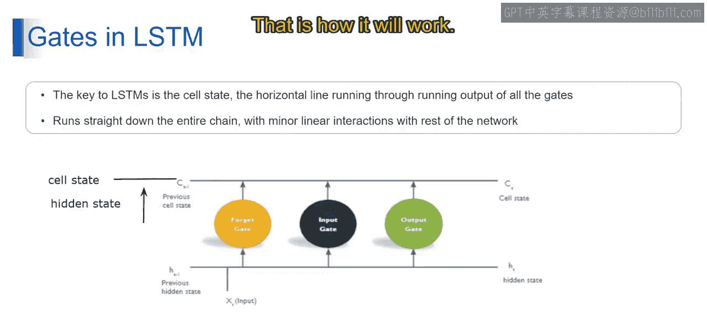

# 第一部分 86：LSTM中的门机制 🧠

在本节中，我们将深入探讨长短期记忆网络的核心机制——门控系统。我们将重点理解细胞状态的概念，以及遗忘门、输入门和输出门如何协同工作，以控制信息的流动和记忆的更新。

## 概述

上一节我们介绍了循环神经网络的基本概念及其在处理序列数据时面临的挑战。本节中，我们来看看LSTM如何通过其独特的门控结构来解决长期依赖问题。关键在于理解细胞状态以及三个门如何对其进行精细调控。

## 理解细胞状态

LSTM的关键在于细胞状态，即图中贯穿整个链条的水平线。

细胞状态是LSTM网络记忆的核心组件，它水平贯穿所有LSTM单元。这与隐藏状态不同，隐藏状态仅将信息垂直传递给下一个LSTM单元。

细胞状态直接沿链条向下传递，使得信息能够随时间持续存在。细胞状态通过门的操作进行修改，这些门选择性地增加或移除其中的信息，从而使LSTM能够在长序列中保留相关信息。

## 与门的交互

细胞状态与LSTM的各个门进行交互，包括遗忘门、输入门和输出门。

以下是各个门的功能详解：

*   **遗忘门**：它接收前一个隐藏状态 `H_{t-1}` 和当前输入 `X_t` 作为输入，同时考虑前一个细胞状态 `C_{t-1}`。遗忘门决定从前一个细胞状态中应保留哪些信息、丢弃哪些信息，从而影响当前细胞状态 `C_t` 的内容。
*   **输入门**：它决定应向细胞状态中添加多少新信息。输入门同样接收前一个隐藏状态 `H_{t-1}`、当前输入 `X_t` 以及前一个细胞状态 `C_{t-1}` 作为输入，并判断新信息对于当前细胞状态的相关性。
*   **输出门**：它控制当前细胞状态中的哪些信息应被传递到输出或下一个隐藏状态。与遗忘门和输入门类似，输出门也接收前一个隐藏状态 `H_{t-1}`、当前输入 `X_t` 以及细胞状态数据作为输入。

这就是LSTM门控机制的基本工作原理。

## 总结

本节课中，我们一起学习了LSTM网络的核心——门控机制。我们明确了**细胞状态**作为网络“记忆通道”的核心作用，并详细分析了**遗忘门**、**输入门**和**输出门**如何协同工作，分别负责信息的保留、更新和输出，从而有效地解决了传统RNN中的长期依赖问题。理解这些门的交互是掌握LSTM工作原理的基础。