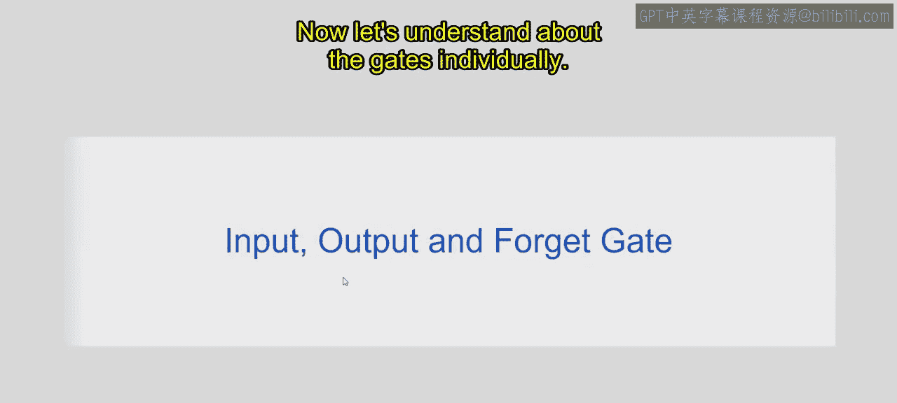
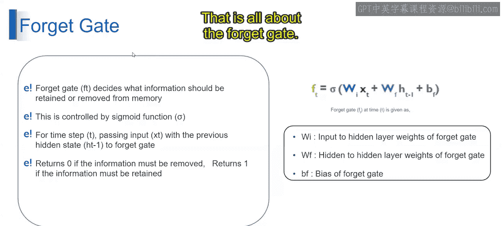
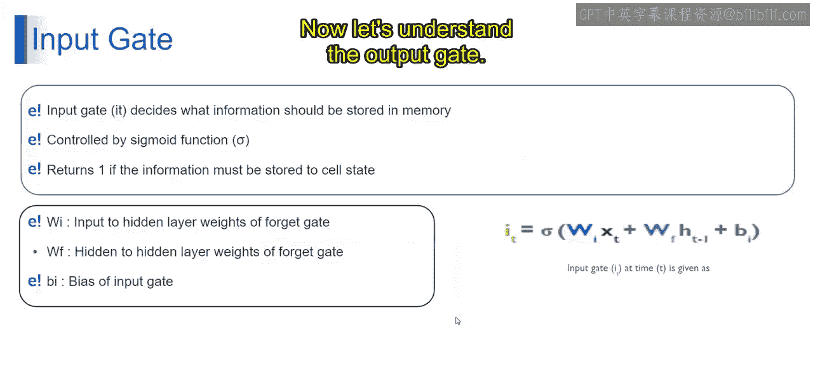
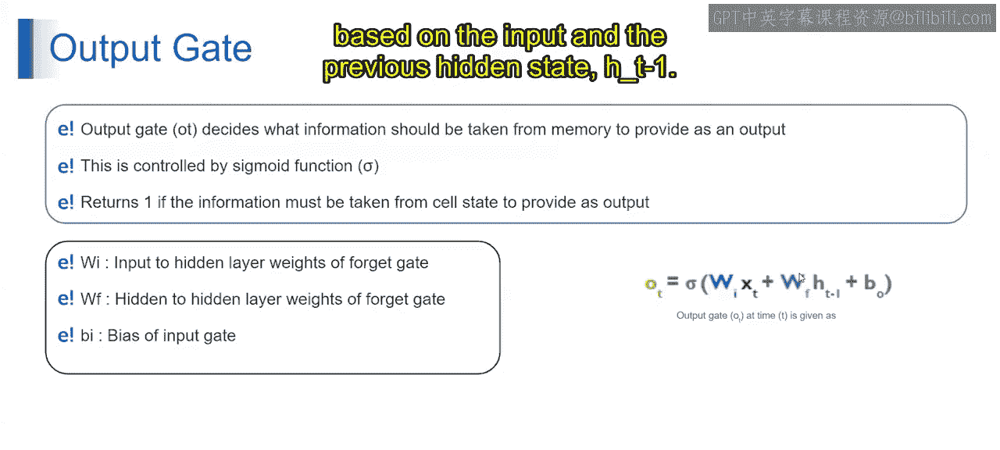
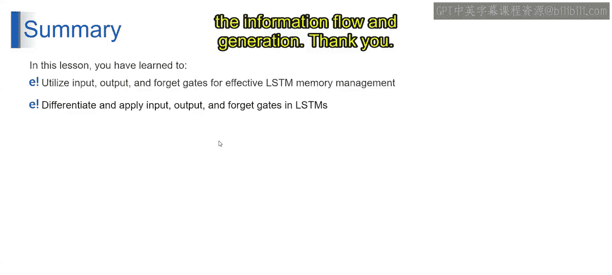

# 第一部分 87：输入、输出和遗忘门

## 概述
在本节课中，我们将学习长短期记忆网络中的三个核心门控机制：遗忘门、输入门和输出门。这些门控结构是LSTM能够有效管理长期依赖信息的关键。我们将逐一解析它们的功能、工作原理和数学表示。

---

## 遗忘门

上一节我们介绍了LSTM的基本结构，本节中我们首先来看看遗忘门。

遗忘门 **F_t** 负责决定从上一个细胞状态 **C_{t-1}** 中，哪些信息应该被保留或遗忘，以供当前时间步 **t** 使用。这个决策通过Sigmoid激活函数实现，该函数输出介于0和1之间的值。

其核心公式如下：

**F_t = σ(W_f · [h_{t-1}, x_t] + b_f)**

以下是公式中各项的含义：
*   **σ**：Sigmoid激活函数。
*   **W_f**：连接前一个隐藏状态 **h_{t-1}** 和当前输入 **x_t** 到遗忘门的权重矩阵。
*   **[h_{t-1}, x_t]**：前一个隐藏状态与当前输入的拼接向量。
*   **b_f**：遗忘门的偏置项。

遗忘门的工作逻辑如下：
*   当 **F_t** 的值接近 **0** 时，表示对应的上一个细胞状态信息应该被**遗忘**。
*   当 **F_t** 的值接近 **1** 时，表示对应的信息应该被**保留**。

简而言之，遗忘门基于当前输入 **x_t** 和前一个隐藏状态 **h_{t-1}**，来决定保留或丢弃长期记忆中的哪些部分。

---

## 输入门

理解了遗忘门如何筛选过去的信息后，我们再来看看输入门如何决定加入哪些新信息。

输入门 **I_t** 负责决定当前输入 **x_t** 中的哪些新信息应该被存储到当前的细胞状态 **C_t** 中。这个决策同样使用Sigmoid激活函数。

其核心公式如下：

**I_t = σ(W_i · [h_{t-1}, x_t] + b_i)**

以下是公式中各项的含义：
*   **W_i**：输入到隐藏层的权重矩阵（用于输入门）。
*   **b_i**：输入门的偏置项。

输入门的工作逻辑如下：
*   当 **I_t** 的值接近 **1** 时，表示对应的当前输入信息**重要**，应该被存储到细胞状态中。
*   当 **I_t** 的值接近 **0** 时，表示对应的信息**不重要**，不应被存储。

同时，LSTM会生成一个候选值向量 **\tilde{C}_t**，它包含了可能被添加到细胞状态中的新信息，通常使用tanh激活函数计算：**\tilde{C}_t = tanh(W_C · [h_{t-1}, x_t] + b_C)**。最终，细胞状态的更新是遗忘门和输入门共同作用的结果：**C_t = F_t * C_{t-1} + I_t * \tilde{C}_t**。

---

## 输出门

最后，我们来看输出门，它决定了当前时刻应该输出什么信息。

输出门 **O_t** 负责决定当前的细胞状态 **C_t** 中的哪些信息应该被传递到输出 **y_t** 或下一个隐藏状态 **h_t**。决策机制依然依赖于Sigmoid激活函数。

其核心公式如下：

**O_t = σ(W_o · [h_{t-1}, x_t] + b_o)**

以下是公式中各项的含义：
*   **W_o**：输入到隐藏层的权重矩阵（用于输出门）。
*   **b_o**：输出门的偏置项。

输出门的工作逻辑如下：
*   当 **O_t** 的值接近 **1** 时，表示对应的细胞状态信息应该被**包含**在输出或下一个隐藏状态中。
*   当 **O_t** 的值接近 **0** 时，表示对应的信息**不应被包含**。

最终，当前时间步的隐藏状态 **h_t**（也常作为输出）由输出门和经过tanh处理的细胞状态共同决定：**h_t = O_t * tanh(C_t)**。

---

## 总结
本节课中，我们一起学习了LSTM网络中三个核心的门控机制：遗忘门、输入门和输出门。你已掌握了它们如何协同工作，以有效地管理网络中的信息流和长期记忆。具体来说：
*   **遗忘门**决定从过去记忆中保留或丢弃什么。
*   **输入门**决定将哪些新信息存入当前记忆。
*   **输出门**决定基于当前记忆输出什么信息。

理解并区分这三个门的功能，是掌握LSTM架构并利用其处理序列数据（如文本、时间序列）的基础。