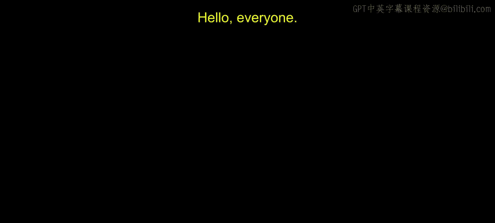
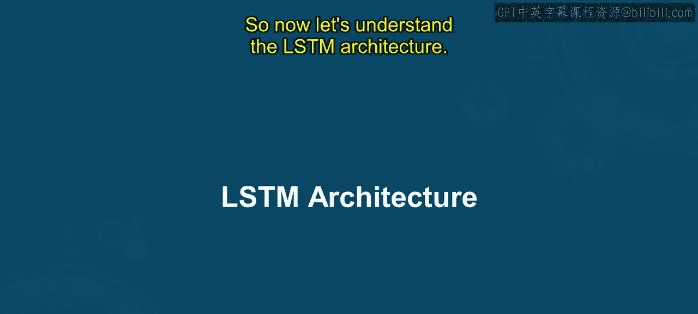
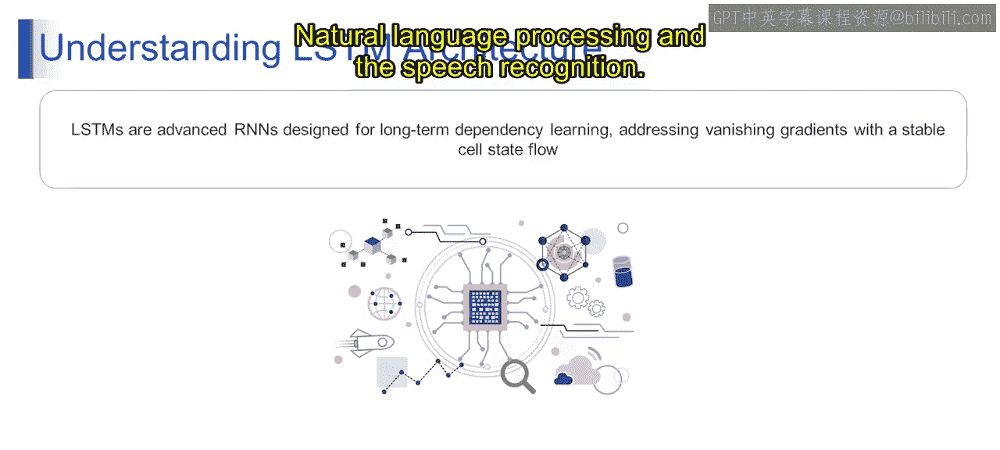

# 第一部分 88：LSTM架构详解

在本节课中，我们将深入学习长短期记忆网络的架构。我们将理解LSTM的组成部分、信息流动方式，并解释为何LSTM在处理序列数据任务中至关重要。

## 概述

上一节我们介绍了LSTM的功能及其独特的门控机制。本节中，我们将深入探讨长短期记忆网络的架构。LSTM是一种循环神经网络，旨在通过专门的门控机制有效捕获和保留序列数据中的长期依赖关系。

## LSTM架构解析

LSTM网络是一种特殊类型的循环神经网络，专门设计用于解决在序列数据中学习长期依赖关系的挑战。LSTM解决的主要问题之一是我们上一模块讨论过的**梯度消失问题**。该问题在训练过程中梯度变得极小时发生，导致网络难以有效学习。

LSTM通过引入一个称为**细胞状态**的独特机制来实现这一目标。细胞状态作为信息在网络中稳定流动的通道，使其能够在长序列中捕获和保留重要信息。这种稳定的细胞状态流使LSTM网络能够有效处理长期依赖关系，使其特别适合涉及序列数据的任务，例如时间序列分析、自然语言处理和语音识别。

以下是LSTM的核心组件及其功能：

1.  **遗忘门**：决定从细胞状态中丢弃哪些信息。其公式为：
    `f_t = σ(W_f · [h_{t-1}, x_t] + b_f)`
    其中，`σ`是Sigmoid激活函数，`W_f`是权重矩阵，`h_{t-1}`是上一时刻的隐藏状态，`x_t`是当前输入，`b_f`是偏置项。

2.  **输入门**：决定将哪些新信息存储到细胞状态中。它包含两个部分：
    *   一个Sigmoid层（输入门层）决定我们将更新哪些值。
    *   一个Tanh层创建一个新的候选值向量`C̃_t`，这些值可能会被添加到状态中。
    公式分别为：
    `i_t = σ(W_i · [h_{t-1}, x_t] + b_i)`
    `C̃_t = tanh(W_C · [h_{t-1}, x_t] + b_C)`

3.  **细胞状态更新**：结合遗忘门和输入门的信息来更新旧的细胞状态`C_{t-1}`为新的细胞状态`C_t`。更新公式为：
    `C_t = f_t * C_{t-1} + i_t * C̃_t`

4.  **输出门**：基于更新后的细胞状态，决定输出什么。输出是过滤后的细胞状态。首先，我们运行一个Sigmoid层来决定细胞状态的哪些部分将被输出。然后，我们将细胞状态通过Tanh函数（将值规范到-1和1之间）并将其乘以Sigmoid门的输出，从而只输出我们决定的部分。
    公式为：
    `o_t = σ(W_o · [h_{t-1}, x_t] + b_o)`
    `h_t = o_t * tanh(C_t)`

## 信息流动与工作流程

LSTM单元在每个时间步`t`接收三个输入：当前时间步的输入`x_t`、前一个时间步的隐藏状态`h_{t-1}`以及前一个时间步的细胞状态`C_{t-1}`。信息按照以下步骤流动：

首先，遗忘门查看`h_{t-1}`和`x_t`，并为细胞状态`C_{t-1}`中的每个数字输出一个介于0和1之间的数。1表示“完全保留”，0表示“完全丢弃”。接着，输入门决定要在细胞状态中存储哪些新信息。然后，将旧的细胞状态更新为新的细胞状态。最后，输出门基于新的细胞状态决定最终的隐藏状态输出`h_t`，这个输出也将传递给下一个时间步。

这种精密的门控机制使LSTM能够有选择地记住或忘记信息，从而克服了传统RNN在长序列上的学习困难。

## 总结

本节课中，我们一起学习了LSTM的架构。我们了解到，LSTM通过遗忘门、输入门、细胞状态和输出门这四个核心组件，有效地管理序列信息，解决了长期依赖学习和梯度消失的问题。这使得LSTM在机器翻译、文本生成、语音识别等需要理解上下文顺序的任务中表现出色。下一节视频中，我们将对此主题进行更详细的阐述。