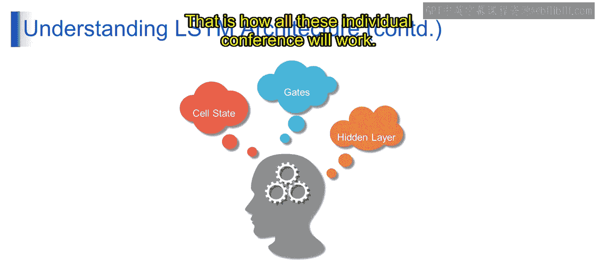

# 第一部分 89：LSTM架构概述 🧠

在本节课中，我们将学习长短期记忆网络的核心架构。我们将深入探讨其三个关键组成部分：细胞状态、门控机制和隐藏层，并理解它们如何协同工作以解决传统循环神经网络中的梯度消失问题。

---

上一节我们介绍了LSTM网络的基本概念，本节中我们来详细解析其架构。

## 细胞状态：信息的高速公路 🛣️

细胞状态是LSTM网络的核心，它像一条传送带，负责在时间步之间传递信息。

它贯穿整个LSTM细胞链，只进行轻微的线性交互。这使得细胞状态能够在长序列中携带相关信息，从而解决梯度消失问题。

可以将细胞状态想象成一条高速公路，信息在其中顺畅流动，不受太大干扰。

例如，假设我们正在训练一个LSTM网络来预测序列中的下一个单词。当网络处理输入序列中的每个单词时，细胞状态会携带关于句子上下文的信息，例如主谓一致或时态。

以句子“The cat is on the mat”为例。在这个句子中，细胞状态可能会保留关于主语（即“The cat”）及其位置（“on the mat”）的信息，并在LSTM细胞中传递。这里的主语是“The cat”，位置是“on the mat”。

## 门控机制：信息的交通管制 🚦

接下来我们看看门控机制。LSTM中的门是专门的神经网络层，用于调节信息流入和流出细胞状态。

主要有三种类型的门：遗忘门、输入门和输出门。每个门负责控制信息流的不同方面，例如决定丢弃哪些信息、存储哪些新信息以及输出哪些信息。

这些门使用S型函数和双曲正切激活函数来决定让多少信息通过。

继续我们预测句子中下一个单词的例子：
*   **遗忘门**决定从先前的细胞状态中丢弃哪些信息，例如句子中较早出现的无关细节。
*   **输入门**决定将哪些新信息添加到细胞状态中，例如当前单词的含义。
*   **输出门**决定使用细胞状态中的哪些信息来预测下一个单词，例如句子的上下文。

## 隐藏层：计算的引擎 ⚙️

最后，我们来看看隐藏层。LSTM网络中的隐藏层包含记忆细胞，它们维护细胞状态并执行计算以更新它。

隐藏层中的每个LSTM细胞处理输入数据，并根据当前输入、先前的细胞状态以及其他细胞的输出来更新其内部状态。隐藏层封装了LSTM网络的内部运作，大部分计算都在这里发生。

在我们的句子预测示例中，隐藏层中的每个LSTM细胞处理输入序列中的一个单词。它使用输入单词、先前的细胞状态以及其他细胞的输出来更新其内部状态并产生一个输出。这个输出连同更新后的状态，被传递给序列中的下一个LSTM细胞。

这就是各个组件协同工作的方式。

---

本节课中，我们一起学习了LSTM架构的三个核心部分：作为信息高速公路的**细胞状态**、负责调控信息流的**门控机制**（遗忘门、输入门、输出门），以及进行计算和状态更新的**隐藏层**。理解这些组件是掌握LSTM如何有效处理序列数据的关键。