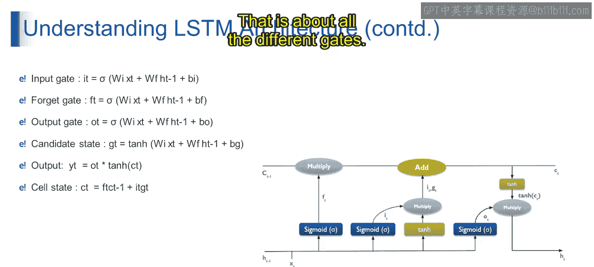

# 第一部分 90：LSTM架构门详解 🧠

在本节课中，我们将要学习长短期记忆网络的核心组成部分——各种“门”的架构与功能。上一节我们介绍了LSTM的基本概念，本节中我们将深入探讨其内部各个门的计算方式与作用。

## 概述

LSTM通过引入精密的门控机制，解决了传统RNN在处理长序列时的梯度消失问题。这些门共同协作，决定哪些信息需要被记住、遗忘或输出。

## 输入门

输入门控制当前输入状态的信息有多少应该被用来更新细胞状态。

*   **公式**：`I_t = σ(W_i * X_t + W_f * H_{t-1} + b_i)`
*   **解释**：输入门通过Sigmoid激活函数计算，其输入是当前时间步的输入`X_t`和上一个时间步的隐藏状态`H_{t-1}`，结合对应的权重`W_i`、`W_f`和偏置`b_i`。输出值在0到1之间，决定了新信息的采纳程度。

## 遗忘门

遗忘门决定有多少先前的细胞状态信息应该被保留或丢弃。

*   **公式**：`F_t = σ(W_f * X_t + W_f * H_{t-1} + b_f)`
*   **解释**：遗忘门的计算方式与输入门类似，也使用Sigmoid函数。它评估过去的细胞状态`C_{t-1}`，并生成一个0到1之间的值，用于控制对过去记忆的保留比例。

## 输出门

输出门调控更新后的细胞状态有多少应该暴露给下一个隐藏状态。

*   **公式**：`O_t = σ(W_o * X_t + W_o * H_{t-1} + b_o)`
*   **解释**：输出门同样基于当前输入和先前隐藏状态，通过Sigmoid函数计算得出。它决定了当前时间步的最终输出`H_t`应包含多少细胞状态的信息。

## 候选门

候选门代表可能被添加到细胞状态中的新候选值。

*   **公式**：`G_t = tanh(W_g * X_t + W_g * H_{t-1} + b_g)`
*   **解释**：候选门使用双曲正切函数`tanh`进行计算，生成一个在-1到1之间的新候选值向量`G_t`。这个值包含了当前输入和过去状态融合后产生的新信息。

## 细胞状态与最终输出

以下是细胞状态的更新规则和最终输出的生成方式。

*   **细胞状态更新公式**：`C_t = F_t * C_{t-1} + I_t * G_t`
    *   新的细胞状态`C_t`由两部分组成：一部分是经过遗忘门筛选的旧状态`F_t * C_{t-1}`，另一部分是经过输入门筛选的新候选信息`I_t * G_t`。
*   **最终输出公式**：`H_t = O_t * tanh(C_t)`
    *   当前时间步的最终输出`H_t`是输出门`O_t`与经过`tanh`函数缩放后的新细胞状态`C_t`的乘积。

## 总结

本节课中我们一起学习了LSTM架构中的关键门控机制。输入门、遗忘门、输出门和候选门通过特定的数学公式协同工作，精确地控制了信息在序列中的流动、记忆与遗忘。正是这套机制使LSTM能够有效地捕捉长期依赖关系，成为处理序列数据的强大工具。下一节我们将进一步展开讨论这个话题。