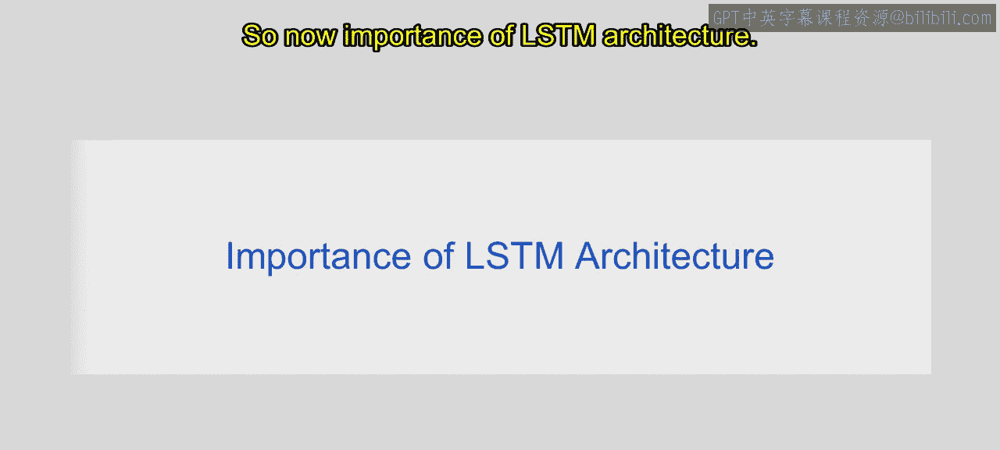
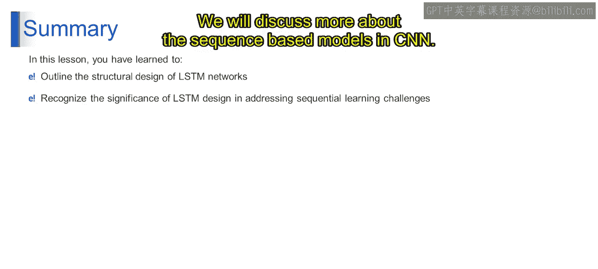

# 第一部分 91：LSTM架构的重要性 🏗️

在本节课中，我们将深入探讨长短期记忆网络架构的重要性。上一节我们介绍了LSTM的基本工作流程，本节中我们来看看其架构设计带来的关键优势。

LSTM架构之所以重要，是因为它提供了多项关键特性，使其在处理序列数据时表现卓越。

以下是LSTM架构的几个核心重要性：

*   **模块化**：LSTM架构提供了模块化特性，使其能够轻松集成到各种神经网络架构中。这种模块化设计使研究人员和开发者能够将LSTM单元融入他们的模型，从而增强了灵活性并便于实验。
*   **克服梯度消失问题**：训练深度神经网络（包括RNN）的一个关键挑战是梯度消失问题，即梯度在反向传播过程中逐层衰减，阻碍了网络对长序列的学习。LSTM架构通过引入专门的门控机制，有效地缓解了这个问题，使网络能够学习并保留长时间跨度内的信息。
*   **选择性记忆**：LSTM网络具备选择性记忆或遗忘先前时间步信息的能力。这种选择性记忆机制使网络能够专注于相关信息，同时丢弃不相关或冗余的数据，从而提高了序列建模任务的效率。
*   **更好的梯度流**：与传统的RNN不同，LSTM架构通过门控连接控制信息流，促进了训练过程中更平滑的梯度流动。LSTM网络保持了更稳定的梯度流，从而在训练过程中实现了更高效的优化和更快的收敛。
*   **多功能性**：LSTM架构具有高度通用性，可应用于广泛的序列数据任务，包括但不限于自然语言处理、语音识别、时间序列预测和序列生成。其对多样化应用的适应性使其成为许多机器学习从业者的首选。
*   **保留长期依赖关系**：LSTM网络擅长捕获和保留序列数据中的长期依赖关系。通过维持一个持久的细胞状态并选择性通过门控更新它，LSTM架构能够有效地捕获跨越多个时间步的时间关系和依赖，这使其非常适合于需要记忆遥远过去事件的任务。

综上所述，LSTM架构提供了多项关键优势，包括模块化、对梯度消失问题的鲁棒性、选择性记忆能力、平滑的梯度流、跨应用的通用性以及保留长期依赖关系的能力。这些特性共同使得LSTM网络在机器学习和人工智能的各种序列数据分析任务中不可或缺。

本节课中我们一起学习了LSTM网络架构的重要性。你已掌握了LSTM的结构组件（包括门和细胞状态），并理解了它们在克服序列学习任务固有挑战中的关键作用。通过理解LSTM设计的意义，你现在已能有效处理序列数据分析，利用其专门架构来捕获和保留长期依赖关系。在下一个模块中，我们将继续讨论CNN中的序列模型。