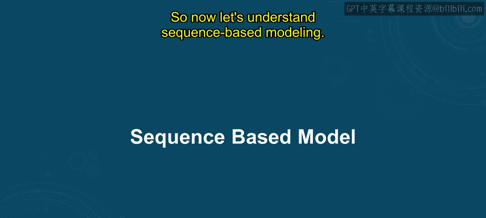
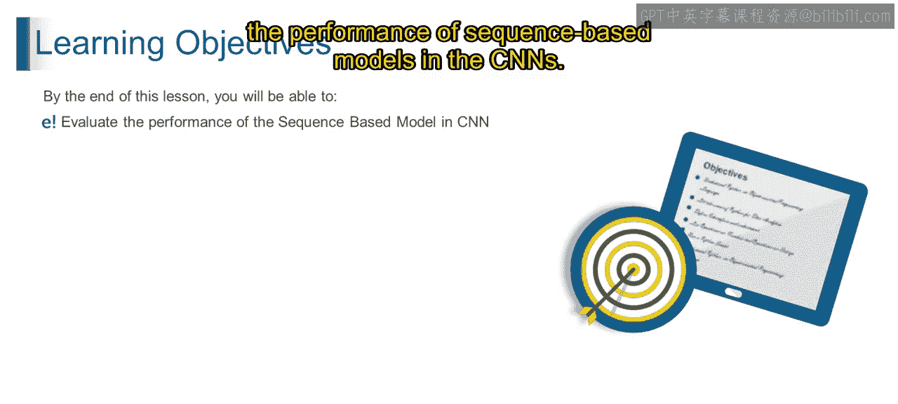
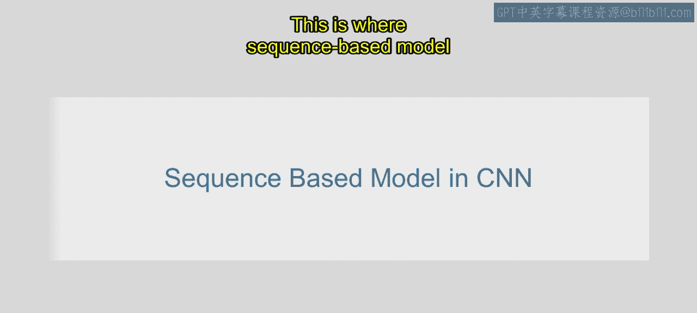
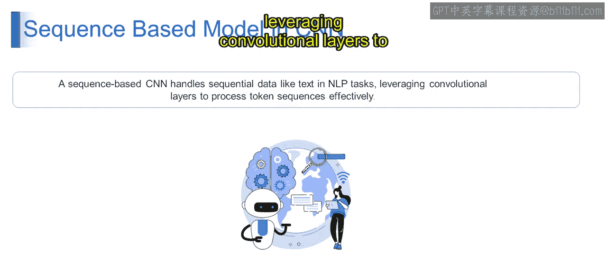

# 第一部分 92：基于序列的模型

在本节课中，我们将要学习卷积神经网络中的基于序列的模型。我们将了解其基本概念、工作原理以及应用场景。

## 概述




上一节我们介绍了机器学习与NLP的基础知识。本节中我们来看看卷积神经网络如何处理序列数据。基于序列的模型扩展了传统CNN架构，使其能够有效分析具有时间或顺序依赖性的输入数据。



## 什么是CNN中的基于序列模型

让我们从一个例子开始理解。假设你有一个任务，需要从图像中分类不同种类的鸟。你决定使用卷积神经网络，这是一种强大的图像分类工具。然而，当分类依据不是单张图像，而是一系列图像序列时，挑战就出现了。这正是CNN中基于序列的模型发挥作用的地方。

例如，你正在使用一系列连续图像追踪鸟类随时间的飞行模式。每张图像代表一个时间点的运动，图像序列捕捉了鸟类的完整运动轨迹。为了准确分类鸟类的飞行姿态，你需要一个能有效分析这些序列图像输入的模型。

从技术上讲，CNN中的基于序列模型扩展了传统CNN架构，以处理序列数据输入。它结合了循环或注意力机制来有效处理输入序列。在上述鸟类分类的例子中，模型会使用卷积层从序列中的每张图像提取特征，然后利用循环或注意力机制来分析连续图像间的时间依赖性。

CNN中的基于序列模型使CNN架构能够适应序列数据处理，使其能够分析跨输入序列的模式和依赖关系。这使其适用于视频分析、时间序列预测和自然语言处理等任务。

以下是一个简单的表示：基于序列的CNN处理如NLP任务中的序列数据，利用卷积层有效处理词元序列。



## 核心概念与表示

基于序列的CNN模型的核心在于将卷积操作应用于序列数据。在自然语言处理中，这通常意味着将文本视为词元序列。

以下是处理文本序列的一个简化代码概念：

```python
# 第一部分 伪代码示例：使用一维卷积处理文本序列
# 第一部分 假设我们有一个词嵌入序列 input_sequence，形状为 [batch_size, sequence_length, embedding_dim]
conv_layer = Conv1D(filters=64, kernel_size=3, activation='relu')
# 第一部分 卷积层在序列长度维度上进行滑动窗口操作，提取局部特征
output_features = conv_layer(input_sequence)
```

其核心思想是公式化地应用卷积运算。对于一维序列（如文本），卷积运算可以表示为：

**输出特征图[位置 i, 过滤器 k] = σ( Σ_{j=0}^{m-1} 权重[k, j] · 输入序列[位置 i+j] + 偏置[k] )**

其中：
*   **σ** 是激活函数（如ReLU）。
*   **m** 是卷积核的大小。
*   **权重[k, j]** 是第k个过滤器在位置j的权重。
*   **输入序列[位置 i+j]** 是输入序列在位置i+j的向量表示。

## 模型特点与应用

基于序列的CNN模型结合了CNN和序列处理的优势。以下是其主要特点：

*   **局部特征提取**：卷积层擅长捕捉序列中的局部模式和n-gram特征。
*   **参数共享**：卷积核在序列上滑动，共享参数，提高了模型的效率。
*   **层次化表示**：通过堆叠多层卷积，模型可以学习到从低级到高级的序列特征。

这种架构适用于多种任务：

1.  文本分类（如情感分析）
2.  序列标注（如词性标注）
3.  机器翻译（作为编码器的一部分）
4.  时间序列预测

## 总结




本节课中我们一起学习了卷积神经网络中的基于序列模型。我们了解到，这种模型通过扩展传统CNN，结合循环或注意力机制，能够有效处理像图像序列、文本或时间序列这样的顺序数据。它利用卷积层提取局部特征，并分析序列元素之间的依赖关系，从而在视频分析、自然语言处理等领域具有广泛的应用前景。在接下来的课程中，我们将进一步深入探讨相关主题。