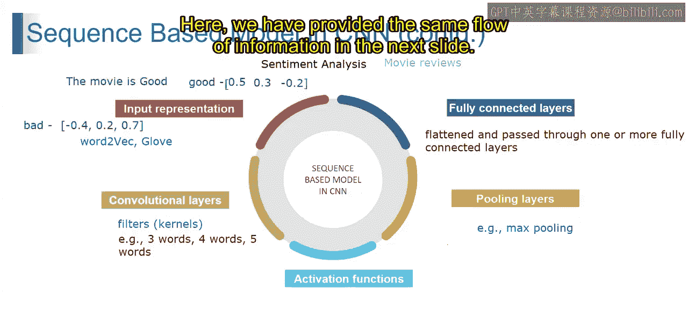

# 第一部分 93：基于序列的CNN模型 🧠

在本节课中，我们将要学习基于序列的卷积神经网络（CNN）在自然语言处理任务中的工作原理。我们将从输入表示开始，逐步了解卷积层、激活函数、池化层和全连接层是如何协同工作，以从文本序列中提取特征并进行预测的。

---

## 概述

上一节我们介绍了CNN的基本概念，本节中我们来看看CNN如何应用于处理序列数据，例如文本。基于序列的CNN通过一系列步骤将文本数据转化为有意义的预测，如情感分析。

## 输入表示

在NLP任务中，文本数据首先需要被转化为模型可以理解的数值形式。以下是处理步骤：

首先，文本被分割成一系列**词元**，可以是单词或字符。每个词元通过如Word2Vec或GloVe等技术，被编码为一个高维空间中的向量。

例如，单词“good”可能被表示为向量 `[0.5, 0.3, -0.2]`，而单词“bad”可能被表示为 `[-0.4, 0.2, 0.7]`。这些**词嵌入**向量捕捉了每个词的语义信息，并作为基于序列的CNN的输入。

## 卷积层

输入表示完成后，下一步是特征提取。这是通过卷积层完成的。

卷积层通过应用**滤波器**（也称为**核**）在输入词元序列上进行滑动操作。每个滤波器学习检测文本数据中的特定特征或模式，并生成**特征图**。

例如，在情感分析中，一个大小为3的滤波器可能会学习检测像“not good”或“very bad”这样的短语模式。

## 激活函数

卷积操作之后，需要引入非线性，使模型能够学习更复杂的关系。这是通过激活函数实现的。

常用的激活函数是**ReLU**（线性整流单元）。它对特征图中的每个元素进行操作，将所有负值置为零。

**公式**：`ReLU(x) = max(0, x)`

这意味着，如果卷积操作的结果是负的，ReLU会将其设置为0，从而有效地只捕捉正向的情感指示特征。

## 池化层

接下来，为了降低数据的维度并保留最重要的信息，我们会使用池化层。

**最大池化**是常用的一种方法。它在每个池化窗口中选择最大值，从而在减少计算复杂度和防止过拟合的同时，保留关键特征。

## 全连接层

最后，经过卷积和池化处理后的特征需要被整合并用于最终预测。

池化层的输出被**展平**成一个长向量，然后传递通过一个或多个**全连接层**。这些层对从输入序列不同部分提取的特征进行高级聚合和转换。

最后一个全连接层通常产生最终的输出预测，例如在分类任务中的类别概率，或在回归任务中的预测值。

## 实例：情感分析

让我们通过一个电影评论情感分析的例子，将上述所有步骤串联起来。

1.  **输入表示**：将句子“The movie is good”中的每个单词转换为词嵌入向量。
2.  **卷积层**：应用不同大小（如3、4、5个词）的滤波器在词嵌入序列上滑动，检测指示情感的短语模式。
3.  **激活函数**：应用ReLU激活函数，引入非线性。
4.  **池化层**：应用最大池化，对特征图进行下采样，保留最显著的特征。
5.  **全连接层**：将池化后的特征展平，通过全连接层进行整合，最终输出一个表示“积极”情感的概率值。

这个架构使模型能够通过识别输入序列内的模式和依赖关系，有效地分析文本数据中的情感。

---

## 总结

本节课中我们一起学习了基于序列的CNN模型。我们了解了文本如何通过词嵌入进行表示，然后经过卷积层提取局部特征，通过ReLU激活函数引入非线性，利用池化层进行下采样以保留关键信息，最后通过全连接层整合特征并做出预测。这种架构是处理文本等序列数据的有力工具。