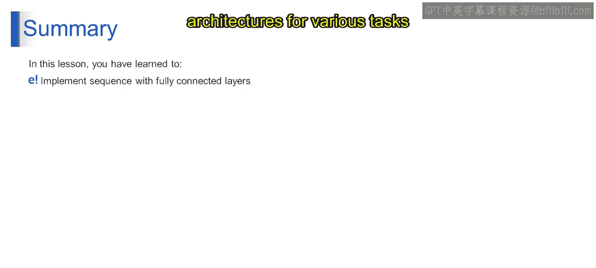

第1：基于序列的CNN模型续篇

在本节课中，我们将继续探讨基于序列的卷积神经网络模型，了解其从输入到输出的完整流程。我们将学习如何利用全连接层构建序列模型，以增强序列数据的特征聚合与预测能力。

上一节我们介绍了序列模型的基本概念，本节中我们来看看一个典型CNN序列模型的具体技术实现步骤。

以下是该技术流程的图示与步骤分解。

首先，模型接收输入数据。输入嵌入层将原始的序列数据（如文本中的单词）转换为密集的向量表示。这一步的数学表示可简化为一个查找操作：`E = Embedding_Lookup(X)`，其中`X`是输入序列，`E`是得到的嵌入矩阵。

接着，卷积层对嵌入后的序列进行特征提取。它使用多个滤波器在序列上滑动，以捕获局部模式。其核心操作是卷积计算，公式可表示为：`Z = conv1d(E, W) + b`，其中`W`是滤波器权重，`b`是偏置项。

然后，激活函数（如ReLU）被应用于卷积层的输出，引入非线性，使模型能够学习更复杂的模式。代码表示为：`A = relu(Z)`。

之后，池化层（通常是最大池化或平均池化）对激活后的特征图进行下采样，减少参数数量并提取最显著的特征。操作可表示为：`P = max_pool1d(A)`。

最后，根据具体任务（分类或回归），模型将池化后的特征展平并送入全连接层进行最终预测。对于分类任务，这通常涉及一个softmax函数：`Output = softmax(FC(Flatten(P)))`。

本节课中我们一起学习了构建基于序列的CNN模型的完整流程，包括输入嵌入、卷积、激活、池化以及最终的分类或回归步骤。你已掌握了利用全连接层构建序列模型的能力，这能促进对序列数据的分析，并增强特征聚合与预测功能。这些知识使你能有效地实现并利用基于序列的架构，应对各种需要序列数据分析的任务。