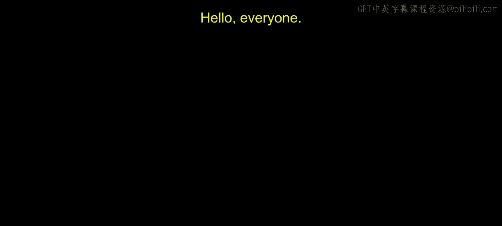
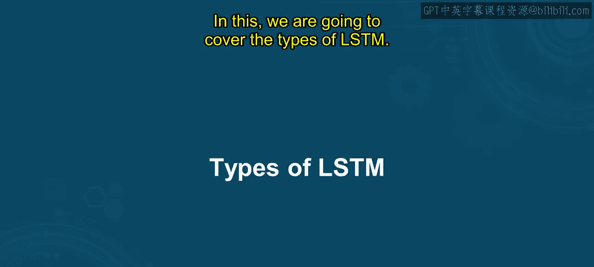
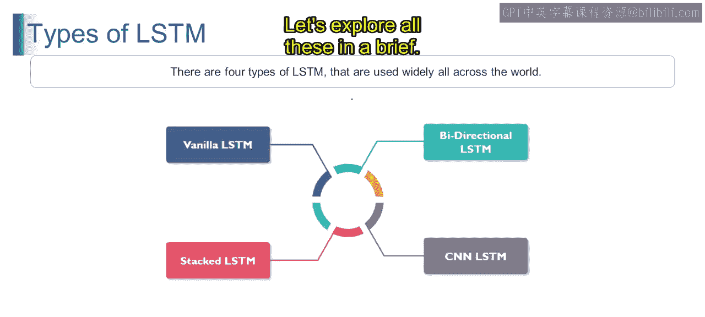
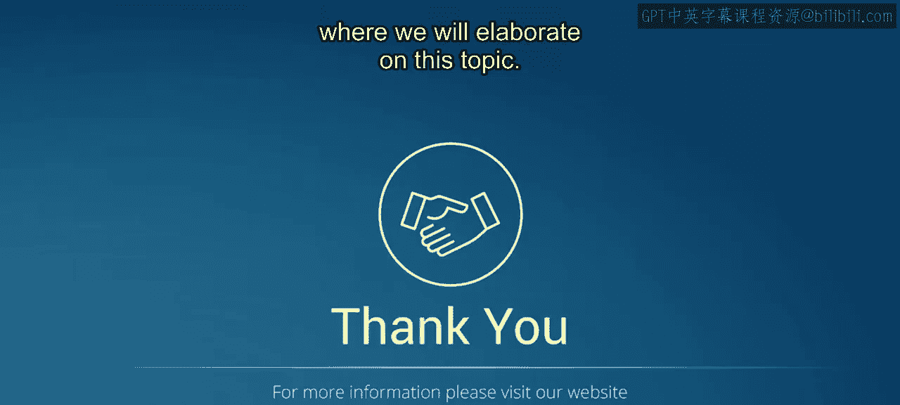

# 第一部分 95：LSTM的类型



在本节课中，我们将学习长短期记忆网络的不同类型。通过本节内容，你将能够识别并描述各种LSTM架构及其应用场景。

---



## 概述

长短期记忆网络是处理序列数据的重要工具。为了应对不同的任务需求，LSTM发展出了多种变体。接下来，我们将逐一探讨四种广泛使用的LSTM类型：标准LSTM、堆叠LSTM、双向LSTM以及CNN-LSTM。

---

## 标准LSTM

标准LSTM是长短期记忆网络最基本的形式。它由单个LSTM层构成，用于处理输入序列并维持一个细胞状态以捕获长期依赖关系。该结构通过输入门、遗忘门和输出门来调控信息流。

**核心概念**：一个标准的LSTM层可以抽象为处理序列并输出隐藏状态的过程。
```python
# 第一部分 伪代码示例：单层LSTM
lstm_layer = LSTM(units=128) # 定义一个具有128个单元的LSTM层
output = lstm_layer(input_sequence) # 处理输入序列
```

例如，在预测序列中下一个单词的任务中，标准LSTM会将单词序列作为输入，并输出下一个单词的概率分布。

---

## 堆叠LSTM

上一节我们介绍了基础的单层LSTM，本节中我们来看看更复杂的堆叠LSTM。堆叠LSTM涉及将多个LSTM层堆叠在一起。

**核心概念**：堆叠LSTM由多个LSTM层垂直堆叠而成，每一层接收前一层的输出作为输入，并将其输出传递给下一层，从而使模型能够学习输入数据的层次化表示。
```python
# 第一部分 伪代码示例：堆叠LSTM
model = Sequential()
model.add(LSTM(units=128, return_sequences=True)) # 第一层，返回序列以供下一层使用
model.add(LSTM(units=64)) # 第二层
```

继续之前的例子，一个用于预测下一个单词的堆叠LSTM可能包含多个LSTM层，每一层捕获输入序列越来越抽象的表示。

---

## 双向LSTM

理解了堆叠结构后，我们再来看看另一种能够捕获更丰富上下文信息的架构——双向LSTM。双向LSTM同时在正向和反向两个方向上处理输入序列。

**核心概念**：双向LSTM由两个独立的LSTM层组成。一层按时间顺序（正向）处理序列，另一层按时间逆序（反向）处理序列。最终的输出通常是这两个方向输出的结合。
```python
# 第一部分 伪代码示例：双向LSTM
model = Sequential()
model.add(Bidirectional(LSTM(units=128), input_shape=(timesteps, features)))
```

例如，在分析一段文本的情感时，双向LSTM会同时考虑每个单词之前和之后的词语，以理解其周围的完整上下文。

---

## CNN-LSTM

最后，我们来看一种结合了不同神经网络优势的混合架构：CNN-LSTM。它将卷积神经网络与LSTM网络相结合，利用CNN进行特征提取，并利用LSTM进行序列建模。

**核心概念**：CNN-LSTM先使用CNN层从输入中提取空间或局部特征，然后将这些特征序列输入到LSTM层中，以捕获时间上的依赖关系。
```python
# 第一部分 伪代码示例：CNN-LSTM（用于视频帧序列）
model = Sequential()
model.add(TimeDistributed(Conv2D(...))) # 对每一帧图像应用CNN
model.add(TimeDistributed(Flatten())) # 展平特征
model.add(LSTM(units=128)) # LSTM层处理时间序列
```

例如，在视频分类任务中，CNN-LSTM模型可能使用CNN层从每一帧中提取空间特征，然后使用LSTM层来捕获帧与帧之间的时间依赖性。

---

## 总结



本节课中我们一起学习了四种主要的LSTM架构。标准LSTM是基础的单层模型。堆叠LSTM通过叠加多层来学习层次化特征。双向LSTM通过双向处理捕获更全面的上下文。CNN-LSTM则融合了CNN的空间特征提取能力和LSTM的时间序列建模能力。这些架构为不同的序列数据分析任务提供了灵活且可扩展的解决方案。



在下一个视频中，我们将更详细地探讨这些主题。