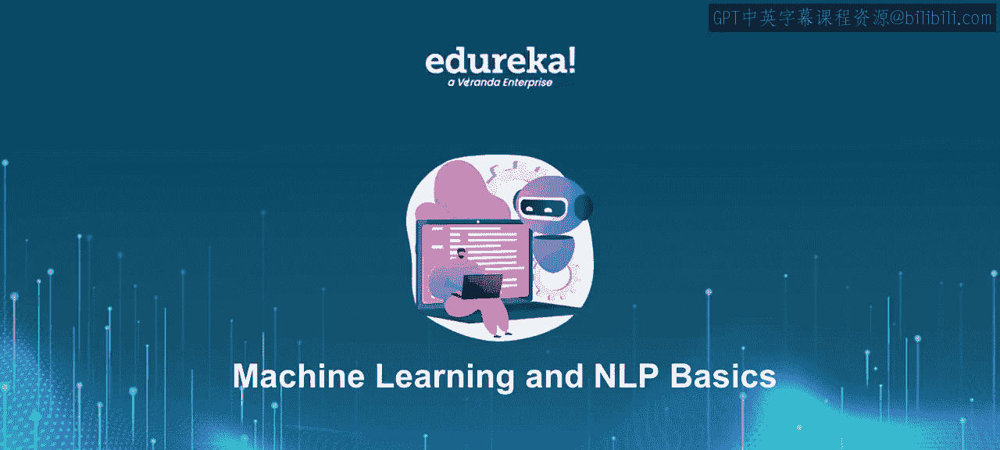
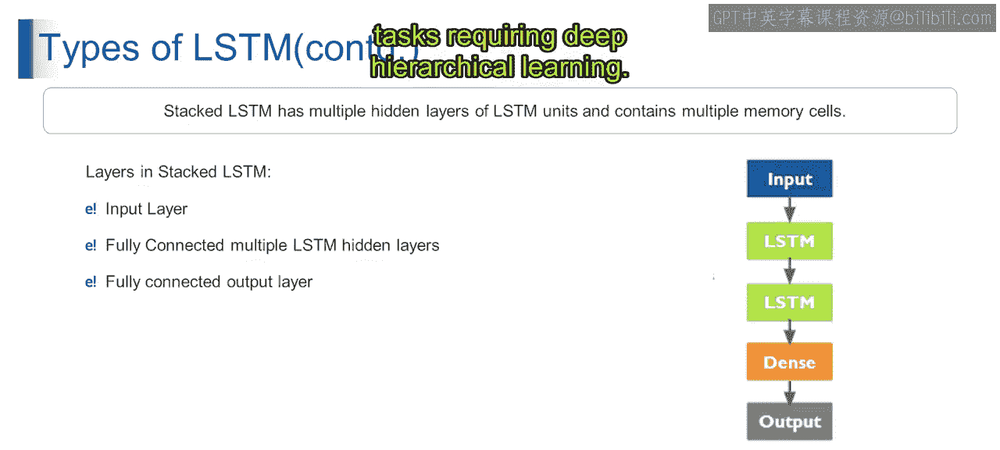

# 第一部分 96：普通LSTM与堆叠LSTM 🧠

在本节课中，我们将要学习两种重要的循环神经网络变体：普通LSTM和堆叠LSTM。我们将探讨它们的基本架构、工作原理以及在处理序列数据（如文本或时间序列）时的应用。理解这两种结构是掌握更复杂深度学习模型的基础。

---

## 普通LSTM

上一节我们介绍了循环神经网络的基本概念，本节中我们来看看其一种强大的变体——长短期记忆网络（LSTM）。普通LSTM是一种标准架构，专门设计用于解决长期依赖问题。

普通LSTM的第一层是输入层。该层接收输入数据，这些数据通常表示为序列数据。例如，在自然语言处理任务中，它接收一个句子中单词的编码表示；在时间序列分析中，它接收一系列按时间排序的数据点。

以下是普通LSTM的核心组件：

*   **全连接LSTM隐藏层**：这是普通LSTM的核心组件，由按顺序排列的LSTM单元组成。每个LSTM单元处理输入序列，更新其内部状态（即细胞状态和隐藏状态），并将信息传递到下一个时间步。例如，在情感分析中，每个LSTM单元可能分析句子中的一个单词，并根据迄今为止看到的单词上下文更新其内部状态。
*   **全连接层（密集层）**：该层接收LSTM隐藏层的输出。它的作用是聚合LSTM隐藏层学习到的特征，并产生最终的预测或输出。
*   **输出层**：输出层接收来自密集层（或最后一个LSTM隐藏层）的输出，并根据具体任务产生最终预测。输出层可能有不同的配置。例如，在分类任务中，对于多类分类，它可能包含一个Softmax激活单元；对于二分类，则可能包含一个单一的Sigmoid单元。

从技术上讲，普通LSTM的架构包括：一个接收序列数据的输入层、一个由LSTM单元组成的全连接LSTM隐藏层（用于处理序列并更新内部状态）、一个用于聚合隐藏层特征的密集层，以及一个基于学习到的特征产生最终预测的全连接输出层。这种架构适用于各种序列数据任务，并构成了更复杂LSTM架构的基础。

---

## 堆叠LSTM

理解了单层LSTM后，我们进一步探讨其更强大的扩展形式。堆叠LSTM通过叠加多个LSTM层，使模型能够学习输入序列中更深层次、更抽象的特征。

想象一下，你正在尝试预测一个序列中的下一个单词。堆叠LSTM允许你在多个抽象级别上分析句子。例如，第一层可能捕获基本的单词关联，而第二层则学习跨单词序列的更复杂模式。

以下是堆叠LSTM的层次结构：

*   **输入层**：与普通LSTM类似，输入层接收序列数据，例如单词序列或时间序列数据。在我们的文本预测任务示例中，输入层接收句子中单词的编码表示。
*   **多个全连接LSTM隐藏层**：堆叠LSTM包含多个LSTM单元的隐藏层，每个层处理输入序列并将其输出传递给下一层。每个隐藏层捕获输入序列越来越抽象的表示，使模型能够学习分层特征。例如，在文本预测中，堆栈中的每个LSTM层可能专注于语言的不同方面，如语法、语义或上下文。
*   **密集层**：该层用于聚合来自多个LSTM层的所有特征。
*   **输出层**：与普通LSTM类似，输出层接收最后一个LSTM层或密集层的输出，并产生最终输出。在我们的文本预测任务中，输出层生成词汇表上的概率分布，以预测序列中的下一个单词。

堆叠LSTM层由多个相互堆叠的LSTM单元层组成。每一层处理输入序列，捕获分层表示，并将其输出传递给下一层。最终的输出层基于学习到的特征产生预测。这种架构使模型能够学习序列数据中复杂的模式和依赖关系，适用于需要深度分层学习的任务。

---

## 双向LSTM简介

在探讨了堆叠的深度之后，我们再来看看另一种增强模型上下文理解能力的方法。接下来我们将简要介绍双向LSTM。

请关注下一个视频，我们将在其中详细阐述这个主题。

---

## 总结

本节课中我们一起学习了两种关键的LSTM架构。我们首先剖析了**普通LSTM**的组成，包括其输入层、核心的LSTM隐藏层、用于特征聚合的密集层以及最终产生预测的输出层。随后，我们探讨了更强大的**堆叠LSTM**，它通过叠加多个LSTM隐藏层来学习序列数据中更深层次、更抽象的分层特征，从而能够捕获更复杂的模式。理解这些基础架构是迈向掌握更高级序列模型（如即将介绍的双向LSTM）的重要一步。