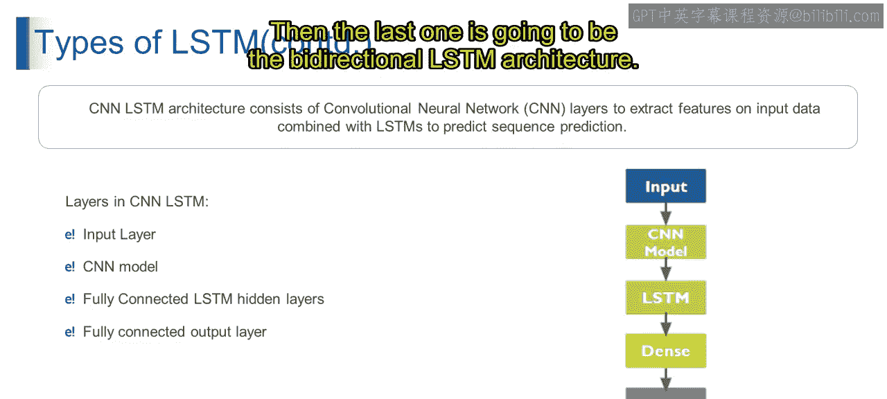

# 第一部分 97：卷积神经网络LSTM 🧠

在本节课中，我们将学习一种结合了卷积神经网络（CNN）和长短期记忆网络（LSTM）的混合架构。这种架构特别适用于处理同时具有空间和时序依赖性的数据，例如视频分析。我们将逐步拆解其工作原理和各个组成部分。

## 概述

上一节我们介绍了CNN和LSTM的基本概念。本节中，我们将探讨如何将两者结合，形成CNN-LSTM架构，以处理像视频分类这样的复杂任务。这种架构先用CNN提取每一帧图像的空间特征，再用LSTM分析这些特征在时间序列上的依赖关系。

## CNN-LSTM架构详解

以下是CNN-LSTM模型的主要层次结构及其功能。

### 输入层

输入层负责接收序列数据。在视频分类任务中，输入数据通常是一系列按时间戳排列的图像帧。例如，一个视频片段可以被表示为帧的序列 `[frame_1, frame_2, ..., frame_n]`。

### CNN层

CNN层负责从每个输入帧中提取空间特征。这些层通过卷积运算来捕获图像中的模式，例如边缘、纹理和物体形状。

在视频分类任务中，CNN层会分析每一帧，识别出重要的视觉特征，如物体、动作和背景。其核心操作可以简化为以下公式：
`特征图 = 卷积(输入帧, 卷积核) + 偏置`

### LSTM层

在使用CNN层提取出空间特征后，输出会被传递到LSTM层。这些层专门用于分析帧与帧之间的时序依赖性，并捕获序列中的长期关系。

在我们的视频分类示例中，LSTM层会分析一系列空间特征，以理解随着时间推移发生的动作序列和运动模式。其核心计算涉及细胞状态 `C_t` 和隐藏状态 `h_t` 的更新。

### 全连接层（Dense Layer）

与常规神经网络类似，全连接层用于聚合从前面所有层（CNN和LSTM）学习到的特征。它将高维特征映射到更适合最终预测任务的维度。

### 输出层

来自LSTM层和全连接层的输出被传递到一个全连接的输出层。该层基于学习到的特征和时序依赖性，产生最终的预测结果。

在视频分类任务中，输出层会预测输入视频序列所关联的动作或类别。例如，使用 `softmax` 激活函数进行多分类：
`预测类别 = softmax(权重 * 特征 + 偏置)`

## 架构优势与应用

从技术上讲，CNN-LSTM架构结合了用于空间特征提取的CNN层和用于序列建模的LSTM层。CNN层从输入数据中提取空间特征，然后由LSTM层进行分析以预测序列输出。

这种架构非常适合处理涉及空间和时序依赖性的序列数据任务，例如：
*   视频分类
*   动作识别
*   手势识别

## 总结

本节课我们一起学习了CNN-LSTM混合架构。我们了解到，该架构首先利用CNN处理图像的空间信息，然后通过LSTM捕捉这些信息在时间维度上的变化。这种设计使其成为处理视频等时空序列数据的强大工具。下一节，我们将探讨双向LSTM架构。