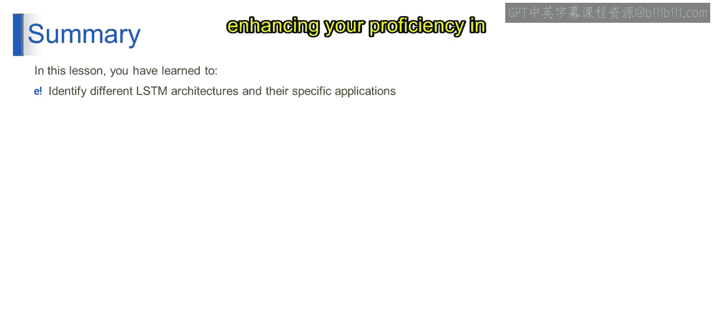

# 第一部分 98：双向LSTM 🧠

在本节课中，我们将要学习双向长短期记忆网络（Bidirectional LSTM）。这是一种强大的循环神经网络架构，专门用于处理和理解序列数据。我们将探讨其工作原理、核心组件以及它在自然语言处理等任务中的应用。

上一节我们介绍了基础的LSTM结构，本节中我们来看看如何通过结合两个方向的LSTM来增强模型对上下文的理解能力。

## 双向LSTM的概念

双向LSTM的名称本身就指明了其核心特性。它通过同时从两个方向处理输入序列来捕获更全面的上下文信息。

想象一下，你在阅读一个句子时，不仅从左到右理解，也从右到左思考。双向LSTM正是如此，它同时向前（从左到右）和向后（从右到左）处理输入序列，以捕获来自两个方向的上下文信息。

## 双向LSTM的架构

以下是双向LSTM网络的主要层次结构：

**输入层**
输入层接收序列数据，例如句子中的单词序列。在我们的文本理解任务中，输入层接收一个单词序列。

**前向LSTM层**
前向LSTM从左到右处理输入序列，捕获正向的上下文信息。在文本理解任务中，前向LSTM从句子开头到结尾分析单词序列。

**后向LSTM层**
后向LSTM从右到左处理输入序列，捕获反向的上下文信息。

**密集层（全连接层）**
密集层将来自前向和后向LSTM的合并输出整合并转换为所需的输出格式，这本质上就是输出层。在文本理解任务中，输出层结合两个方向的信息来进行预测或提取与任务相关的特征，例如识别所提供句子的情感。

## 工作原理示例

让我们以句子“The cat sat on the mat”为例。
*   前向LSTM从左到右读取，依次处理每个单词，捕获正向的上下文信息。
*   后向LSTM则从右到左分析句子，以相反的顺序捕获上下文信息，即从“mat”开始，然后是“the”、“on”、“sat”、“cat”、“The”。

通过这种方式，前向和后向LSTM协同工作。

## 技术实现与优势

从技术上讲，双向LSTM由两个LSTM层组成：一个按正向（左到右）处理输入序列，另一个按反向（右到左）处理。这种架构允许模型从两个方向捕获上下文信息，从而增强了其理解和分析序列数据的能力。

两个方向的输出通常会被合并，然后传递给密集层或全连接输出层，以进行进一步的处理或预测。

## 应用场景

双向LSTM通常用于理解过去和未来输入上下文都至关重要的任务中，例如：
*   机器翻译
*   情感分析
*   命名实体识别

本节课中我们一起学习了双向LSTM。你了解了其通过结合前向和后向处理来捕获更丰富上下文信息的核心思想，认识了其网络架构中的各个层次，并知道了它在多种序列数据分析任务中的典型应用。掌握这种架构有助于你为特定任务选择和运用最合适的LSTM变体。

谢谢。