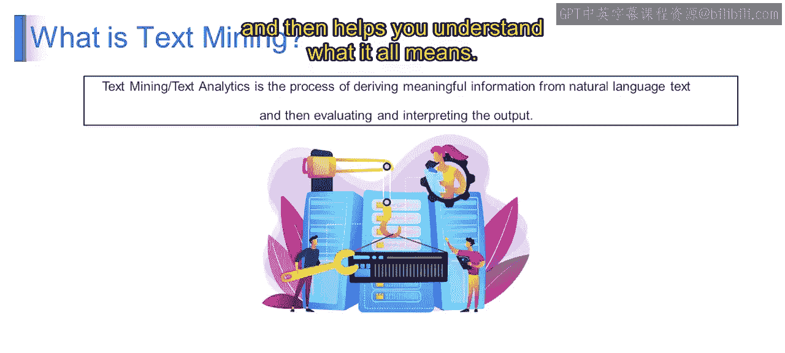

# 第一部分 99：文本挖掘入门 🧠

在本节课中，我们将学习文本挖掘的基本概念，并了解它如何作为自然语言处理的基础。通过本节内容，你将能够分析文本挖掘的核心原理，并理解NLP如何支持从文本中提取信息。

---

## 什么是文本挖掘？

上一节我们介绍了课程的整体框架，本节中我们来看看文本挖掘的具体定义。

文本挖掘可以理解为从海量文本数据中筛选出有用信息的过程。想象你面前有一大堆文档，比如文章、书籍或社交媒体帖子，你需要从中找到有价值的内容，这正是文本挖掘的用武之地。

文本挖掘就像一个超级智能的助手，它能为你阅读和理解所有这些文本。其核心是**从非结构化的文本数据中分析和提取有价值信息的过程**。

为了更清晰地说明，我们来看一个简单的例子。

假设你有一堆关于某产品的客户评价，有人说它很棒，有人说一般，也有人说很糟糕。在这种情况下，文本挖掘能帮助你通读所有评价，理解人们的观点，甚至将它们分类为**积极**、**中性**或**消极**的情感。

---

## 文本挖掘的技术视角

理解了基本概念后，让我们深入一点，从技术角度看看文本挖掘。

文本挖掘是从大量非结构化文本数据中提取有意义信息和洞察的过程。它涉及使用计算机算法和自然语言处理技术来分析文本，从而揭示其中的**模式**、**趋势**和**有价值的知识**。

再次举例，假设你拥有电子邮件、文章或社交媒体帖子等文本数据。文本挖掘（或称文本分析）就像一个超级智能的工具，帮助你理解所有这些文本。

以下是文本挖掘通常遵循的步骤：

首先，它通读文本并提取重要部分，例如识别**关键词**、**短语**和**模式**。

然后，它分析所有这些信息以理解其含义。例如，对于之前提到的产品评价集合，文本挖掘会逐一检查每条评价，提取出人们是喜欢还是讨厌该产品等细节。

分析完成后，文本挖掘工具帮助你解读结果。这意味着理解数据所传达的信息，例如找出趋势、识别共同主题，甚至根据发现的参数预测未来结果。

简单来说，文本挖掘就像一个智能助手，它能阅读大量文本，找出重要内容，然后帮助你理解所有这些信息的含义。

---

## 总结

本节课中，我们一起学习了文本挖掘的基础知识。我们了解到，文本挖掘是从非结构化文本中提取有价值信息的自动化过程，它利用NLP技术来识别模式、趋势和洞察。这为后续深入学习自然语言处理和大型语言模型奠定了重要基础。请继续关注下一个视频，我们将进一步详细探讨这个话题。