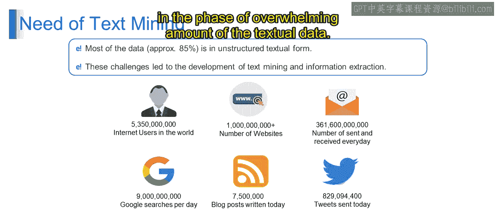
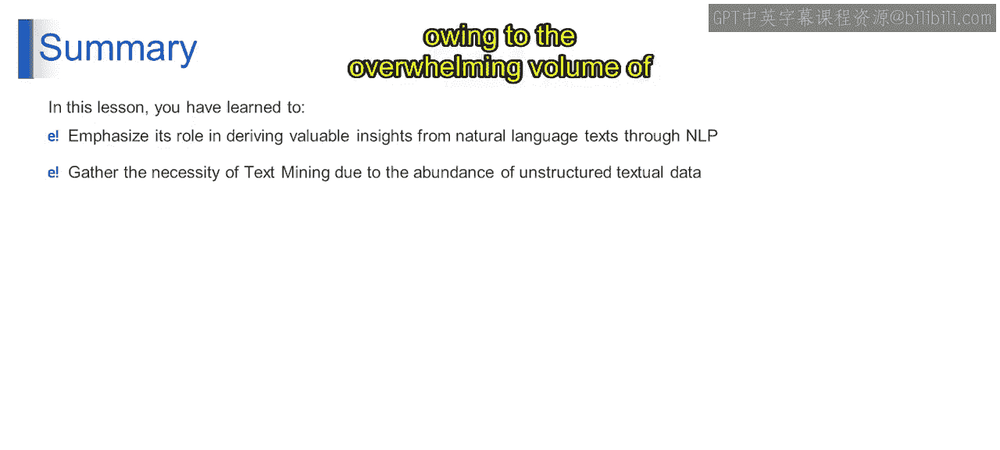

# 第一部分 100：文本挖掘的需求与自然语言处理（NLP）简介

在本节课中，我们将要学习文本挖掘为何至关重要，并初步了解自然语言处理（NLP）的基本概念。我们将从数据现状出发，探讨处理海量文本信息的需求，并理解NLP如何帮助计算机理解和处理人类语言。

---

## 文本挖掘的需求 📊

上一节我们讨论了数据的演变，本节中我们来看看文本挖掘的必要性。

据统计，当今可用数据中约85%是以非结构化的文本形式存在的。这意味着绝大多数数据，如电子邮件、社交媒体帖子、文章、博客等，并不像数据库那样规整地存储在行和列中。这种数据形式给传统的数据分析方法带来了挑战。

正是这些挑战催生了文本挖掘和信息提取技术的发展。面对海量的非结构化文本数据，传统分析方法难以高效提取有意义的见解。文本挖掘技术应运而生，旨在自动化地从文本数据中提取有价值的信息。

以下是几个具体数据示例，用以说明文本数据的规模：

*   **53.3亿互联网用户**：全球数十亿人每日访问互联网并生成内容，持续产生海量文本数据，包括社交媒体帖子、在线文章乃至电子邮件。
*   **超过10亿个网站**：互联网充斥着包含海量文本内容的网站。每个网站都可能包含文章、博客、论坛、产品描述等，进一步增加了非结构化文本数据的丰富性。
*   **每日收发3196亿封电子邮件**：电子邮件是个人和职业场景中重要的文本数据来源。分析电子邮件可以提供关于客户反馈、市场趋势和沟通模式的宝贵见解。
*   **每日90亿次谷歌搜索**：每次谷歌搜索都会以搜索查询、搜索结果和用户互动的形式生成文本数据。分析这些数据可以揭示用户行为趋势、热门话题和新兴兴趣。
*   **每日撰写75.75万篇博客文章**：博客是个人和组织分享观点、专业知识和信息的常见平台。分析博客文章有助于识别影响者、监测行业趋势并理解消费者偏好。
*   **每日发送8299.44万条推文**：Twitter每日产生海量的短文本消息，即推文。分析推文可以提供关于公众舆论、情绪趋势和讨论中新兴话题的实时洞察。

各种在线平台上非结构化文本数据的指数级增长，凸显了文本挖掘的必要性。基于这些例子，我们可以理解，文本挖掘技术使组织能够在面对海量文本数据时，提取有价值的见解、检测模式并做出明智决策。

---

## 什么是自然语言处理（NLP）？ 🤖

了解了处理文本数据的迫切需求后，本节我们来具体看看实现这一目标的核心技术——自然语言处理。

**NLP** 即自然语言处理。我们可以通过一个实际例子来理解：想象有一个计算机程序，能够理解并使用人类语言（如英语、西班牙语甚至印地语）进行工作。这正是NLP的目标所在。NLP是人工智能的一个分支，专注于教会计算机以对我们有意义的方式来理解、解释和生成人类语言。

例如，当你在谷歌这类搜索引擎中输入一个问题时，NLP帮助搜索引擎理解你的问题并找到相关结果。简而言之，NLP就是关于**教会计算机像我们一样理解和处理人类语言**。

基于以上定义，自然语言处理能够分析文本数据，从中发掘宝贵的见解。通过运用计算技术，NLP从书面语言中提取有意义的信息。这包括以下任务：

*   **情感分析**
*   **命名实体识别**
*   **文本摘要**

最终，NLP有助于理解和解释人类语言，并应用于机器翻译、聊天机器人等多种场景。

---

## 总结 📝

本节课中，我们一起学习了自然语言处理如何促进从文本数据中提取有意义的见解，并且认识到了由于可用非结构化文本数据量巨大，文本挖掘已成为一项迫切需求。NLP作为桥梁，使计算机能够处理和理解我们的语言，从而解锁海量文本数据中的价值。