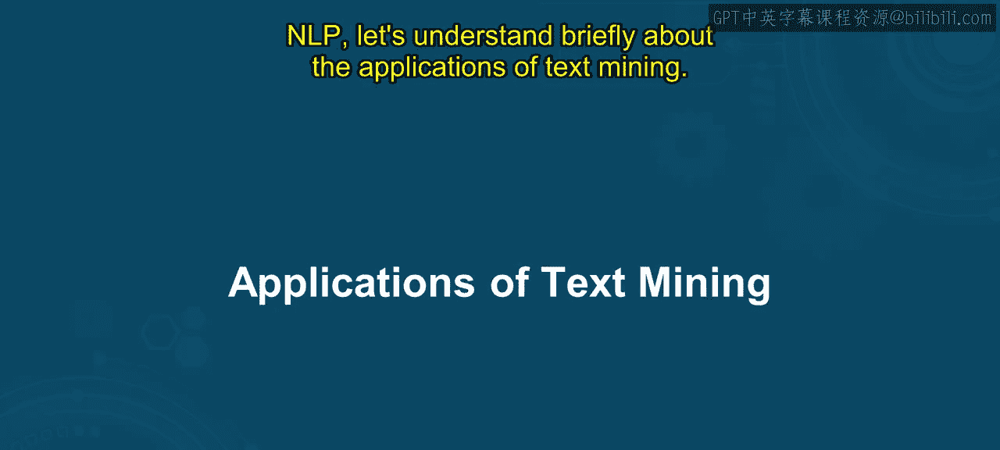
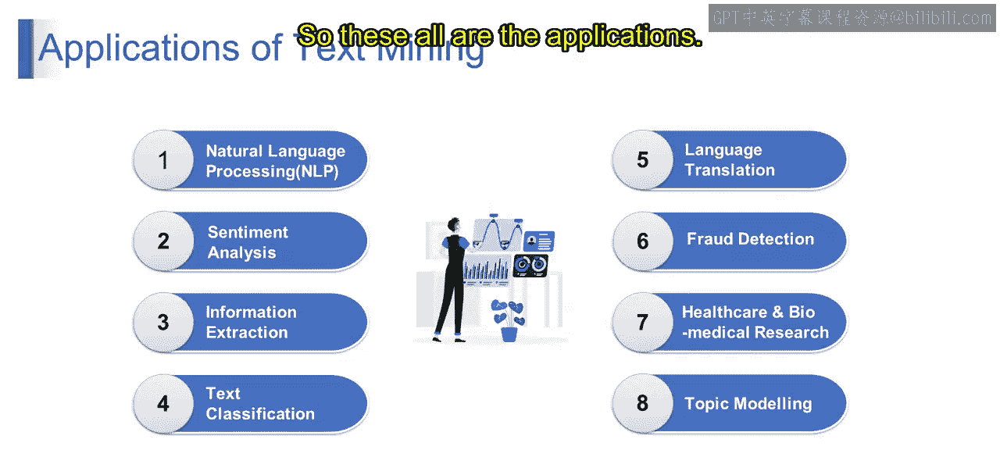
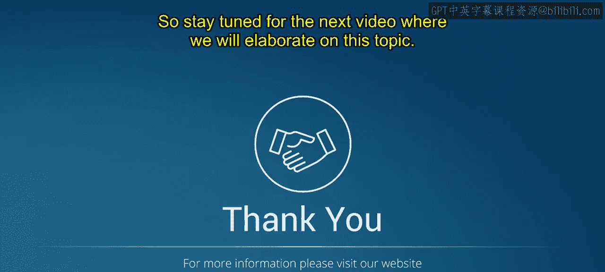

# 第一部分 101：文本挖掘的应用

在本节课中，我们将学习文本挖掘的各种实际应用。我们将逐一探讨自然语言处理、情感分析、信息提取等核心应用领域，并了解它们如何在不同行业中发挥作用。

---

## 概述

上一节我们介绍了文本挖掘和自然语言处理的基本概念。本节中，我们来看看文本挖掘的具体应用。我们将涵盖从虚拟助手到医疗研究的多个领域，并比较不同应用的特点。通过学习，你将能够探索文本挖掘在各行各业的多样化应用，并掌握如情感分析等关键技术。

---

## 自然语言处理

想象你有一个像Siri或Alexa这样的虚拟助手，它能理解并响应你的语音命令。这就是NLP的实际应用，即计算机理解人类语言。

从技术上讲，**自然语言处理**是人工智能的一个领域，专注于教会计算机以对我们有意义的方式去理解、解释和生成人类语言。它涉及诸如文本解析、词性标注和命名实体识别等任务。

---

## 情感分析

当你看到一条电影评论写着“我爱这部电影”时，情感分析会将其识别为积极情感。类似地，“我讨厌这项服务”则会被识别为消极情感。

**情感分析**是一种文本挖掘技术，用于确定一段文本所表达的情感是积极、消极还是中性。它通过分析语言和上下文来理解文本的情感基调。

---

## 信息提取

假设你收到一封确认航班预订的电子邮件，信息提取技术可以帮助识别关键细节，如起飞时间、目的地和航班号。

**信息提取**是从非结构化或半结构化文本源中自动提取结构化信息的过程。它涉及识别和提取特定的信息片段，例如姓名、日期和地点。

---

## 文本分类

例如，电子邮件垃圾邮件过滤器会根据邮件内容，将收到的邮件分类为垃圾邮件或非垃圾邮件，从而帮助保持收件箱的整洁。

从技术上讲，**文本分类**是将文本文档归类到预定义类别中的任务。它涉及训练一个模型来识别文本中的模式，并分配适当的标签或类别。

---

## 语言翻译

像谷歌翻译这样的在线翻译服务，可以帮助将文本从一种语言翻译成另一种语言，从而实现使用不同语言的人们之间的交流。

**语言翻译**涉及将文本从一种语言自动转换为另一种语言，同时保留其含义和上下文。它依赖于NLP技术来理解输入文本并生成目标语言的准确翻译。

---

## 欺诈检测

例如，银行使用文本挖掘来分析客户交易，并通过识别可疑模式或异常来检测欺诈活动。

**欺诈检测**涉及使用文本挖掘技术来分析文本数据（如金融交易、电子邮件或客户互动），以识别欺诈行为或可疑活动。

---

## 医疗与生物医学研究

例如，文本挖掘在医疗保健领域用于分析医疗记录和研究论文，以识别疾病的模式、趋势和潜在治疗方法。

在健康和生物医学研究中，文本挖掘被应用于分析大量文本数据，如医学文献、患者记录和临床试验报告，以提取有价值的见解，从而改善患者护理和推动医学知识进步。

---

## 主题建模

想象你有一个新闻文章集合，主题建模可以帮助识别所有文章中讨论的主要主题或议题，例如政治、体育或娱乐。

**主题建模**是一种文本挖掘技术，用于发现文档集合中存在的抽象主题或议题。它识别经常共同出现的词簇，并将它们分配到不同的主题中。

---

## 应用总结

通过理解以上内容，我们可以看到文本挖掘在各个领域都有多样化的应用：从理解人类语言和情感，到提取有价值的信息、分类文本、实现语言翻译、检测欺诈、推动健康研究，以及在大型文档集合中识别主题。

---

## 总结

本节课中，我们一起学习了文本挖掘的八大核心应用。每个应用都通过具体的例子和定义进行了阐述，帮助我们理解技术如何解决实际问题。这些应用展示了文本挖掘在连接人类语言与计算机智能方面的强大能力。

请继续关注下一个视频，我们将对此主题进行更详细的阐述。