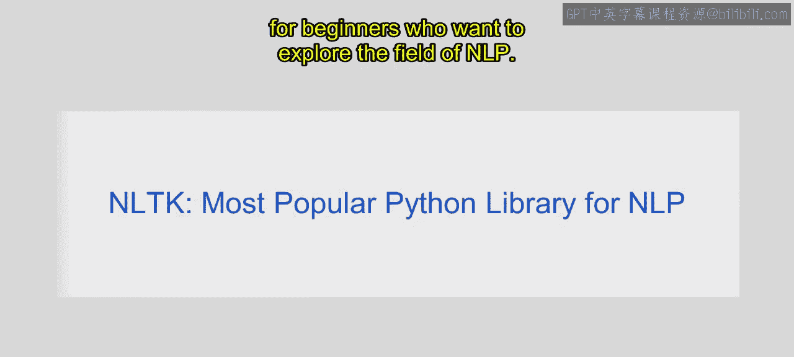
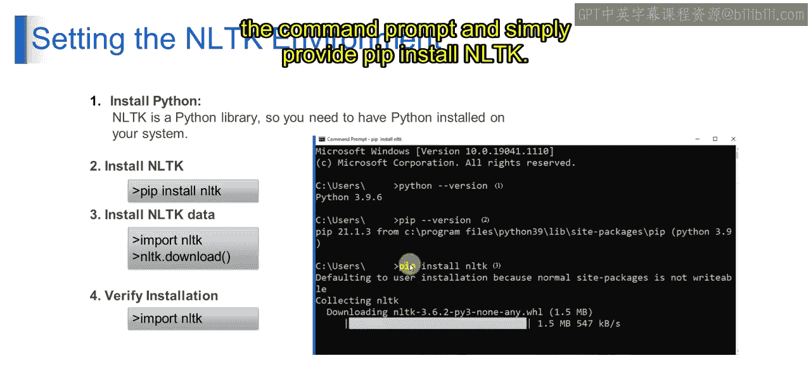

# 第一部分 103：设置NLTK环境 🛠️


在本节课中，我们将学习如何为自然语言处理任务设置NLTK环境。我们将涵盖安装NLTK库以及下载其必要数据包的具体步骤。


## 概述

NLTK，即自然语言工具包，是一个功能强大的Python库，专门用于处理人类语言数据，也就是自然语言处理。它提供了易于使用的接口和工具，用于执行分词、词干提取、词性标注、句法分析等任务。NLTK被语言学、数据科学、机器学习和人工智能等领域的研究人员、学生和专业人士广泛使用。

## 为什么需要NLTK？

处理人类语言数据本身就很复杂。与表格中的数值等结构化数据不同，自然语言文本是非结构化的，且常常具有歧义。NLTK提供了一套全面的工具和资源来处理、分析和理解自然语言文本。它简化了文本预处理、特征提取和建模等任务，使开发者和研究人员更容易构建NLP应用程序并进行实验。

此外，NLTK也是一个学习NLP概念和技术的教育资源。它提供了广泛的文档、教程、示例和数据集，是初学者探索NLP领域的理想起点。

## 设置NLTK环境

上一节我们介绍了NLTK的基本概念和重要性，本节中我们来看看如何具体设置NLTK环境。以下是设置步骤：

### 第一步：安装Python

要设置NLTK环境，首先需要安装Python。NLTK是一个Python库，因此您的系统上必须先有Python。如果您已经按照上一课的内容安装了Anaconda，那么Python应该已经包含在您的Anaconda发行版中了。如果没有，您可以从Python官方网站单独下载并安装。

### 第二步：安装NLTK库

NLTK不包含在标准的Python安装中，因此需要单独安装。您可以使用Python包管理器Pip来安装，运行以下命令：



```bash
pip install nltk
```

如果您使用的是Anaconda，也可以在Anaconda Prompt或终端中运行：

```bash
conda install nltk
```

您可以使用以上任一命令进行安装。

### 第三步：下载NLTK数据包

NLTK附带各种数据集和资源（如语料库、分词器、词干提取器等），这些数据包需要单独下载。安装完NLTK库后，您需要在Python环境中下载这些数据。

以下是下载数据包的方法：

1.  在Python交互式环境或脚本中，导入NLTK。
2.  调用 `nltk.download()` 函数。这会打开一个图形化下载管理器，您可以在其中选择需要的数据包进行下载。

例如，在Python中执行：

```python
import nltk
nltk.download()
```

运行上述代码会弹出一个下载器窗口。对于初学者，建议下载“popular”集合，它包含了最常用的数据包。



## 总结


本节课中，我们一起学习了如何为自然语言处理项目设置NLTK环境。我们首先了解了NLTK库的作用和必要性，然后逐步完成了Python的确认安装、NLTK库的安装以及核心数据包的下载。正确设置环境是开始进行任何NLP任务的第一步。请继续关注下一个视频，我们将深入探讨NLTK的具体功能和应用。