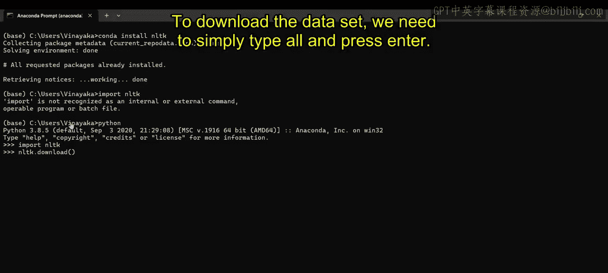
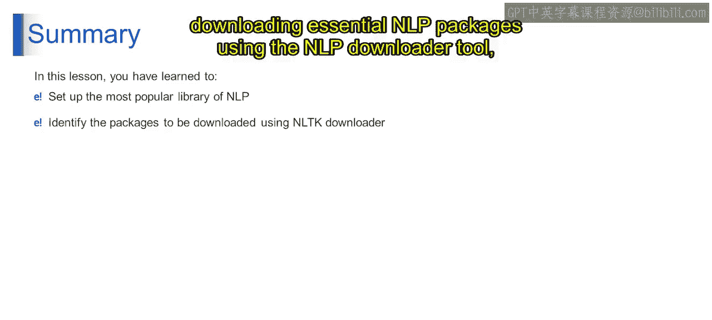

# 第一部分 104：配置NLTK环境 🛠️

在本节中，我们将学习如何为自然语言处理任务配置一个核心工具库——NLTK。我们将通过Anaconda环境安装NLTK，并使用其内置的下载器获取必要的数据集和资源包。

---

## 概述

上一节我们介绍了自然语言处理的基本概念。本节中，我们将动手配置NLTK库，这是进行NLP任务的一个基础且强大的Python库。我们将完成从安装到下载数据资源的全过程。

## 安装NLTK


首先，我们需要在Anaconda环境中安装NLTK库。如果你已经安装了Anaconda，可以通过Anaconda Prompt来执行安装命令。

打开你的Anaconda Prompt，输入以下命令：

```bash
conda install nltk
```

执行此命令后，安装程序将开始运行。如果是首次安装，可能需要一些时间；如果库已存在，过程会更快。安装完成后，我们需要验证NLTK是否能正常工作。

## 启动Python解释器并导入NLTK

安装完成后，不能直接在命令行中导入NLTK，否则会报错。必须先启动Python解释器。



在Anaconda Prompt中，输入以下命令进入Python交互环境：

```bash
python
```

成功启动后，你将看到Python提示符（如 `>>>`）。此时，可以导入NLTK库：

```python
import nltk
```

如果导入成功，没有报错，说明NLTK已正确安装。

## 使用NLTK下载器获取数据资源

NLTK库本身不包含所有数据，许多语料库、模型和资源需要额外下载。为此，NLTK提供了一个便捷的下载工具。

在Python解释器中，执行以下命令来启动下载器：

```python
nltk.download()
```

执行后，会弹出一个图形化下载管理界面。NLTK提供了多种资源包，涵盖不同语言、语料库、模型以及用于分词、词性标注、命名实体识别和情感分析等任务的工具。

对于初学者，通常建议下载所有常用资源包，以确保有足够的材料进行学习和实验。

在下载器界面中，你可以：
*   选择 **`all`** 来下载所有流行的资源包。
*   或者，根据你的具体任务需求，手动勾选特定的包。

选择完毕后，点击 **`Download`** 按钮。NLTK将从其服务器下载所选包，并在界面中显示下载进度。

下载完成后，NLTK会确认所有包已成功下载。此时，你可以关闭下载器界面，并开始使用NLTK进行各种自然语言处理任务。

## 总结




本节课中，我们一起学习了如何配置NLTK环境。你成功地在Anaconda环境中安装了NLTK库，并掌握了使用NLTK下载器选择和下载核心NLP资源包的方法。这为后续进行有效的自然语言处理任务奠定了坚实的基础。