# 第一部分 105：访问NLTK语料库 📚


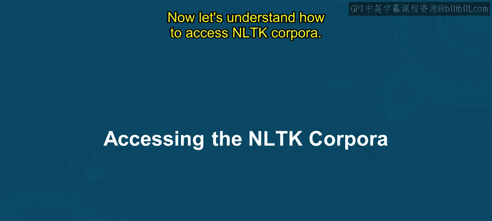

在本节课中，我们将学习如何访问和使用NLTK（自然语言工具包）中的语料库。语料库是自然语言处理（NLP）研究和应用的基础资源，包含了大量用于训练和测试模型的文本数据。

## 什么是NLTK语料库？ 🤔

上一节我们介绍了课程目标，本节中我们来看看NLTK语料库的具体含义。

NLTK语料库，或称语料库，指的是为语言学研究、分析和自然语言处理模型训练而收集和组织的大型文本集合。它是一个为研究分析而组织的文本集合。

以下是为什么我们需要NLTK语料库的几个主要原因：

*   **训练和测试NLP模型**：NLTK语料库是训练和评估NLP模型与算法的宝贵资源。这些语料库包含多样化的样本、带注释的数据和语言资源，对于构建和评估词性标注器、命名实体识别器、情感分析器等NLP系统至关重要。
*   **研究与实验**：NLP领域的研究人员和从业者经常使用NLTK语料库进行实验、评估新算法以及探索语言现象。通过访问带有注释数据和语言标注的语料库，研究人员可以研究语言处理的各个方面，并开发创新的NLP解决方案。
*   **教育与学习**：NLTK语料库对于对NLP和计算语言学感兴趣的学生和学习者是宝贵的教育资源。它们提供了真实的文本数据示例，让学习者能够以实践的方式练习和应用分词、词干提取、句法分析等NLP技术。
*   **基准测试与比较**：NLTK语料库被用作评估NLP系统和算法性能的基准。通过使用标准化的语料库和评估指标，研究人员和开发人员可以比较不同方法的有效性，并衡量NLP领域的进展。
*   **语言资源共享**：NLTK语料库促进了NLP社区内语言资源的共享和分发。通过提供对带注释的文本、词典和语言模型的访问，NLTK语料库使得全球的研究人员、开发人员和从业者能够进行协作和知识共享。

基于以上理解，NLTK语料库是训练、测试和学习自然语言处理的重要资源。它们提供了对多样化文本和语言资源的访问，使得开发稳健的NLP模型、推进计算语言学研究以及NLP领域的教育成为可能。

## 如何访问NLTK语料库？ 🔧

现在我们已经了解了NLTK语料库的重要性，本节中我们来看看如何具体访问它们。

要访问NLTK语料库，在下载之后，你可以使用 `nltk.corpus` 模块。让我们看看具体如何操作。

### 访问WordNet

WordNet是一个英语词汇数据库。可以通过以下方式访问。

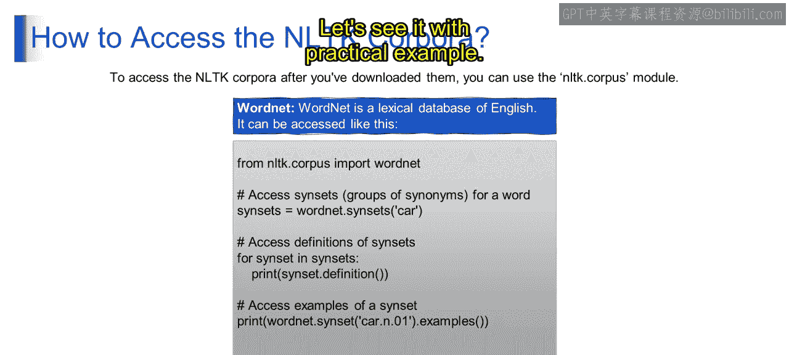

以下代码段演示了如何访问WordNet。WordNet是NLTK中的一个词汇数据库，它将单词组织成同义词集（synsets），并提供它们之间的关系，有助于自然语言处理任务。

```python
import nltk
nltk.download('wordnet')
from nltk.corpus import wordnet

# 第一部分 检索与“car”相关的同义词集
synsets = wordnet.synsets('car')
for s in synsets:
    print(s.definition())

# 第一部分 打印特定词义的示例
print(wordnet.synset('car.n.01').examples())
```

**代码解释**：
1.  `import nltk`：导入NLTK库。
2.  `nltk.download('wordnet')`：如果系统中尚未下载WordNet数据，此行代码将下载它。
3.  `from nltk.corpus import wordnet`：从NLTK语料库中导入wordnet模块。
4.  `synsets = wordnet.synsets('car')`：从WordNet中检索与“car”相关联的同义词集（即一组同义词）。
5.  循环遍历每个检索到的词义（sense）并使用 `s.definition()` 打印其定义。
6.  `print(wordnet.synset('car.n.01').examples())`：打印与单词“car”的特定词义相关联的示例。

**执行结果**：代码会输出“car”的各种定义，例如“a motor vehicle with four wheels...”以及相关示例。

你可以将代码中的 `'car'` 替换为其他单词（如 `'moon'` 或 `'apple'`）来探索WordNet中不同词汇的信息。

### 访问布朗语料库

布朗语料库是由布朗大学开发的一个综合性文本语料库，广泛用于语言学研究和自然语言处理任务。

以下是访问布朗语料库的代码示例：

```python
nltk.download('brown')
from nltk.corpus import brown

# 第一部分 获取语料库中的所有类别
categories = brown.categories()
print(categories)

# 第一部分 获取‘news’类别中的单词
words = brown.words(categories='news')
print(words[:50]) # 打印前50个单词
```

**代码解释**：
1.  `nltk.download('brown')`：下载布朗语料库数据。
2.  `from nltk.corpus import brown`：从NLTK语料库中导入布朗语料库模块。
3.  `categories = brown.categories()`：检索布朗语料库中可用类别的列表。
4.  `words = brown.words(categories='news')`：从布朗语料库的特定类别（本例中为‘news’）中检索单词。
5.  `print(words[:50])`：打印‘news’类别中布朗语料库的前50个单词。

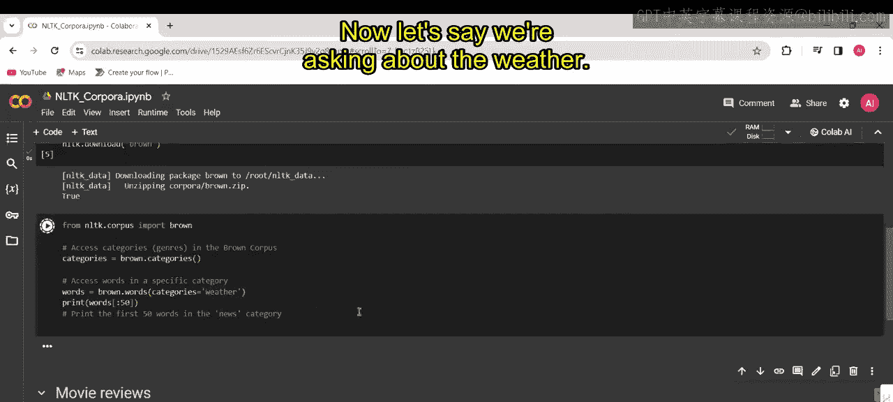

**执行结果**：代码会输出布朗语料库中包含的类别列表（如 `['adventure', 'belles_lettres', 'editorial', ...]`），以及‘news’类别下的前50个单词，这些单词构成一个新闻句子的开头部分。

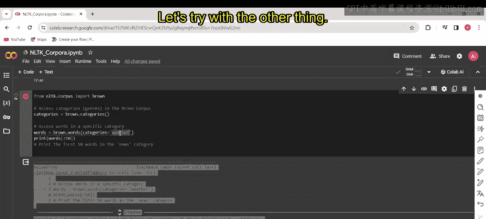

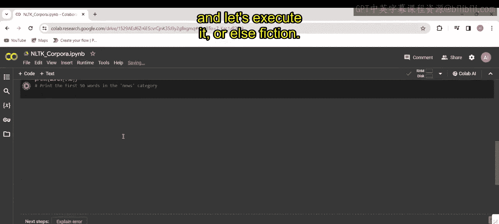

布朗语料库通常包含来自多种体裁的文本样本，包括新闻文章、社论、散文、小说、评论和学术文章等。它主要关注跨体裁的通用语言使用，因此通常不包含如天气报告、体育数据或科学文献等高度专业化的类别。

### 访问电影评论语料库

接下来，我们探索如何访问电影评论语料库，这常用于情感分析任务。

以下是访问电影评论语料库的代码：

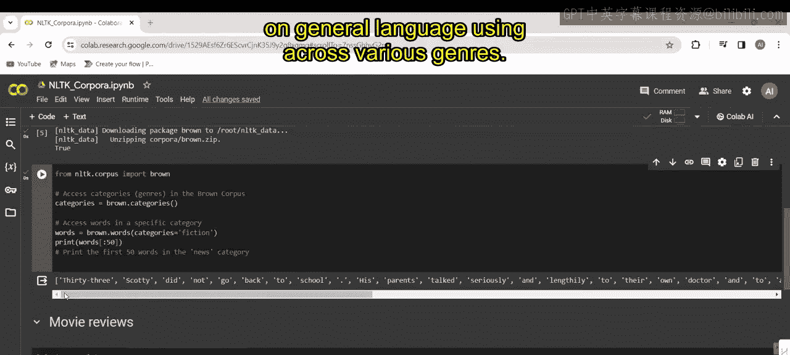

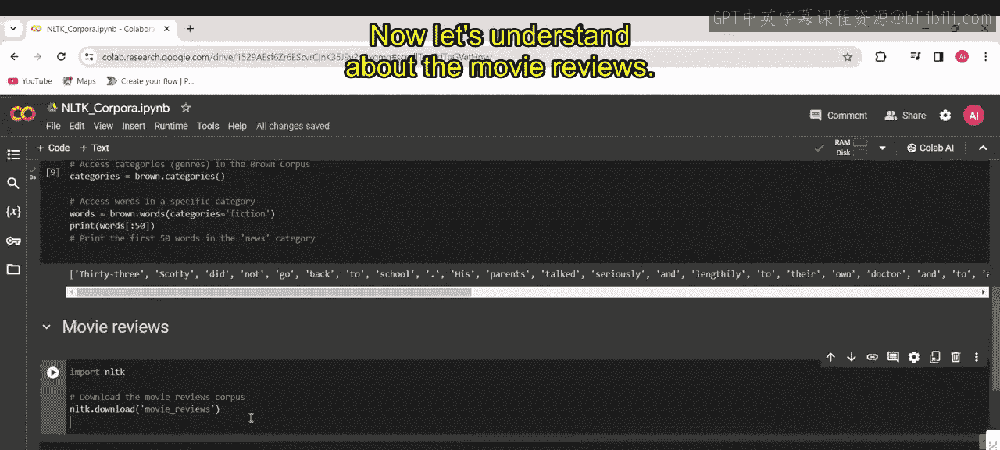

```python
nltk.download('movie_reviews')
from nltk.corpus import movie_reviews

# 第一部分 获取语料库中的类别（情感）
categories = movie_reviews.categories()
print(categories) # 输出: ['neg', 'pos']

# 第一部分 获取正面和负面评论的文件ID列表
fileids_pos = movie_reviews.fileids('pos')
fileids_neg = movie_reviews.fileids('neg')

# 第一部分 访问特定评论中的单词
words_positive = movie_reviews.words(fileids_pos[0]) # 第一篇正面评论
words_negative = movie_reviews.words(fileids_neg[0]) # 第一篇负面评论

print(words_positive[:20]) # 打印第一篇正面评论的前20个单词
print(words_negative[:20]) # 打印第一篇负面评论的前20个单词
```

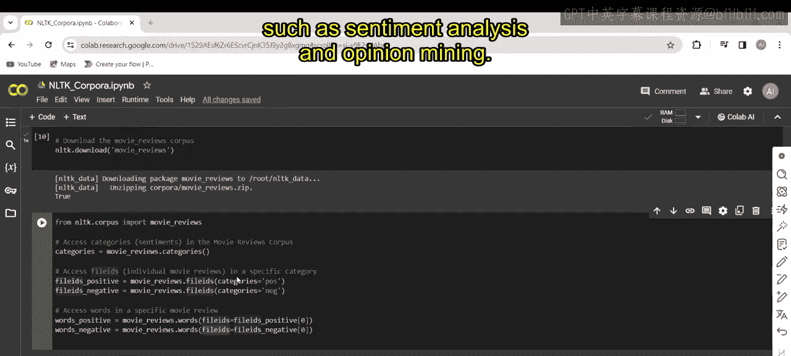

**代码解释**：
1.  `nltk.download('movie_reviews')`：下载电影评论语料库数据。
2.  `from nltk.corpus import movie_reviews`：从NLTK的语料库集合中导入电影评论语料库，允许我们访问电影评论数据。
3.  `categories = movie_reviews.categories()`：检索电影评论语料库中可用类别（情感）的列表。本例中情感为‘pos’（正面）和‘neg’（负面）。
4.  `fileids_pos = movie_reviews.fileids('pos')`：检索归类为正面电影评论的字段（即文件标识符）列表。
5.  `fileids_neg = movie_reviews.fileids('neg')`：检索归类为负面电影评论的字段列表。
6.  `words_positive = movie_reviews.words(fileids_pos[0])`：使用正面类别中第一篇评论的字段，检索该特定正面电影评论中的单词。
7.  `words_negative = movie_reviews.words(fileids_neg[0])`：使用负面类别中第一篇评论的字段，检索该特定负面电影评论中的单词。

**执行结果**：`words_positive` 包含来自正面电影评论的单词，`words_negative` 包含来自负面电影评论的单词。这些单词被分词并作为列表存储，允许你为了情感分析或文本分类等任务进一步分析和处理它们。

此代码片段演示了如何使用Python中的NLTK访问和探索电影评论语料库，使研究人员和NLP从业者能够分析电影评论中表达的情感，用于情感分析和意见挖掘等各种应用。

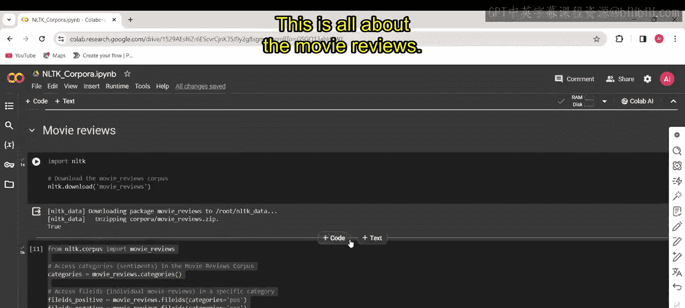

## 总结 📝

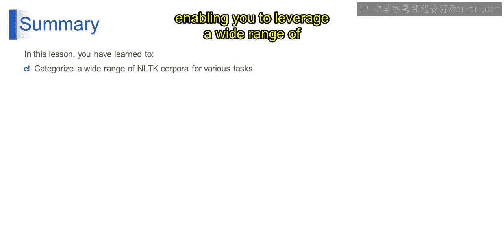

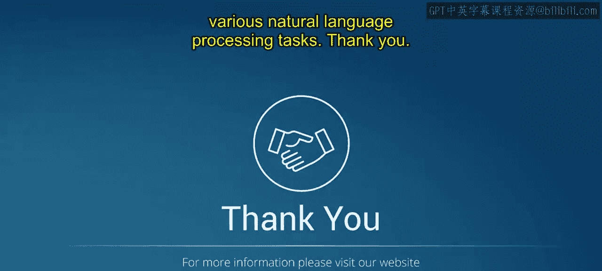

本节课中我们一起学习了如何访问和使用NLTK中的核心语料库。你已掌握如何分类和访问多样的NLTK语料库，例如WordNet、布朗语料库和电影评论语料库。这使你能够利用广泛的文本数据来完成各种自然语言处理任务，为后续的NLP模型构建和分析奠定了坚实的基础。