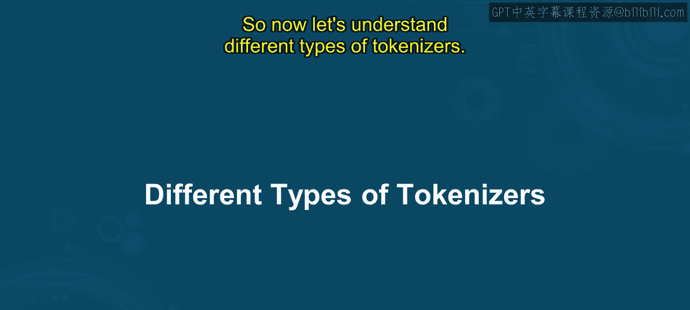
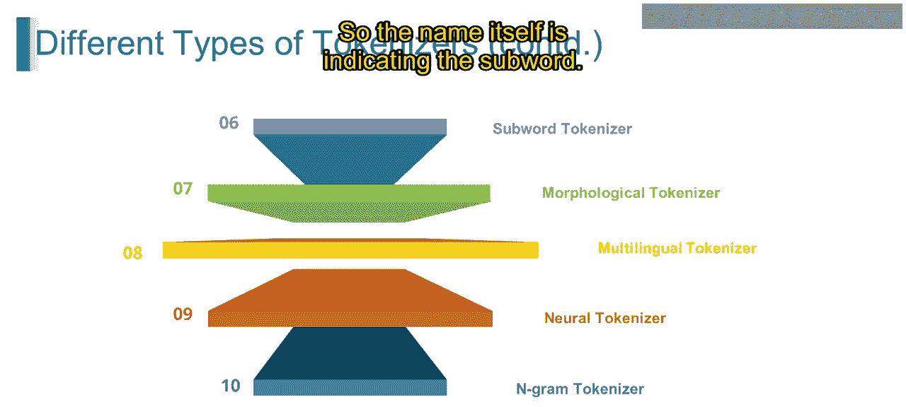

# 第一部分 106：分词详解 🧩

在本节课中，我们将要学习自然语言处理中的一个核心预处理步骤——分词。我们将了解分词器的定义、不同类型及其应用场景。

---

## 什么是分词？

在深入探讨之前，让我们先理解什么是分词。让我用一个例子来解释。

假设我们有一个句子：“I love natural language processing.”。在自然语言处理中，为了分析这个句子，我们需要将其分解成更小的单元，以理解其结构和含义。分词通过将句子分割成单个单元（如子词）来帮助我们实现这一目标。

在我们的例子中，分词器会将句子分解为以下标记：`I`、`love`、`natural`、`language`、`processing`。

现在，让我们将这个例子与专业定义联系起来。

在NLP中，将文本分割成更小单元的算法或工具被称为分词器。这些单元被称为**标记**，根据分词器的配置，标记可以是单词、子词甚至是字符。分词是NLP中一个重要的预处理步骤，它通过将文本数据分解成有意义的单元（即标记），为后续分析和机器学习任务准备数据。

标记在NLP中扮演着关键角色，它们将文本分割成标记，使我们能够高效地分析和处理文本数据。它们为各种语言分析和机器学习任务提供了结构化的输入数据，构成了这些任务的基础。

---

## 分词器的类型

上一节我们介绍了分词的基本概念，本节中我们来看看不同类型的分词器。以下是几种主要的分词器类型：

*   空格分词器
*   基于词典的分词器
*   基于规则的分词器
*   正则表达式分词器
*   统计分词器
*   子词分词器

让我们逐一进行了解。

### 1. 空格分词器

这种分词器根据空格字符来分割文本。

例如，对于句子“I love natural language processing.”，空格分词器会将其分割为单词：`I`、`love`、`natural`、`language`、`processing`。

空格分词器基于空格字符（如空格、制表符和换行符）来分割文本，将每个非空格字符序列视为一个标记。

### 2. 基于词典的分词器

这种分词器使用预定义的单词或子词词典来分割文本。

例如，对于单词“unbelievable”，基于词典的分词器可能会将其分割为：`un` 和 `believable`。

该分词器根据在词典中找到的匹配项，将文本分割成标记。这是它与空格分词器的主要区别。

### 3. 基于规则的分词器

这种分词器应用一组预定义的规则或模式来将文本分割成标记。

例如，对于句子“I am happy! :)”，基于规则的分词器会考虑标点符号和表情符号，将其分割为：`I`、`am`、`happy`、`!`、`:)`。

它通常会考虑标点符号、表情符号和其他语言模式。

### 4. 正则表达式分词器

这种分词器使用正则表达式来确定分词的规则。

例如，对于句子“Let‘s meet at 3:30 pm!”，正则表达式分词器可以灵活地根据特定模式进行分割，例如：`Let's`、`meet`、`at`、`3:30`、`pm`、`!`。

它允许基于特定模式进行更灵活和可定制的分词。

### 5. 统计分词器

这种分词器利用统计模型或机器学习算法，根据语料库中单词或字符的概率分布来确定标记的边界。

例如，对于句子“I am reading a book.”，统计分词器会将其分割为：`I`、`am`、`reading`、`a`、`book`。

### 6. 子词分词器

这种分词器将单词进一步分解为更小的、有意义的子词单元。

例如，对于单词“unbelievable”，子词分词器可能会将其分割为：`un`、`believe`、`able`。

这对于处理词汇表外的单词或形态丰富的语言特别有用。常见的子词分词算法包括**Byte-Pair Encoding (BPE)** 和 **WordPiece**。

---

## 分词器的用途

了解了不同类型后，我们来看看分词器的主要用途。以下是分词在NLP中的几个关键应用：

*   **文本预处理**：为机器学习模型准备文本数据。
*   **特征提取**：将文本转换为模型可以理解的数值特征。
*   **语言建模**：构建和训练语言模型，如GPT、BERT。
*   **机器翻译**：将源语言文本分割成标记，以便翻译。
*   **情感分析**：将评论文本分解为标记以分析情感。
*   **信息检索**：将查询和文档分割成标记以进行匹配。

---

## 总结

本节课中我们一起学习了自然语言处理中的核心概念——分词。我们首先了解了分词的定义及其重要性，即通过将文本分解为标记来为分析做准备。接着，我们详细探讨了六种主要的分词器类型：空格分词器、基于词典的分词器、基于规则的分词器、正则表达式分词器、统计分词器和子词分词器，并通过例子说明了它们的工作原理。最后，我们列举了分词在文本预处理、特征提取、语言建模等多个NLP任务中的关键用途。掌握分词是理解和应用更高级NLP技术的基础。