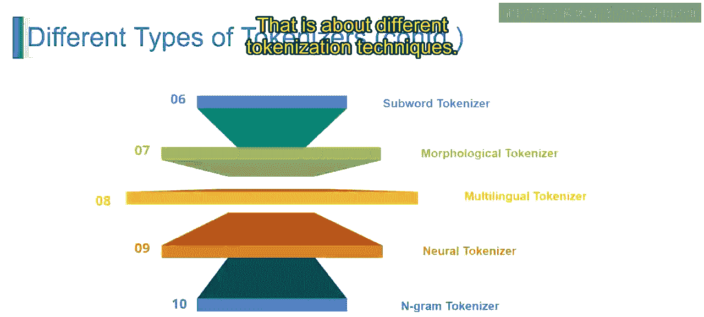

# 第一部分 107：分词的类型

在本节课中，我们将学习自然语言处理中几种核心的分词技术。分词是将文本拆分成更小单元（称为词元）的过程，是文本预处理的关键步骤。我们将逐一探讨子词分词、形态分词、多语言分词、神经网络分词和N-gram分词，了解它们各自的原理、特点和应用场景。

---

## 从子词分词开始

上一节我们介绍了分词的基本概念，本节中我们来看看具体的分词类型。首先从子词分词器开始。

子词分词器基于语言模式，将单词拆分成更小的单元（即子词）。这种方法能更好地处理未知词汇，并在形态丰富的语言中提升模型性能。

以下是一个例子，展示如何将句子“unbelievable”进行子词分词：
```
原始句子: unbelievable
分词结果: un + believ + able
```


---

## 理解形态分词器

了解了子词分词后，我们接下来看看形态分词器。它采用了另一种分析单词结构的方式。

形态分词器将文本分割成语素，语素是语言中最小的意义单位。这有助于分析单词结构并从形态变化中推导含义。

我们使用同一个句子“unbelievable”来展示形态分词：
```
原始句子: unbelievable
分词结果: un + believe + able
```

---

## 处理多语言文本

在掌握了针对单词内部结构的分词方法后，我们需要一种能处理多种语言的分词器。这就是多语言分词器。

多语言分词器专为处理来自多种语言的文本而设计，能有效地将文本分割成独立的词元，同时适应每种语言的语言特点和正字法规范。它能处理各种书写系统、字符编码和词边界。

例如，对于英文句子“How are you doing today?”：
```
原始句子: How are you doing today?
分词结果: How, are, you, doing, today, ?
```

---

## 基于神经网络的分词

除了基于规则的方法，现代自然语言处理也利用机器学习。神经网络分词器便是其中之一。

神经网络分词器利用神经网络或深度学习模型，直接从数据中学习分词模式。这种方法提供了更好的性能，并能适应各种文本类型和语言。

例如，对句子“I am happy!”进行神经网络分词：
```
原始句子: I am happy!
分词结果: I, am, happy, !
```

---

## 捕捉局部上下文的N-gram分词

最后，我们来看一种通过组合连续单元来捕捉上下文的分词方法：N-gram分词器。

N-gram分词器将文本分割成N个词元的连续序列（N代表单词或字符的数量）。这种方法能捕捉局部上下文，提升文本在语言建模和机器翻译等任务中的表示能力。

例如，对于短语“natural language processing”，进行二元分词（Bigram，N=2）：
```
原始短语: natural language processing
Bigram分词结果: (natural, language), (language, processing)
```

---

## 本节总结

本节课中我们一起学习了五种主要的分词类型：
*   **子词分词**：将单词拆分为有意义的子单元，处理未知词能力强。
*   **形态分词**：分割成语素，分析单词的内部结构和意义。
*   **多语言分词**：专为跨语言文本设计，适应不同的语言规范。
*   **神经网络分词**：使用深度学习模型从数据中自动学习分词模式。
*   **N-gram分词**：生成连续的词元序列，以捕捉文本的局部上下文。




这些分词器各有优势和适用场景，在自然语言处理任务的文本预处理阶段扮演着至关重要的角色，为有效的文本分析与理解奠定了基础。请继续关注下一节，我们将对此主题进行更深入的探讨。