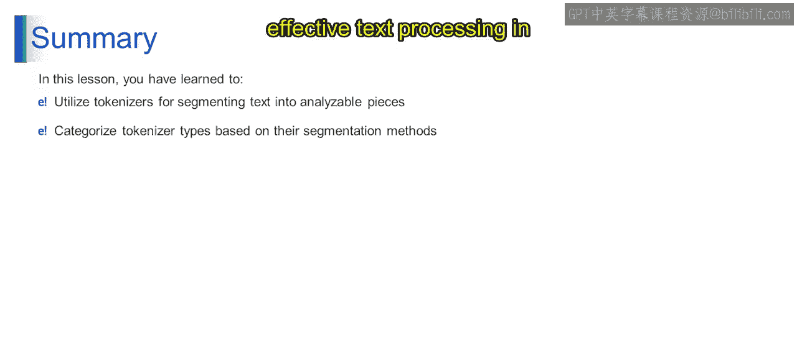
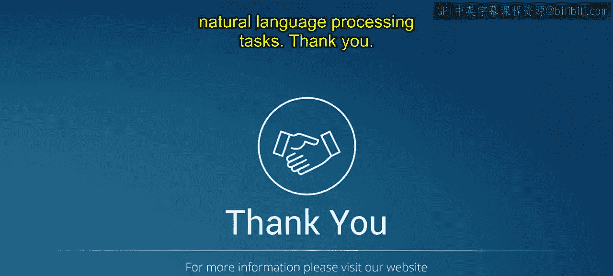

# 第一部分 108：分词的用途 🧩

在本节课中，我们将要学习分词（Tokenization）在自然语言处理中的核心用途。分词是将文本分解成更小单元（如单词或子词）的过程，它是许多NLP任务的基础。我们将逐一探讨分词在文本预处理、信息检索、机器翻译、情感分析、文本摘要和词性标注等任务中的具体应用。

---

上一节我们介绍了分词的基本概念和工作原理，本节中我们来看看分词在实际任务中的具体用途。

## 文本预处理 📝


分词是文本预处理的关键步骤。它将原始文本分解为更小的单元（即词元），以便进行后续的清洗和结构化处理。

以下是文本预处理中常见的分词相关操作：
*   **分词**：将句子或段落分解为单词或子词。
*   **小写化**：将所有字母转换为小写，以统一形式。
*   **去除标点**：删除标点符号，减少噪音。
*   **处理特殊字符**：处理如`@`、`#`等可能影响分析的字符。

**代码示例**（Python）：
```python
import re
text = "Hello, World! Let's learn NLP."
# 第一部分 简单分词（按空格和标点分割）
tokens = re.findall(r'\b\w+\b', text.lower())
print(tokens)  # 输出: ['hello', 'world', 'let', 's', 'learn', 'nlp']
```

## 信息检索 🔍

分词有助于构建搜索索引，并从大量文本集合中检索相关文档或信息。词元作为索引的基础，用于匹配查询词和文档内容。

**公式描述**：
在信息检索中，一个简单的相关性评分可以表示为：
`Score(Q, D) = Σ (tf(t in D) * idf(t))`，其中`t`代表查询`Q`和文档`D`中共有的**词元**。

## 机器翻译 🌐

在机器翻译中，分词协助将句子或短语分解为更小的单元，为机器翻译模型提供结构化的输入数据，从而促进翻译过程。

**核心概念**：
机器翻译模型（如Seq2Seq）的输入通常是经过分词处理的**词元序列**。例如，句子“Hello world”在输入模型前会被分词为`['Hello', 'world']`。

## 情感分析 😊😠

分词将文本分离成独立的单词或子词，使情感分析模型能够通过检查单个词元的极性（正面、负面、中性）来分析文本中表达的情感。

**简单解释**：
模型会分析句子中每个**词元**（如“great”、“terrible”）的情感倾向，然后综合判断整个句子的情感。

## 文本摘要 📄➡️📝

分词将文本分解为更小的单元，便于文本摘要算法通过分析词元的频率和相关性来识别重要的句子或短语。

**工作原理**：
在抽取式摘要中，算法会统计**词元**在各句中的出现情况，将包含重要和高频词元的句子选入摘要。

## 词性标注 🏷️

分词为词性标注模型提供独立的单词或子词作为输入，以便为每个词元分配语法标签（如名词、动词、形容词等），这有助于句法分析和理解。

**示例**：
对于句子“Cats chase mice”，分词后得到`['Cats', 'chase', 'mice']`，词性标注模型会输出`['NOUN', 'VERB', 'NOUN']`。

---

## 总结

本节课中我们一起学习了分词在自然语言处理中的多样化用途。我们看到，通过将文本分解为更小、可分析的单元（词元），分词为文本预处理、信息检索、机器翻译、情感分析、文本摘要和词性标注等众多NLP应用奠定了基础，使得对文本数据进行有效的分析和理解成为可能。





总而言之，在本课中，你已经掌握了运用分词将文本分割成可分析单元，并根据其分割方法进行分类的技能，这为在自然语言处理任务中进行有效的文本处理奠定了坚实的基础。