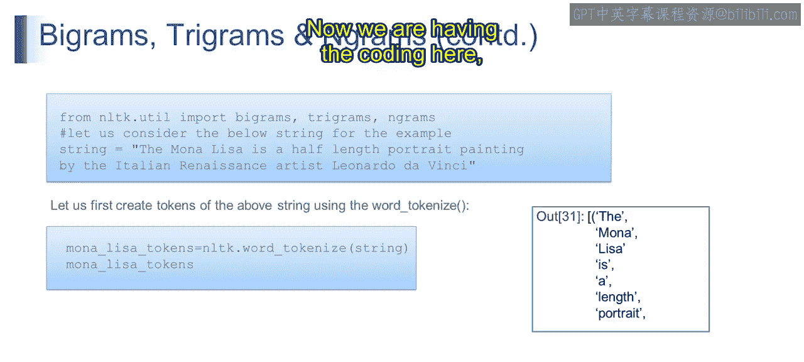

# 第一部分 109：二元组、三元组与N元组

在本节课中，我们将学习自然语言处理中的基础概念：二元组、三元组和N元组。我们将了解它们的定义、工作原理以及它们如何帮助分析文本。课程结束时，你将能够生成并利用这些单元进行文本分析，并使用NLTK库来创建它们。

## 概述：什么是N元组？

在深入细节之前，我们先理解核心概念。N元组是文本中连续的N个单词（或标记）组成的序列。它们是分析语言模式和上下文关系的基础工具。

## 二元组：两个词的序列

上一节我们介绍了N元组的基本概念，本节中我们来看看最简单的形式：二元组。

二元组是文本中两个相邻单词组成的序列。它们有助于理解句子中两个连续单词之间的关系。

以下是二元组的一个示例：
假设我们有一个句子：“I love natural language processing”。首先，我们需要将其转换为独立的标记（分词）：
`[‘I’, ‘love’, ‘natural’, ‘language’, ‘processing’]`

接着，从这个标记列表中生成二元组：
*   I love
*   love natural
*   natural language
*   language processing

从技术上讲，二元组在自然语言处理中常用于语言建模、词性标注和情感分析等任务。

## 三元组：三个词的序列

理解了二元组后，我们进一步看看能提供更多上下文信息的三元组。

三元组是文本中三个相邻单词组成的序列。与二元组相比，它们通过一次考虑三个连续单词来捕捉更多的上下文信息。

以下是基于同一句子的三元组示例：
*   I love natural
*   love natural language
*   natural language processing

三元组比二元组提供更多上下文，对于文本生成、翻译和命名实体识别等任务非常有用。

## N元组：通用的N词序列

在了解了二元组和三元组之后，本节我们来学习更通用的概念：N元组。

N元组将二元组和三元组的概念泛化，考虑连续的N个单词序列。参数`n`的值可以灵活设定，从而捕捉不同层次的上下文。

例如，当 `n=4` 时，我们的示例句子会生成以下四元组：
*   I love natural language
*   love natural language processing

N元组允许通过选择不同的N值来灵活分析文本数据，广泛应用于文本分类、信息检索和文本摘要等任务。

## 核心概念总结

二元组、三元组和N元组是自然语言处理中的基本概念。它们通过考虑相邻单词或标记的序列来分析文本数据，为理解文本的结构和上下文提供了宝贵的见解，并助力各种NLP任务和应用。

*   **二元组**：两个相邻单词的序列。
*   **三元组**：三个相邻单词的序列。
*   **N元组**：N个相邻单词的序列，其中N是任意正整数。

在接下来的视频中，我们将通过代码实践来详细阐述这个话题。