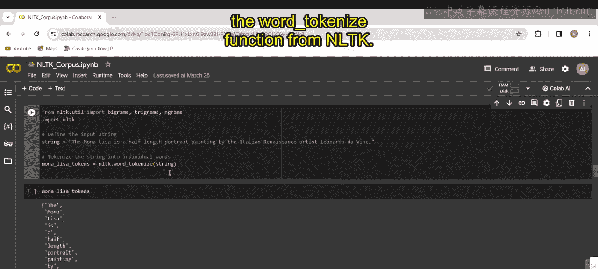
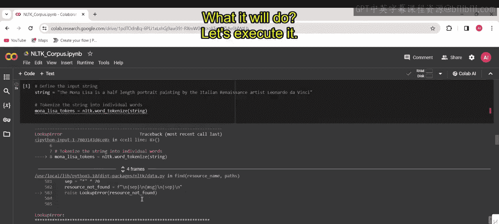
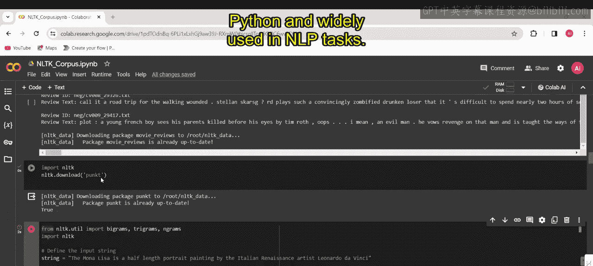
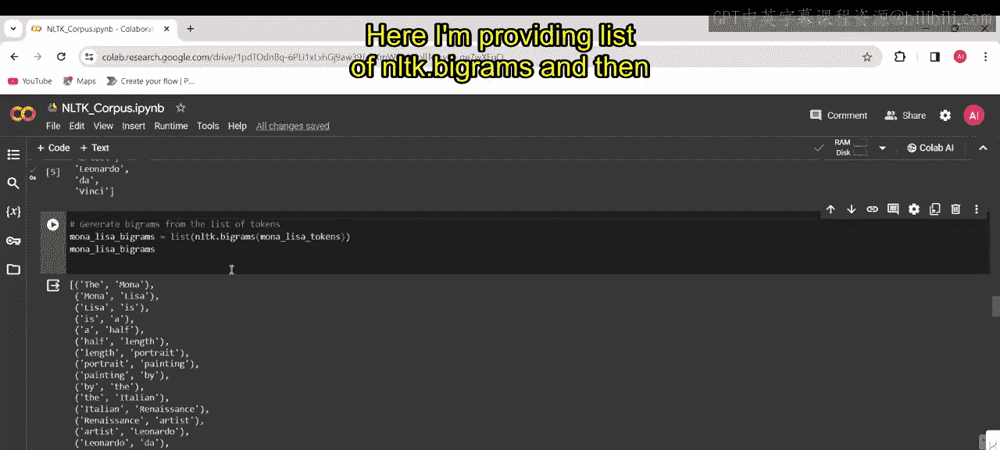
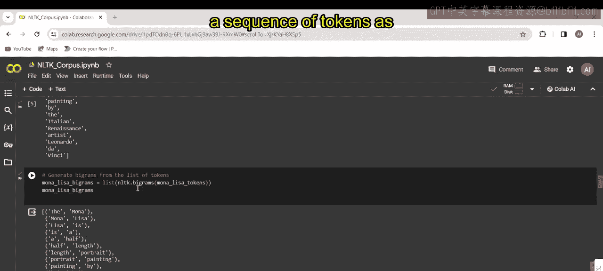
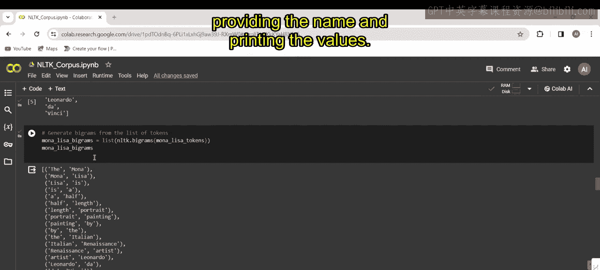
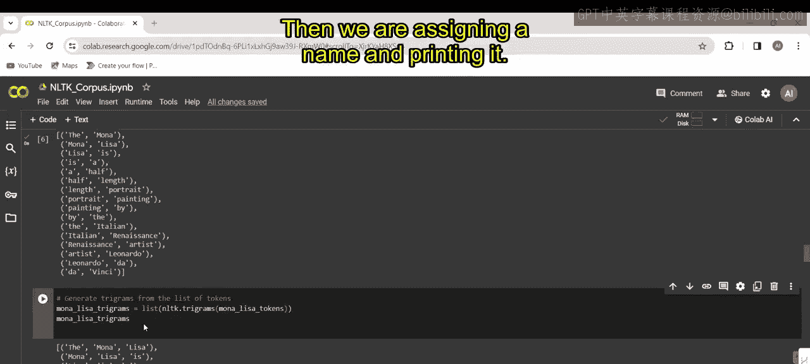
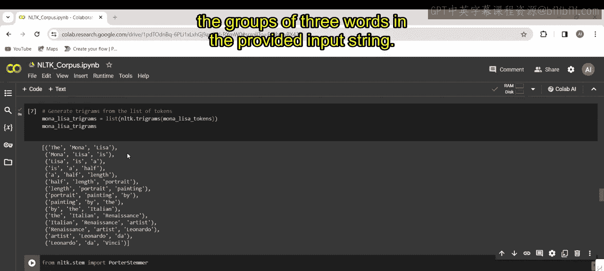
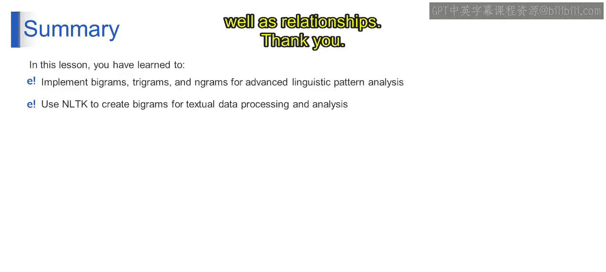

# 第一部分 110：二元组、三元组和n元组演示 🧩

在本节课中，我们将学习如何使用NLTK库将文本句子转换为二元组、三元组和n元组。我们将通过一个具体的代码示例，演示如何对句子进行分词，并生成这些序列，以分析文本中的语言模式。

---

## 概述

上一节我们介绍了语言模型的基本概念。本节中，我们来看看如何通过代码实现文本的序列化分析。具体来说，我们将把一个关于《蒙娜丽莎》的句子分解成单词，然后生成相邻单词的组合，即二元组和三元组。


## 代码实现步骤

以下是实现该功能的核心步骤。

首先，我们需要导入必要的库和函数。

```python
from nltk.util import bigrams, trigrams, ngrams
import nltk
```



*   `from nltk.util import bigrams, trigrams, ngrams`：这行代码从NLTK库导入了用于生成二元组、三元组和n元组的函数。
*   `import nltk`：这行代码导入了NLTK库本身，这是进行文本分词所必需的。

接下来，我们定义要处理的输入字符串。

```python
sentence = “The Mona Lisa is a half-length portrait painting by the Italian Renaissance artist Leonardo da Vinci.”
```

这行代码定义了一个输入字符串，内容是关于《蒙娜丽莎》画作的一句话。

现在，我们需要将这个字符串分割成独立的单词，这个过程称为分词。





```python
nltk.download(‘punkt’)
tokens = nltk.word_tokenize(sentence)
```

*   `nltk.download(‘punkt’)`：这行代码下载英语的Punkt分词器模型，使其可用于分词。Punkt分词器是NLTK库中包含的一个算法工具，专门用于将文本分割成单词或标点符号等独立的标记。
*   `tokens = nltk.word_tokenize(sentence)`：这行代码使用NLTK的`word_tokenize`函数将输入字符串分词成独立的单词列表。

执行上述代码后，`tokens`变量将包含从输入句子中提取出的单词列表。这些标记将用于生成二元组、三元组等。



## 生成序列

有了分词后的列表，我们就可以开始生成各种序列了。

首先，我们生成二元组。

```python
bigrams_list = list(bigrams(tokens))
print(“Bigrams:”, bigrams_list)
```

*   `bigrams(tokens)`：这行代码为分词列表生成二元组。二元组是文本序列中相邻单词的配对。`bigrams`函数接收一个标记序列作为输入，并返回一个生成器。
*   `list(bigrams(tokens))`：这部分代码将`bigrams`函数返回的生成器对象转换为列表，以便我们可以访问和打印这些二元组。





类似地，我们生成三元组。

```python
trigrams_list = list(trigrams(tokens))
print(“Trigrams:”, trigrams_list)
```

*   `trigrams(tokens)`：这行代码为分词列表生成三元组。三元组是文本序列中相邻单词的三元组合。
*   `list(trigrams(tokens))`：这部分代码将生成器对象转换为列表。

列表中的每个元组代表一个三元组，其中的三个元素是输入字符串中连续的三个单词。这个三元组列表能更好地揭示文本中单词之间的序列关系。

## 输出结果



执行全部代码后，我们可以看到二元组和三元组的输出示例。

*   **二元组输出**：例如 `(‘The’, ‘Mona’)`, `(‘Mona’, ‘Lisa’)`, `(‘Lisa’, ‘is’)` 等。
*   **三元组输出**：例如 `(‘The’, ‘Mona’, ‘Lisa’)`, `(‘Mona’, ‘Lisa’, ‘is’)`, `(‘Lisa’, ‘is’, ‘a’)` 等。



这些输出展示了输入句子中连续的单词组。

## 总结



本节课中，我们一起学习了如何为高级语言模式分析实现二元组、三元组和n元组，从而增强文本处理和解析能力。具体来说，我们利用NLTK库轻松生成了文本的二元组和三元组序列，这有助于我们更深入地洞察文本的数据结构以及单词之间的关系。通过掌握这些基础技术，你为后续更复杂的自然语言处理任务打下了坚实的基础。