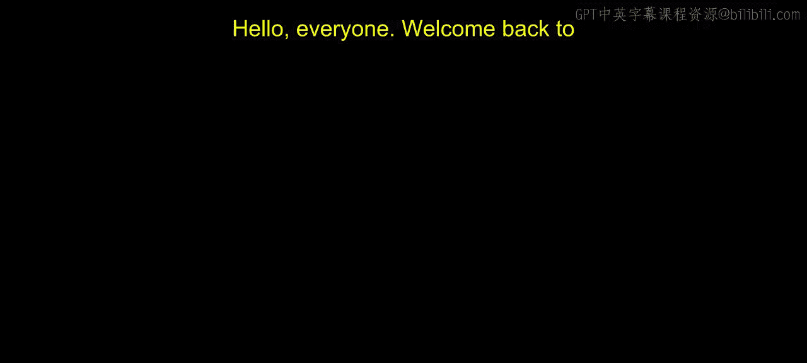
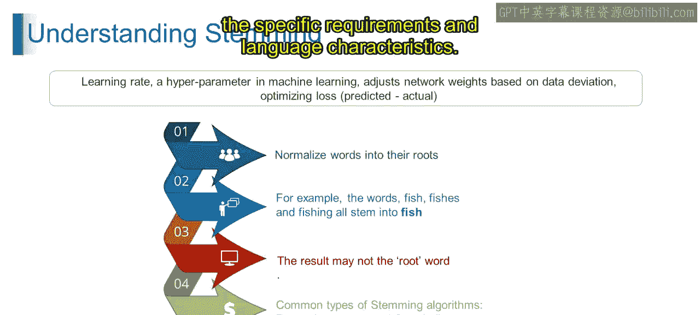
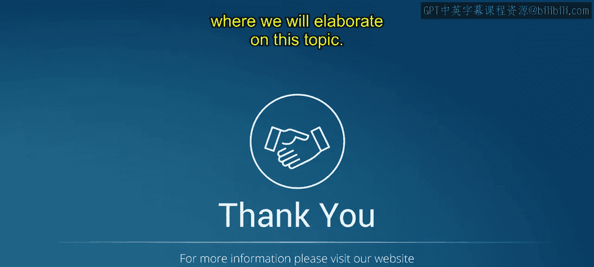

# 第一部分 111：词干提取

在本节课中，我们将要学习自然语言处理中的一个重要概念——词干提取。我们将了解词干提取的定义、目的、应用以及NLTK库中提供的几种常见算法。

## 概述

词干提取是自然语言处理中用于将单词还原为其基础或词根形式（称为词干）的过程。它通过去除单词的后缀或前缀来提取其基本形式，从而将单词的多种变体简化为一个共同的形式。这有助于提升文本分析和信息检索等任务的效率。

## 什么是词干提取？

词干提取是一种文本规范化技术，旨在通过去除词缀来生成单词的词根或基本形式，即词干。它基于一系列语言规则和算法来识别并剥离词缀，从而简化文本数据中单词的表示形式。

简单来说，词干提取通过将单词简化为其基础或词根形式来简化单词形态，这有助于文本分类、信息检索和情感分析等多种NLP任务。它将具有相似含义的单词视为同一实体，从而提高了文本处理算法的效率和效果。

## 深入理解词干提取

上一节我们介绍了词干提取的基本概念，本节中我们来详细拆解其定义、应用、局限性以及常见算法。

### 定义

词干提取是一种文本规范化技术，用于将单词缩减为其基础或词根形式（即词干）。它通过去除单词的后缀或前缀来提取基本形式，从而将单词的变体简化为一个共同形式。

### 应用

词干提取通过将单词转换为其词根形式来帮助规范化文本，这有助于文本分析和信息检索等任务。

例如，单词 “running”、“runs”、“runner” 在进行词干提取后，都会被简化为其共同的词根形式 “run”。这种简化使算法能够专注于单词的核心含义，而忽略细微的形态变化。

### 局限性

虽然词干提取能将单词规范化到其词根形式，但必须注意，结果可能并非总是实际的词根单词。词干提取算法是基于规则的，有时可能产生不被认可为有效单词的词干形式。

### 常见词干提取算法

以下是NLP中常用的几种词干提取算法：

*   **波特词干提取器**：由马丁·波特开发，是最广泛使用的词干提取算法之一。它应用一组规则将单词缩减为词干，尽管有时可能产生非实际单词的词干。
*   **兰卡斯特词干提取器**：也称为Paice/Husk词干提取器，是一种流行的算法。它比波特词干提取器更激进，倾向于产生更短的词干，但准确性可能较低。
*   **雪球词干提取器**：也称为波特2词干提取器，是波特词干提取器的改进版本。它提供了更好的性能和语言支持，因此是许多应用的首选。

## 总结

本节课中我们一起学习了词干提取。我们了解到，词干提取在NLP中通过将单词规范化到其基础形式，对文本处理和分析任务起着至关重要的作用。虽然波特、兰卡斯特和雪球等词干提取算法为此提供了有价值的工具，但理解它们的局限性并根据具体需求和语言特性选择最合适的算法至关重要。