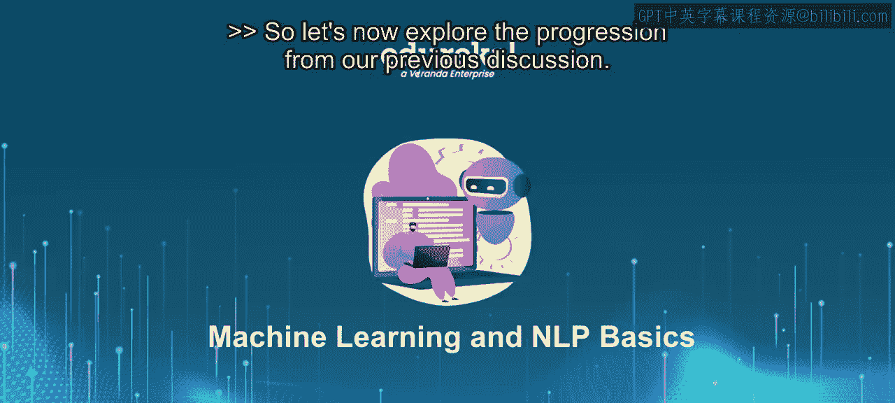
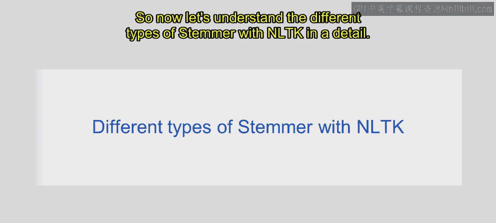
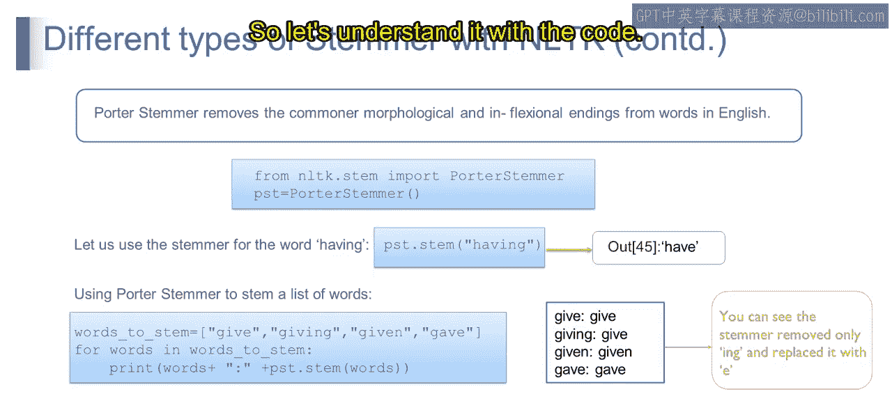

# 第一部分 112：不同类型的词干提取器

在本节中，我们将探讨自然语言处理中几种核心的词干提取器。词干提取是文本预处理的关键步骤，旨在将单词还原为其基本形式，从而简化后续的分析任务。

---



## 概述



上一节我们介绍了词干提取的基本概念。本节中，我们将详细探讨NLTK库中提供的三种主要词干提取器：波特词干提取器、兰卡斯特词干提取器和雪球词干提取器。我们将了解它们的工作原理、特点以及适用场景。

---

### 波特词干提取器

波特词干提取器是NLP中用于处理英文单词的流行算法。它通过截断单词后缀来将其缩减为基础形式。

**公式/代码示例**：
```python
from nltk.stem import PorterStemmer
stemmer = PorterStemmer()
word = "running"
stemmed_word = stemmer.stem(word)  # 结果: 'run'
```

例如，单词“running”通过移除后缀“ing”将被提取为词干“run”。这就是波特词干提取器的基本操作。

---

### 兰卡斯特词干提取器

接下来我们看看兰卡斯特词干提取器。它是NLTK中提供的一种更为激进的词干提取算法，旨在将单词截断至尽可能短的词根形式。与波特提取器相比，它通常会产生更大幅度的缩减。

**公式/代码示例**：
```python
from nltk.stem import LancasterStemmer
stemmer = LancasterStemmer()
word = "running"
stemmed_word = stemmer.stem(word)  # 结果可能为 'run' 或更短形式
```

例如，兰卡斯特词干提取器可能将“running”进一步缩减为“run”，甚至可能得到更短的结果。

---

### 雪球词干提取器

最后，我们来了解雪球词干提取器。它也被称为波特2代词干提取器，是波特词干提取器的改进版本。

**公式/代码示例**：
```python
from nltk.stem import SnowballStemmer
stemmer = SnowballStemmer('english')
word = "running"
stemmed_word = stemmer.stem(word)  # 结果: 'run'
```

雪球词干提取器提供了更好的性能和更广泛的语言支持，因此成为许多应用的首选。

---

以下是三种词干提取器的主要特点总结：

*   **波特词干提取器**： 经典算法，通过规则去除后缀。
*   **兰卡斯特词干提取器**： 更为激进，可能产生非词典词根。
*   **雪球词干提取器**： 波特算法的改进版，支持多语言，性能更优。

---

## 总结



本节课中我们一起学习了三种主要的词干提取器。词干提取通过将单词规范化为基础形式，在NLP中扮演着至关重要的角色，促进了文本处理和分析任务。虽然波特、兰卡斯特和雪球等词干提取算法为此提供了有价值的工具，但理解它们的局限性并根据特定需求和语言特性选择最合适的算法至关重要。

现在我们已经理解了不同类型的词干提取器，下一节我们将通过实际代码来学习如何应用它们。