# 第一部分 113：词干提取演示

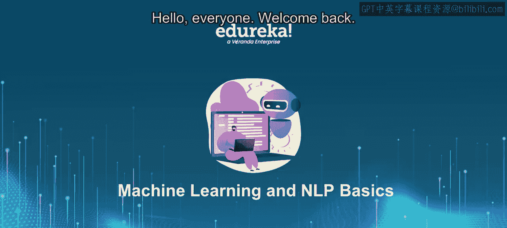

在本节课中，我们将学习词干提取的代码实现部分。我们将通过NLTK库，演示如何使用Porter、Lancaster和Snowball这三种经典的词干提取算法，将英文单词还原为其基本或词根形式。

---

## Porter词干提取器

上一节我们介绍了词干提取的基本概念，本节中我们来看看如何使用Porter词干提取器。Porter词干提取器是一种常用的算法，它通过移除常见的词形和屈折变化后缀，将英文单词简化到其词根形式。

首先，我们需要从NLTK库中导入PorterStemmer类。

```python
from nltk.stem import PorterStemmer
```

这行代码导入了PorterStemmer类，使我们能够使用它来处理英文单词。

接下来，我们初始化PorterStemmer。

```python
pst = PorterStemmer()
```

这行代码创建了一个PorterStemmer类的实例，生成了一个名为`pst`的词干提取器对象，供后续操作使用。

现在，让我们对一个单词进行词干提取。

```python
print(pst.stem('having'))
```

这行代码将Porter词干提取器应用于单词“having”。提取器会移除常见的词形后缀“ing”，得到其基本形式“have”。

以下是处理一个单词列表的步骤：

我们首先定义一个需要提取词干的单词列表。

```python
words_to_stem = ['give', 'giving', 'given', 'gave']
```

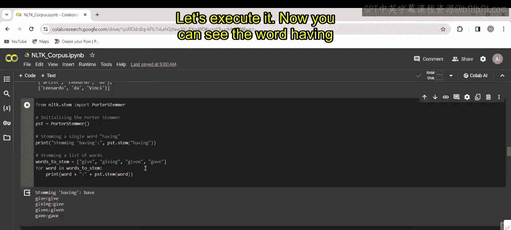

这行代码定义了一个待提取词干的单词列表。

然后，我们遍历列表中的每个单词并提取词干。

```python
for word in words_to_stem:
    print(word + ' : ' + pst.stem(word))
```

这个循环遍历提供的列表`words_to_stem`中的每个单词。在循环内，代码使用Porter词干提取器处理每个单词，并打印原始单词及其提取后的形式。

执行代码后，可以看到结果：
- “having”被转换为“have”。
- “give”保持不变，因为它已是基本形式。
- “giving”被提取为“give”，通过移除了“ing”后缀。
- “given”保持不变，因为它已是基本形式。
- “gave”保持不变，因为它也是基本形式。

Porter词干提取器有效地移除了英文单词中常见的词形和屈折变化后缀，得到了它们的词根形式。它将单词的不同变体简化到共同的基本形式，有助于文本分析和信息检索等自然语言处理任务。

---

## Lancaster词干提取器

了解了Porter算法后，我们再来看看Lancaster词干提取器。它采用了不同的、有时更为激进的规则来截断后缀。

首先，我们需要从NLTK库中导入LancasterStemmer类。

```python
from nltk.stem import LancasterStemmer
```

第一行代码从NLTK库导入了LancasterStemmer类。

接着，我们初始化Lancaster词干提取器。

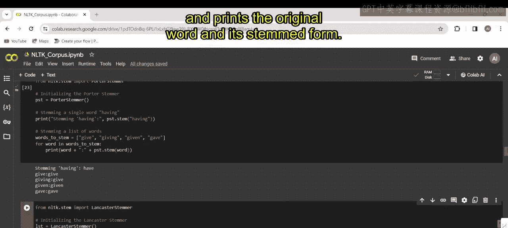

```python
lst = LancasterStemmer()
```

这行代码创建了一个LancasterStemmer类的实例。

现在，我们使用Lancaster词干提取器处理同一个单词列表。

我们采用与之前相同的列表，但这次使用LancasterStemmer而非PorterStemmer。

以下是处理过程：循环遍历提供的列表中的每个单词，对每个单词应用Lancaster词干提取器，并打印原始单词及其提取后的形式。

执行代码后，可以看到输出结果：
- “give”保持不变。
- “giving”被提取为“giv”，这展示了Lancaster词干提取器在截断后缀时更为激进的特点。
- “given”被提取为“giv”。
- “gave”被提取为“gav”。

这就是Lancaster词干提取器的工作方式。

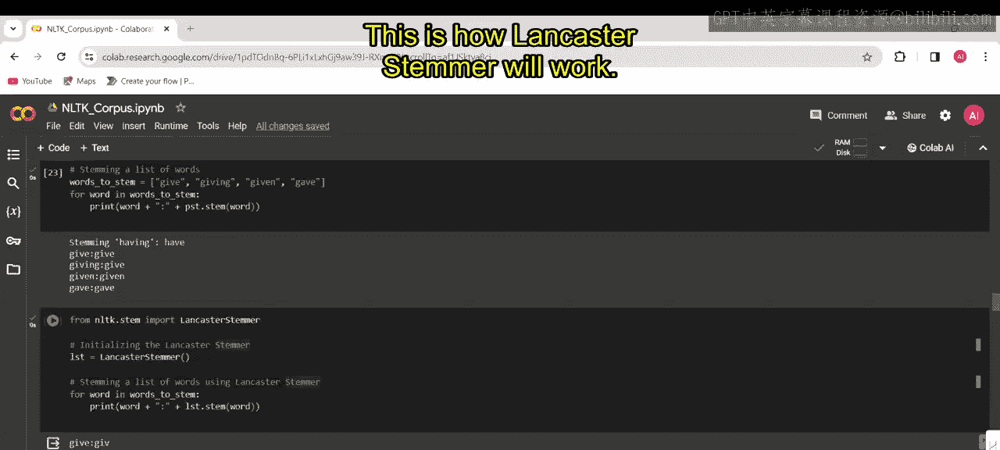

---

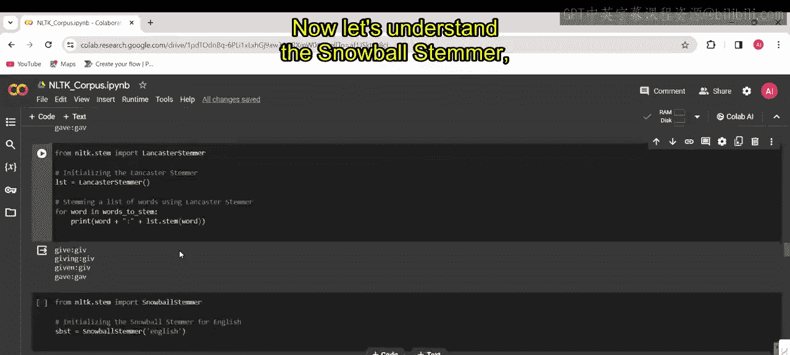

## Snowball词干提取器

最后，我们来学习Snowball词干提取器。它是一种支持多种语言的词干提取算法。

首先，我们导入SnowballStemmer类。

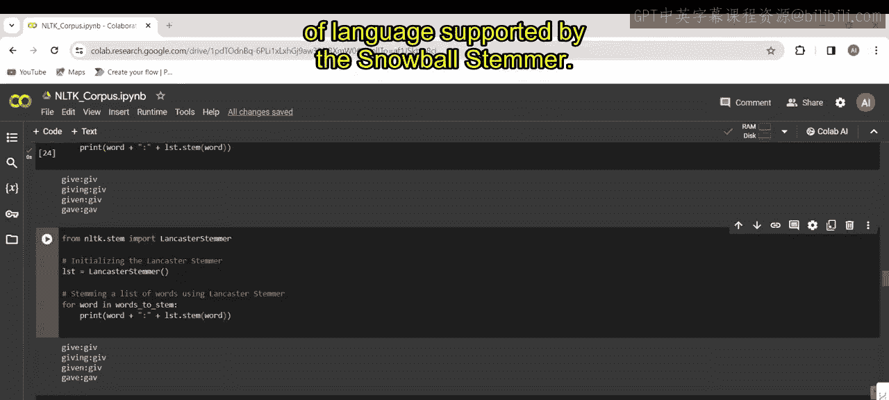

```python
from nltk.stem import SnowballStemmer
```

第一行代码从NLTK库导入了SnowballStemmer类。

接着，我们为英语初始化Snowball词干提取器。

```python
spst = SnowballStemmer('english')
```

这行代码初始化了SnowballStemmer类的一个实例，并指定用于英语。Snowball词干提取器是一种支持多种语言的算法，通过指定“english”，我们表明要对英文单词进行词干提取。

Snowball词干提取器支持多种语言。我们可以查看其支持的语言列表。

```python
print(SnowballStemmer.languages)
```

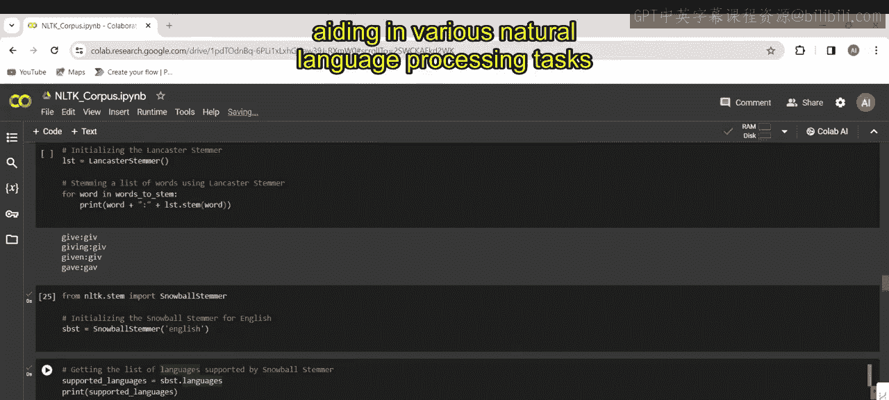

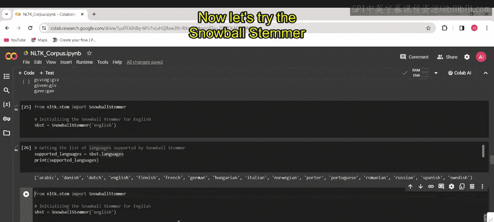

执行这行代码并打印，可以看到Snowball词干提取器支持多种语言，包括阿拉伯语、荷兰语、英语、法语、德语、意大利语、葡萄牙语、俄语、西班牙语、瑞典语等。每种语言都有针对其语言特点定制的词干提取规则和算法。

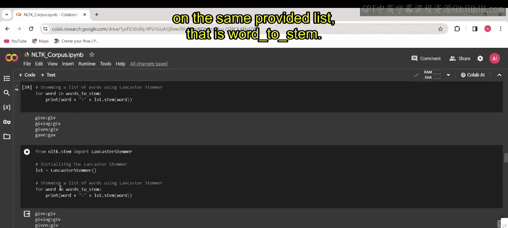

Snowball词干提取器是一种支持多种语言（包括英语）的通用算法。通过指定目标语言，我们可以对该语言的文本数据进行词干提取，有助于文本分析和信息检索等自然语言处理任务。

现在，让我们使用Snowball词干提取器处理同一个提供的单词列表。

在这段代码中，我们同样初始化了Snowball词干提取器。首先，我们对单个单词“having”进行提取。

```python
print(spst.stem('having'))
```

这行代码将Snowball词干提取器应用于单词“having”，并打印其提取后的形式。在本例中，“having”被提取为“have”。

然后，我们对包含多个单词的列表进行词干提取。

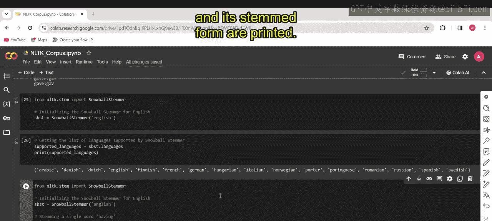

```python
for word in words_to_stem:
    print(word + ' : ' + spst.stem(word))
```

这个循环遍历列表`words_to_stem`中的每个单词。在循环内，Snowball词干提取器被应用于每个单词，并同时打印原始单词及其提取后的形式。

查看输出结果：
- “give”保持不变，符合预期。
- “giving”被提取为“give”，符合Snowball词干提取器的规则。
- “given”保持不变，因为它已是基本形式。
- “gave”保持不变，符合预期。

Snowball词干提取器有效地将单词简化为其基本词根形式，有助于文本归一化和分析等自然语言处理任务。

---

## 总结

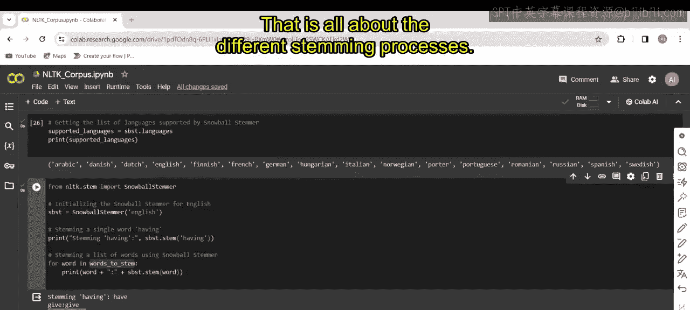

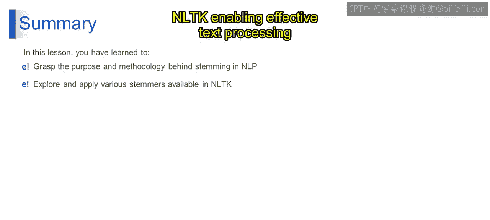

本节课中，我们一起学习了词干提取在自然语言处理中的重要性，理解了它在单词归一化中的作用。我们探索并实践了NLTK库提供的几种不同的词干提取算法，包括Porter、Lancaster和Snowball，从而能够进行有效的文本处理与分析。