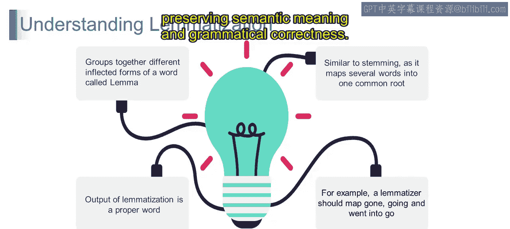

# 第一部分 114：词形还原

在本节课中，我们将要学习自然语言处理中的一个重要概念——词形还原。我们将了解词形还原的定义、它与词干提取的区别，以及如何使用NLTK库来实现它。

## 概述

词形还原是将单词还原为其基本形式或词根形式的过程，这个基本形式被称为“词元”。与词干提取不同，词形还原会考虑单词的语义和词性，确保输出的结果是一个在语言中有效的单词。这对于文本标准化和后续的文本分析至关重要。

## 什么是词形还原？

上一节我们介绍了课程概述，本节中我们来看看词形还原的准确定义。

词形还原是将单词还原为其基本词根形式的过程，该基本形式被称为**词元**，其目标是实现文本标准化。

与词干提取简单地通过去除前缀或后缀来推导词根形式不同，词形还原会考虑单词的含义，并确保生成的词元是语言中的一个有效单词。

例如，考虑单词“running”、“ran”和“runs”。所有这些单词的词元都将是“run”。

你可能会想，词干提取似乎也做同样的事情，那么词形还原有什么不同呢？让我们通过另一个例子来理解。

例如，假设我们处理单词“better”。如果使用词干提取，输出可能仍然是“better”。但如果在词形还原过程中转换这个单词，输出将是“good”。这就是区别所在。

我们理解到的区别是：词干提取通过去除后缀将单词简化为其词根形式，而词形还原则根据单词的含义将其转换为其基本或字典形式。

因此，从技术上讲，词形还原涉及识别单词的形态变体，并根据其在语言中的预期含义，将它们映射到一个称为词元的单一词根单词。

词形还原会考虑单词的词性，并应用语言规则和词典来准确地执行标准化过程。

例如，在句子“The foxes are running”中，词形还原会将“running”转换为“run”，同时保留句子的语法上下文。

词形还原旨在将单词标准化为其规范形式，从而促进自然语言处理中文本数据更准确的分析和解释。

## 词形还原详解

现在，让我们更详细地理解词形还原。以下是其核心特点：

**将单词的不同屈折形式分组为词元**
词形还原通过将单词的屈折变体分组在一起来识别其基本或字典形式，即词元。例如，如前所述，“running”、“ran”和“runs”都映射到词元“run”。

**类似于词干提取，它将多个单词映射到一个共同的词根**
与词干提取类似，词形还原旨在将单词还原为其基本或词根形式。然而，与词干提取应用启发式规则来砍掉前缀或后缀不同，词形还原采用语言分析来确保生成的词元是语言中的有效单词。

**词形还原的输出是一个正确的单词**
词形还原和词干提取之间的一个关键区别在于，词形还原产生语言中的有效单词。这确保了词形还原的输出保留了语义含义和语法正确性。

例如，单词“went”：
*   词干提取形式是“went”。
*   词形还原形式将其转换为基于词根的形式“go”。

单词“mice”：
*   词干提取形式是“mice”。
*   词形还原形式将其生成为“mouse”。

这确保了词形还原的输出保持语义含义和语法正确性。

**例如，词形还原应将“gone”、“going”和“went”映射为“go”**
在提供的示例中，词形还原会正确地将屈折形式“gone”、“going”和“went”映射到基本形式“go”。这种将变体合并为单一词元的方式有助于文本标准化，并提高了语言分析的准确性。

考虑到所有这些，词形还原是自然语言处理中的一项有价值的技术，它将单词的屈折形式分组到其基本或词根形式，即词元。与词干提取不同，词形还原确保生成的输出是语言中的有效单词，保留了语义含义和语法正确性。

## 总结

本节课中我们一起学习了词形还原。我们了解了它是将单词还原为其基本词元的过程，与词干提取相比，它更注重语义和语法正确性，能产生有效的单词。我们还探讨了它的核心特点，包括对屈折形式的分组、与词干提取的异同，以及其输出是正确单词的重要性。掌握词形还原是进行高质量文本预处理和分析的关键一步。