# 第一部分 115：使用NLTK进行词形还原 🧠

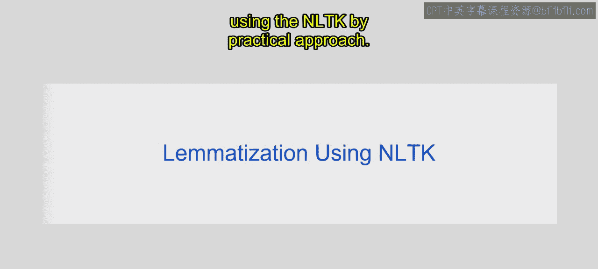

在本节课中，我们将学习词形还原的概念，并通过NLTK库进行实践操作。我们将了解词形还原与词干提取的区别，并掌握如何使用WordNet词形还原器将单词还原为其基本形式。

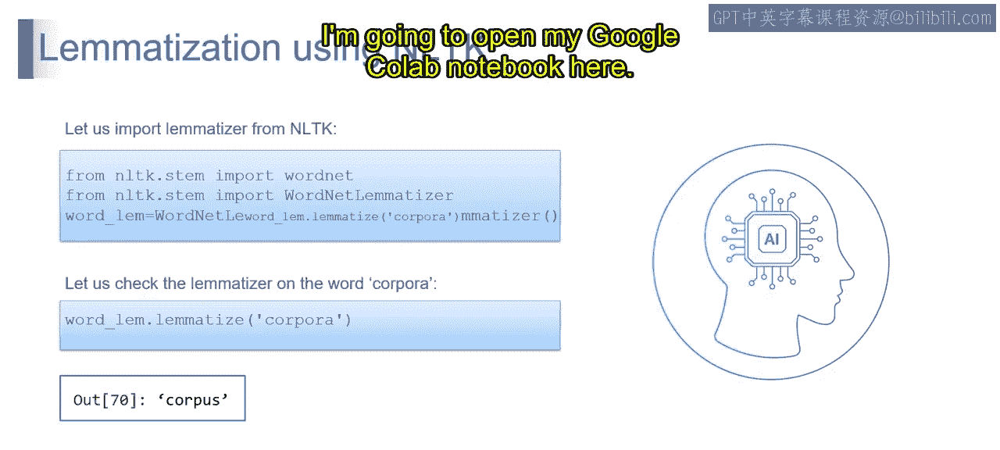

---

上一节我们介绍了词形还原的基本原理，本节中我们来看看如何使用NLTK库进行实际操作。

首先，我们需要导入必要的工具并初始化词形还原器。

```python
from nltk.stem import WordNetLemmatizer
wordnet_lemmatizer = WordNetLemmatizer()
```

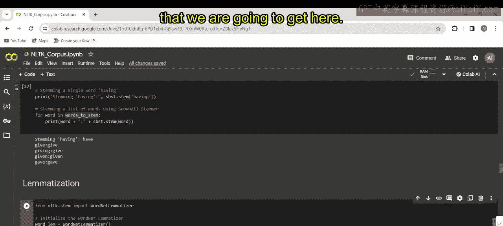

第一行代码从NLTK导入了`WordNetLemmatizer`类，这个类用于执行词形还原。`WordNetLemmatizer`是一个基于英语词汇数据库WordNet的自然语言处理工具。第二行代码初始化了词形还原器的一个实例。

接下来，我们尝试对一个单词进行词形还原。

```python
lemma = wordnet_lemmatizer.lemmatize("corpora")
print(lemma)
```

这行代码对单词“corpora”应用了`lemmatize`方法。该方法会返回该单词的基本形式或词元。执行后，输出结果为“corpus”。

---

为了更清晰地展示词形还原的效果，我们可以对比它与词干提取的区别。以下是几个例子。

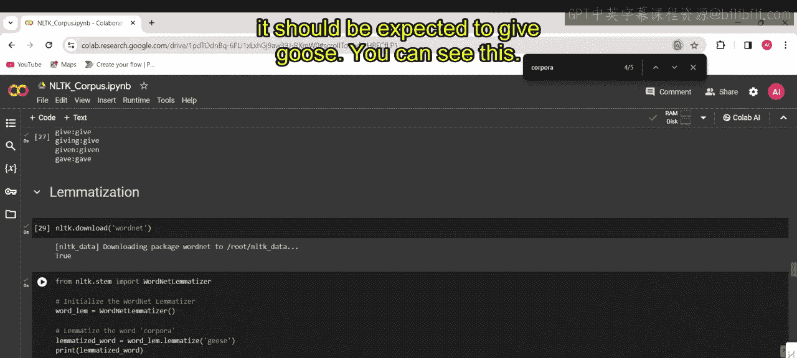

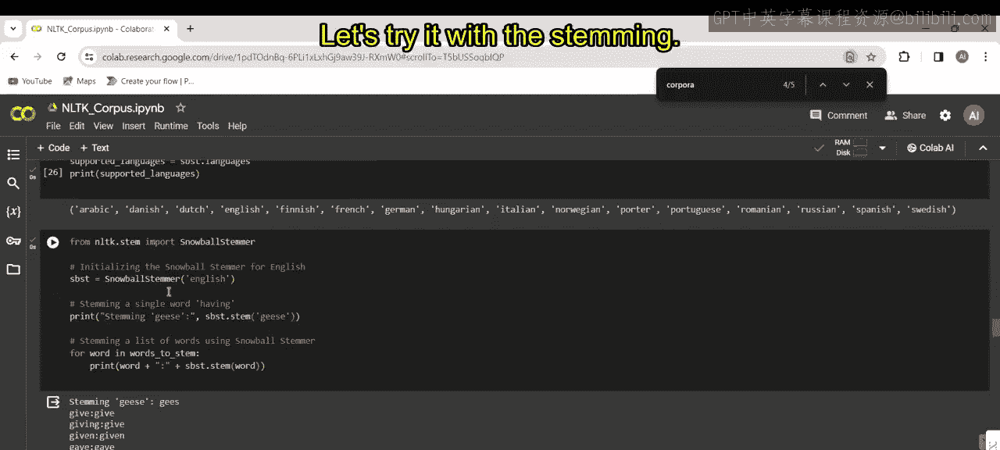

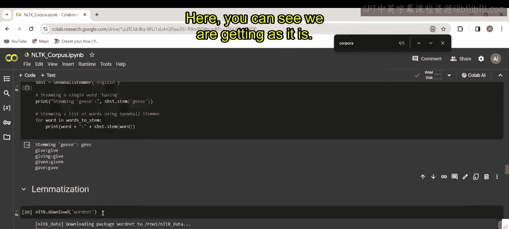

以下是使用词形还原和词干提取处理不同单词的对比：

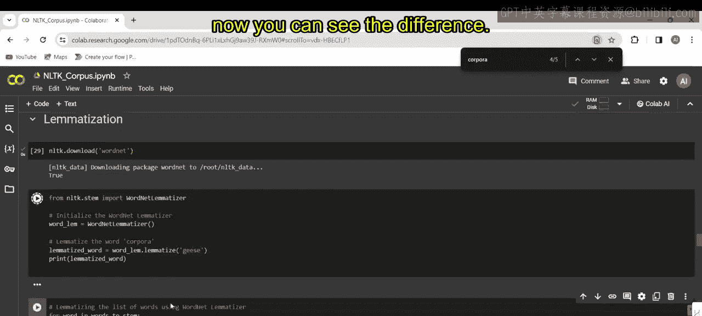

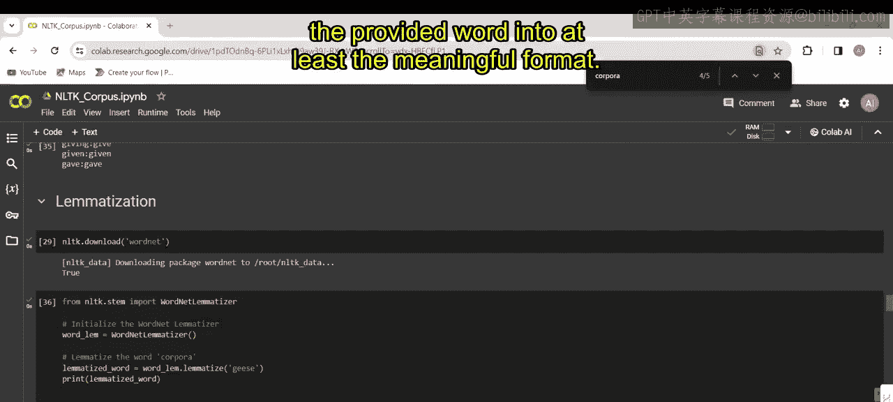

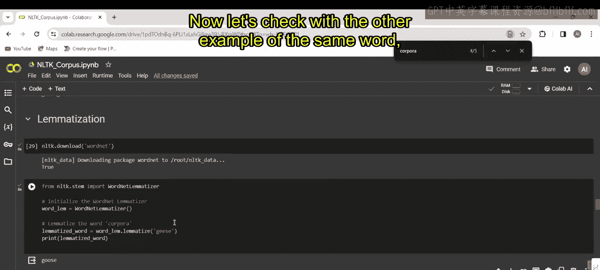

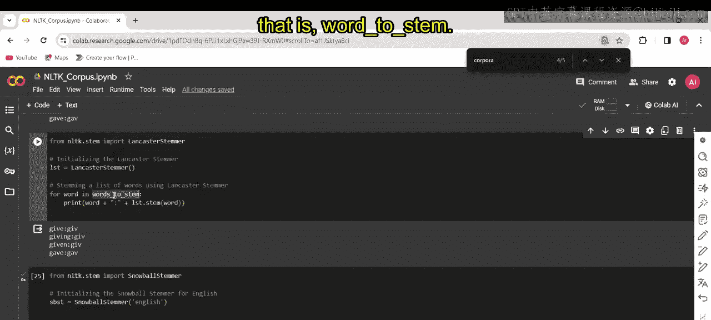

*   **mice**:
    *   词形还原输出：`mouse`
    *   词干提取（Snowball）输出：`mic`
*   **geese**:
    *   词形还原输出：`goose`
    *   词干提取（Snowball）输出：`gees`

可以看到，词形还原能够将单词还原为有意义的词元（如“mouse”，“goose”），而词干提取有时会产生无意义的词干（如“mic”，“gees”）。这是两者之间的主要区别。

---

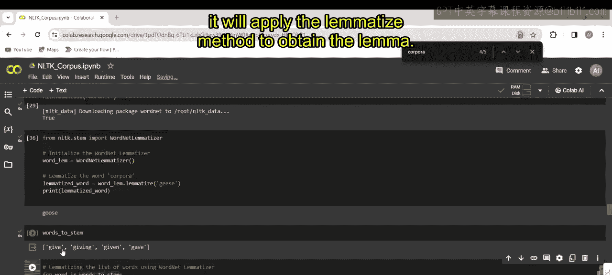

现在，让我们对一个包含动词不同形式的列表进行词形还原。

```python
words_to_stem = [‘give‘, ‘giving‘, ‘given‘, ‘gave‘]
for word in words_to_stem:
    lemma = wordnet_lemmatizer.lemmatize(word)
    print(f“{word} -> {lemma}“)
```

这段代码遍历列表中的每个单词，并对每个单词应用`lemmatize`方法。然而，运行后你会发现输出结果与输入完全相同（give -> give, giving -> giving等）。

词形还原器没有改变这些单词，因为**没有提供词性标签**。默认情况下，`WordNetLemmatizer`假设所有单词都是名词。由于“give”、“giving”、“given”和“gave”本身已经是其基本形式（作为名词时），词形还原器将它们原样保留。如果没有明确的词性标注，词形还原器会默认按名词处理，因此不会改变已经是基本形式的单词。

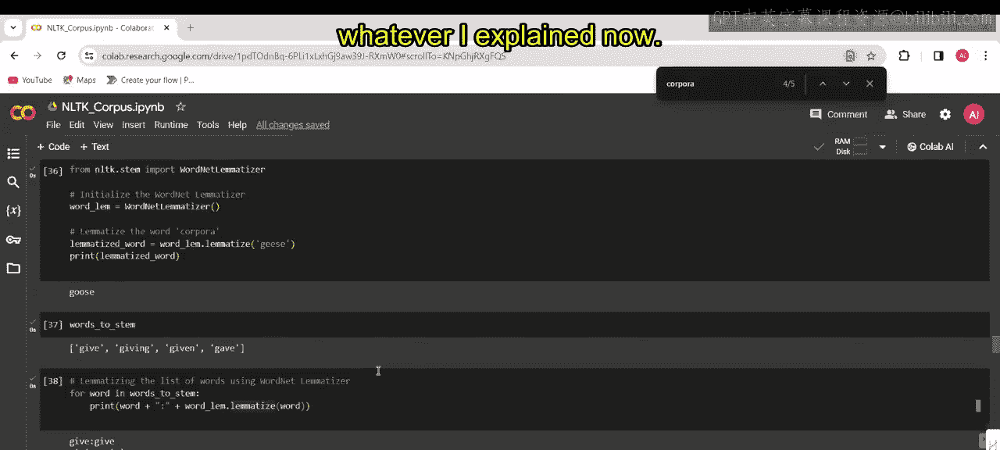

---

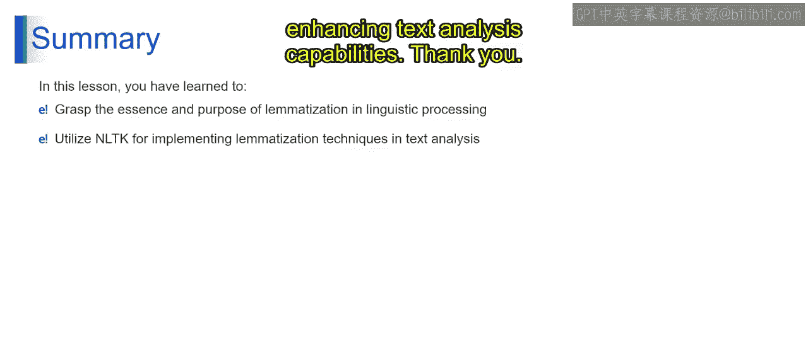

本节课中我们一起学习了词形还原在语言处理中的重要性，理解了它在获取单词基本形式方面的作用。此外，我们利用NLTK库实践了有效的词形还原技术，从而增强了文本分析的能力。