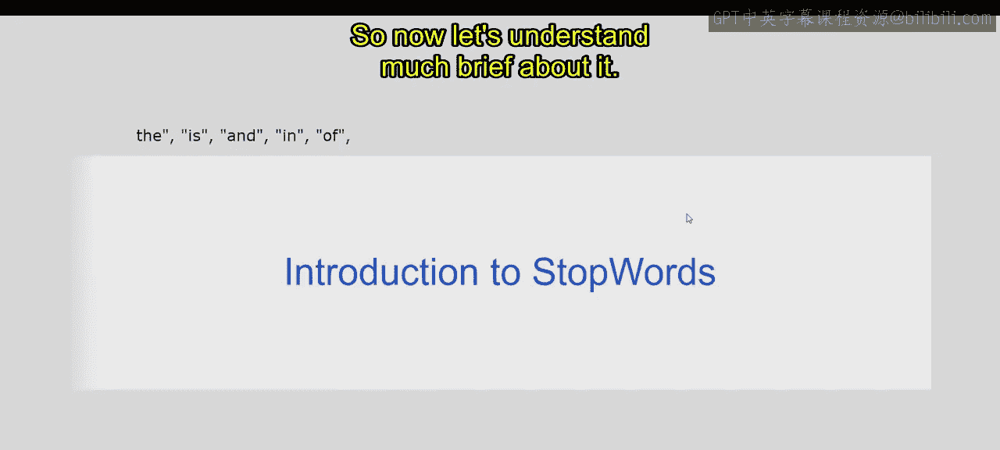
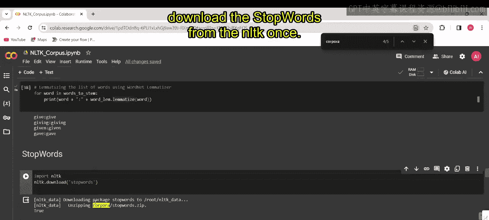
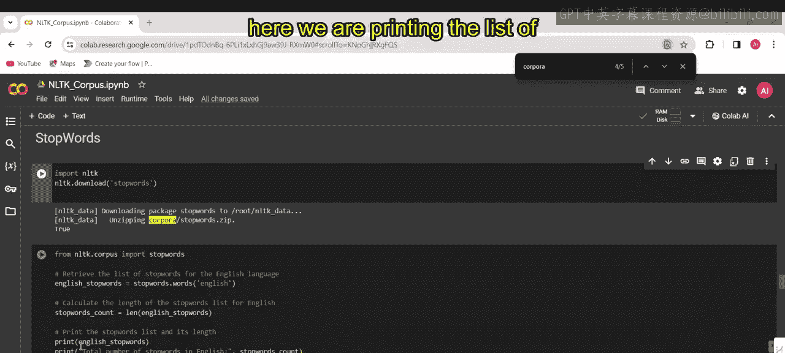
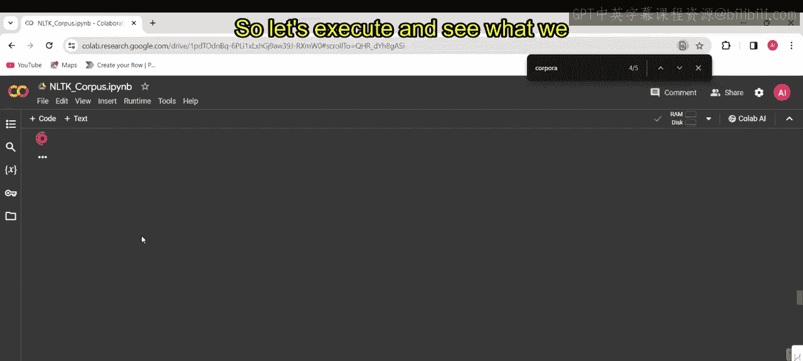
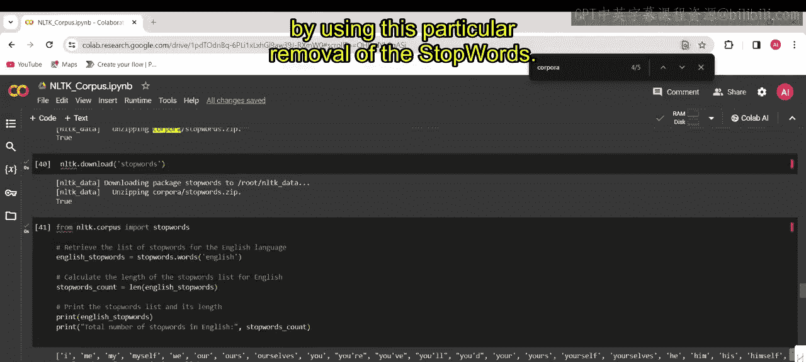
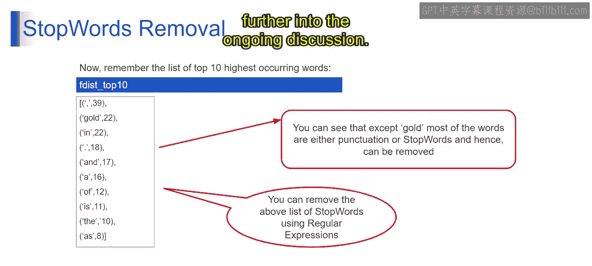

# 第一部分 116：停用词 🛑


在本节课中，我们将要学习自然语言处理中的一个重要概念——**停用词**。我们将了解什么是停用词，为什么需要在文本分析任务中移除它们，以及如何使用代码来实现停用词的移除。

## 概述

停用词是语言中常见的、通常不携带重要含义或对句子整体语义贡献不大的词语。在文本处理过程中，这些词常被过滤掉，以提高文本分析任务的效率和准确性。例如，在英语中，“the”、“is”、“and”、“in”、“of”等词通常被视为停用词。

## 停用词简介


首先，我们来理解什么是停用词。停用词是语言中常见的词语，在文本分析任务（如自然语言处理和信息检索）中通常被认为是无关紧要或非必要的。它们经常从文本数据中移除，以便专注于更有意义的词语，并提高文本处理算法的效率。

从技术上讲，停用词是在文本分析任务中被视为不重要的词语。移除它们可以减少噪音，提高自然语言处理任务的准确性。


## 停用词的影响

上一节我们介绍了停用词的定义，本节中我们来看看它们的影响。大多数搜索引擎会忽略这些常见词语，因为包含它们会增加索引的大小，而不会提高搜索的精确度或召回率。



这句话强调了在文本分析任务（如搜索引擎索引）中忽略停用词背后的逻辑。通过过滤掉停用词，搜索引擎可以专注于更有意义的术语，从而提高搜索的相关性和效率。

以下是停用词被忽略的核心原因：
*   **增加索引大小**：停用词出现频率极高，包含它们会不必要地膨胀数据库。
*   **不改善精度**：停用词对确定文档主题或用户搜索意图帮助不大。
*   **不改善召回率**：它们通常不会帮助找到更相关的文档。

## 识别与获取停用词

理解了停用词的影响后，我们来看看如何在实践中识别和获取它们。我们将使用Python的NLTK库来操作。

以下是使用NLTK获取英语停用词列表的代码步骤：




```python
# 第一部分 1. 导入必要的库和模块
import nltk
from nltk.corpus import stopwords

# 第一部分 2. 下载停用词语料库（如果尚未下载）
nltk.download('stopwords')

# 第一部分 3. 获取英语停用词列表
english_stop_words = stopwords.words('english')

# 第一部分 4. 计算停用词总数
stop_words_count = len(english_stop_words)

# 第一部分 5. 打印结果
print("英语停用词列表：", english_stop_words)
print("停用词总数：", stop_words_count)
```



这段代码演示了如何使用NLTK检索英语停用词列表并获取其总数。执行后，你会看到一个包含“i”、“we”、“my”、“myself”、“are”等词的列表，总数通常是**179**个。你可以想象，通过移除这些词，我们可以显著减少需要处理的词汇索引数量。


## 停用词移除实践

现在我们已经获得了停用词列表，接下来学习如何从实际文本中移除它们。移除停用词是文本预处理的关键步骤。

在提供的上下文中，有一个使用词频分布提取出的前10个最高频词的列表。移除停用词可以帮助我们得到更能反映文本主题的关键词。接下来的内容将进一步深入讨论。







## 总结


本节课中，我们一起学习了**停用词**的概念。我们了解到停用词是那些在语言中常见但语义贡献度低的词语，移除它们可以提高文本处理任务的效率和准确性。我们通过NLTK库查看了英语中的停用词示例，并理解了在搜索引擎和信息检索中过滤停用词的重要性。掌握停用词的处理是进行更高级文本分析的基础。