# 第一部分 117：停用词演示 🧹

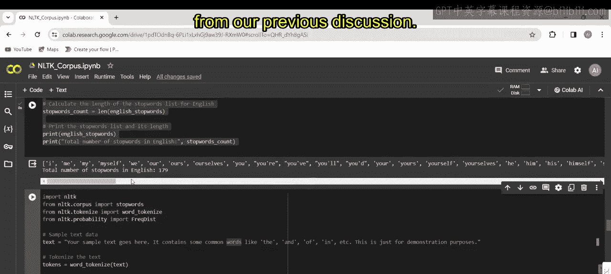

在本节课中，我们将学习自然语言处理中的一个重要预处理步骤：停用词移除。我们将通过具体的代码示例，演示如何识别并移除文本中的停用词和标点符号，从而简化文本数据，为后续的分析任务做好准备。

---

上一节我们讨论了文本分析的基本概念，本节中我们来看看如何通过代码实现停用词的移除。

首先，我们需要导入必要的NLTK库模块。

以下是导入模块的代码：
```python
import nltk
from nltk.corpus import stopwords
from nltk.tokenize import word_tokenize
from nltk.probability import FreqDist
```

*   `nltk` 是自然语言工具包，为自然语言处理任务提供各种工具和资源。
*   `stopwords` 模块包含多种语言的常见停用词列表。
*   `word_tokenize` 函数用于将文本分割成独立的单词，即分词。
*   `FreqDist` 类用于计算序列中各项的频率分布。

接下来，我们准备一段用于演示的样本数据。

以下是样本文本：
```python
text = "Yes sample text goes here. It contains some common words like the, and, of, in, etc."
```

这段文本包含了一些常见的停用词，如 “the”、“and”、“of”、“in” 等，仅用于演示目的。

现在，我们对文本进行分词处理。

以下是分词代码：
```python
tokens = word_tokenize(text)
```

`word_tokenize` 函数将文本分割成独立的单词（即词元），并将它们存储在 `tokens` 变量中。

分词完成后，我们开始移除停用词。

以下是移除停用词的代码：
```python
stop_words = set(stopwords.words('english'))
filtered_tokens = [word for word in tokens if word.lower() not in stop_words]
```

*   `stopwords.words('english')` 调用会检索一个英语停用词集合。
*   列表推导式 `[word for word in tokens if word.lower() not in stop_words]` 会从分词后的文本中过滤掉停用词，同时忽略大小写差异。过滤后的词元存储在 `filtered_tokens` 变量中。

完成停用词移除后，我们可以计算剩余词汇的频率分布。

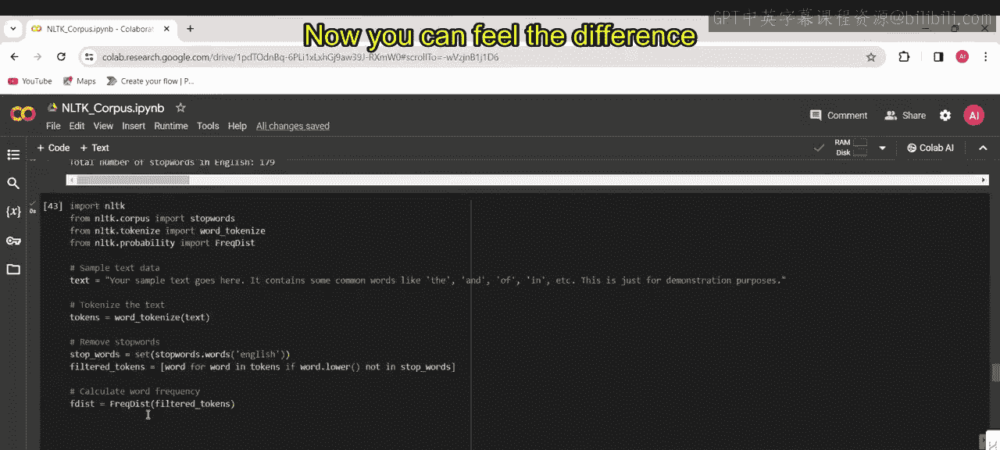

以下是计算词频的代码：
```python
fdist = FreqDist(filtered_tokens)
top_10 = fdist.most_common(10)
print(top_10)
```

*   `FreqDist(filtered_tokens)` 函数根据过滤后的词元创建一个频率分布对象，用于统计每个唯一单词的出现次数。
*   `most_common(10)` 方法用于从频率分布对象中检索出现频率最高的10个单词及其频次。

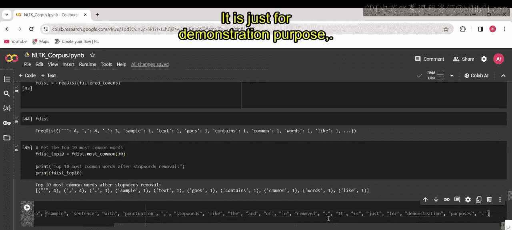

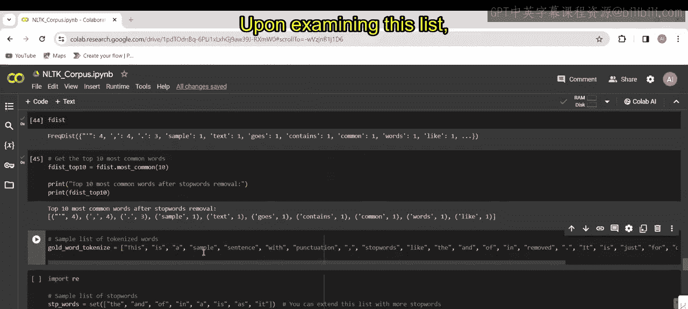

执行上述代码后，控制台将打印移除停用词后最常见的10个单词。与原始文本相比，你可以感受到数据精简带来的变化。

---

为了更全面地展示预处理效果，我们接下来演示如何同时处理标点符号。

我们使用另一段包含标点和停用词的样本文本。

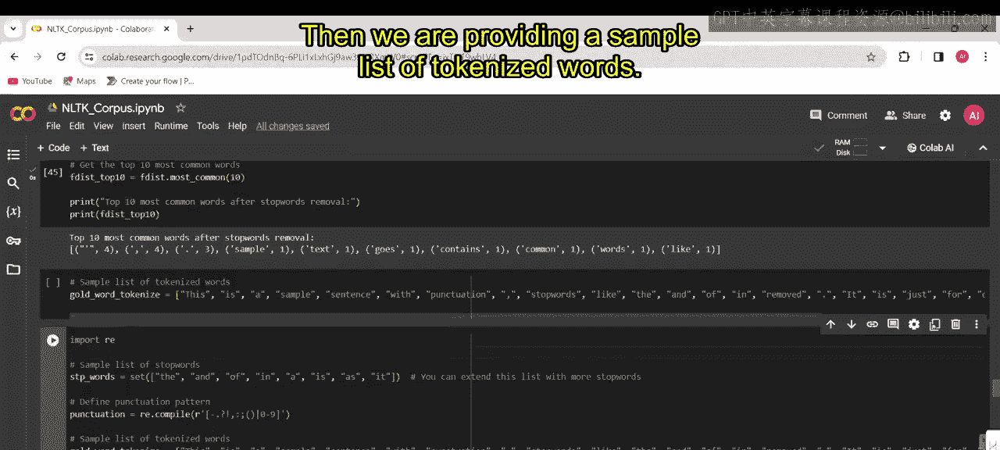

以下是包含标点的样本：
```python
gold_word_tokenized = ['This', 'is', 'a', 'sample', 'sentence', 'with', 'punctuations', ',', 'and', 'stop', 'words', 'like', 'the', ',', 'and', ',', 'of', ',', 'in', 'removed', '.']
```

以下是移除标点和停用词的完整代码步骤：
```python
import re

# 第一部分 定义停用词列表和标点符号模式
stop_words_list = ['the', 'and', 'of', 'in', 'a', 'is', 'as', 'it']
punctuation_pattern = re.compile(r'[^\w\s]')

# 第一部分 初始化列表，用于存储处理后的单词
post_punctuation = []

# 第一部分 遍历每个词元，移除标点
for word in gold_word_tokenized:
    cleaned_word = punctuation_pattern.sub('', word)
    if cleaned_word:  # 如果清洗后的单词非空
        post_punctuation.append(cleaned_word)

# 第一部分 从清洗后的列表中移除停用词
final_filtered = [word for word in post_punctuation if word.lower() not in stop_words_list]

print(final_filtered)
```

*   `import re` 导入Python正则表达式模块，用于模式匹配操作。
*   `re.compile(r‘[^\w\s]’)` 创建了一个正则表达式模式，用于匹配常见的标点符号。
*   循环遍历 `gold_word_tokenized` 中的每个单词，使用 `punctuation_pattern.sub(‘’, word)` 移除标点，并将清洗后非空的单词添加到 `post_punctuation` 列表。
*   最后，再次使用列表推导式从 `post_punctuation` 中过滤掉停用词，得到 `final_filtered`。

执行代码后，控制台将输出同时移除了标点和停用词的单词列表。可以看到，“a”、“is”等停用词以及逗号、句点等标点已被成功移除。

---

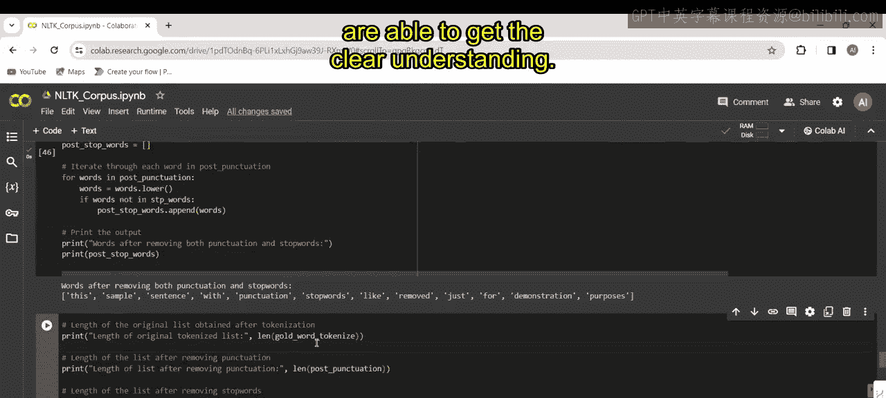

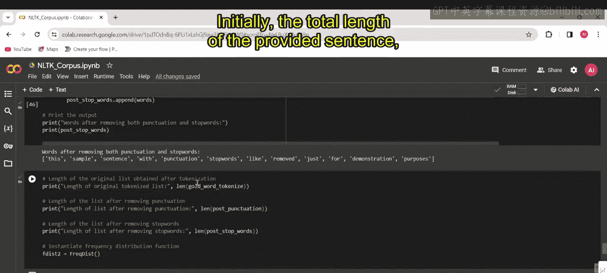

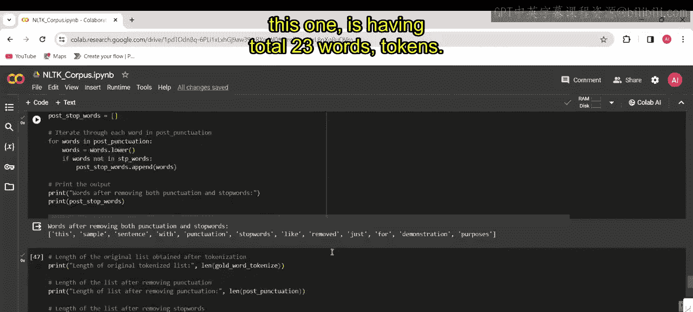

为了量化预处理的效果，我们可以比较各处理阶段列表的长度。

以下是计算和比较长度的代码：
```python
original_length = len(gold_word_tokenized)
after_punct_length = len(post_punctuation)
final_length = len(final_filtered)

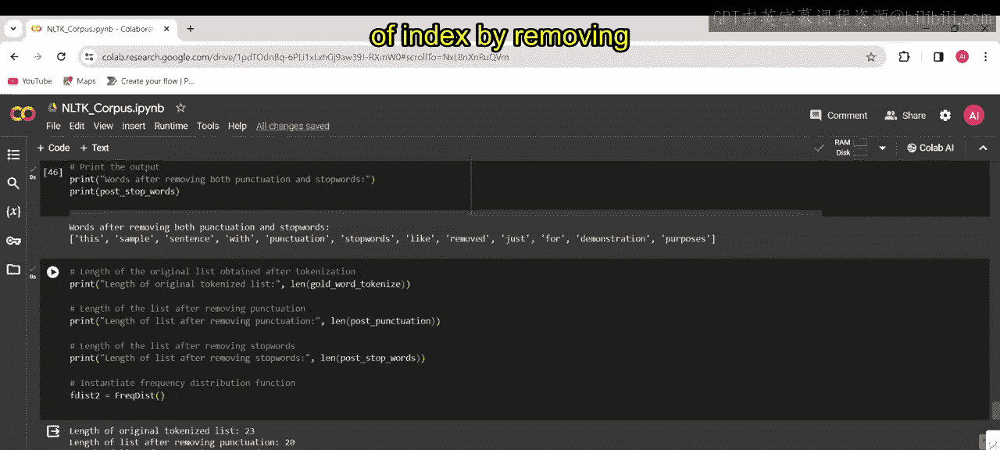

print(f"原始列表长度: {original_length}")
print(f"移除标点后长度: {after_punct_length}")
print(f"最终列表长度（移除标点和停用词后）: {final_length}")
```

执行后，输出可能类似于：
```
原始列表长度: 23
移除标点后长度: 20
最终列表长度（移除标点和停用词后）: 12
```

通过比较这些长度，可以观察到：
1.  移除标点使列表大小减少，因为它消除了标点符号。
2.  进一步移除停用词，通过排除常见且信息量较少的单词，使列表大小变得更小。
在这个例子中，单词数量从23个减少到12个，精简了近50%的数据量，有效去除了文本中的“噪声”。

最后，我们可以对预处理后的文本进行频率分布分析。

以下是分析代码：
```python
fdist2 = FreqDist(final_filtered)
print(fdist2.most_common())
```

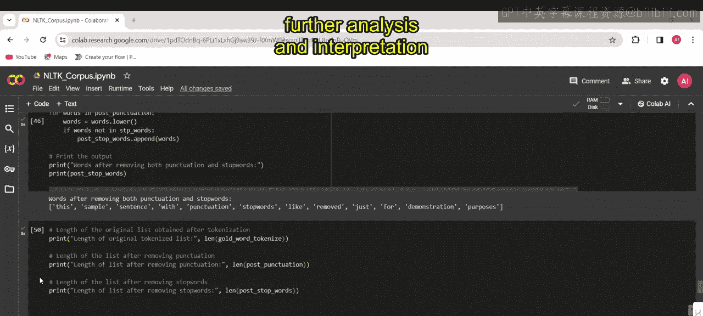

实例化一个新的频率分布对象 `fdist2`，可以分析停用词移除后文本数据中独特单词的分布情况。这个频率分布有助于了解清洗后文本中最常见的词汇，便于进一步的分析和解读。

---

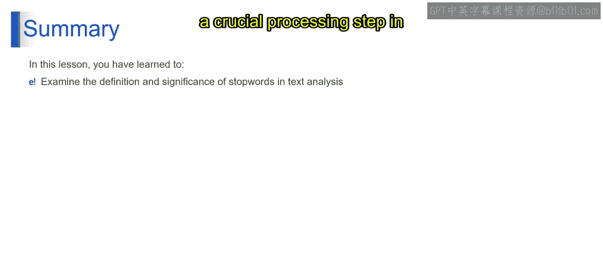

本节课中我们一起学习了停用词在文本分析中的作用及其重要性。通过具体的编码示例，我们实现了停用词移除这一文本分析中的关键预处理步骤。这个过程包括识别并消除文本数据中的常见功能词（停用词）和标点符号，从而提升文本分析结果的质量和准确性。通过比较预处理前后数据的变化，我们可以直观地评估这一步骤对文本数据的精简效果。