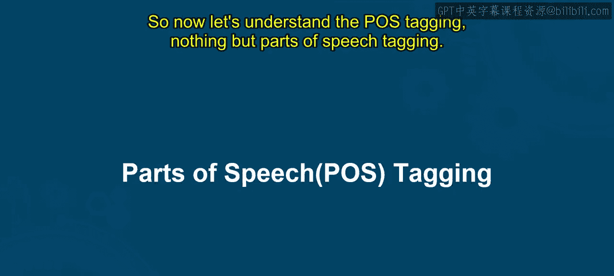

# 第一部分 118：词性标注

在本节课中，我们将要学习自然语言处理中的一个基础任务——词性标注。我们将了解它的定义、重要性，并认识一些常见的词性标签。

## 概述

词性标注是自然语言处理中的一项基础任务，它为句子中的每个单词标注其对应的语法类别或词性，例如名词、动词、形容词、副词等。这种标注有助于理解句子的句法结构和含义，并为后续的文本分析任务提供支持。

## 什么是词性标注？

词性标注，即对句子中的每个单词进行词性标记。这项任务通过统计模型或基于规则的算法，根据单词在句子中的上下文和语法角色，为其分配一个特定的标签。这些标签通常遵循一个标准标签集，例如宾州树库标签集。

例如，在句子“Gaurro likes to eat P.”中：
*   “Gaurro” 被标注为 **名词**。
*   “likes” 被标注为 **动词**。
*   “to” 被标注为 **介词**。
*   “eat” 被标注为 **动词**。
*   “P” 被标注为 **名词**。

词性标注对于句法分析、信息提取、情感分析、文本生成和机器翻译等任务至关重要，因为它提供了关于文本数据的有价值的语言学信息。

## 词性的上下文依赖性

同一个单词在不同的上下文中可能属于不同的词性。词性标注能够帮助我们捕捉语言的这种灵活性。

例如，在句子“Google something on the internet”中：
*   单词“Google”通常是一个专有名词，指代一家公司。
*   然而，在这个句子中，它被用作**动词**，意思是“在网络上搜索”。

这展示了词性标注的重要性：它允许我们根据单词在句子中的具体用法来理解其语法功能，从而更准确地分析文本。

## 常见词性标签

以下是部分常见的词性标签及其描述：

*   **名词**：表示人、地点、事物或概念。
*   **动词**：表示动作、状态或事件。
*   **形容词**：描述或修饰名词。
*   **副词**：修饰动词、形容词或其他副词，表示方式、地点、时间等。
*   **代词**：代替名词或名词短语。
*   **介词**：表示名词或代词与其他词之间的关系。
*   **连词**：连接单词、短语或句子。
*   **感叹词**：表达强烈的情感或反应。

## 总结

本节课中，我们一起学习了词性标注。我们了解到，词性标注是为文本中的单词标记其语法类别的过程，它是理解句子结构的基础。我们还认识到，单词的词性依赖于上下文，而准确的词性标注对于许多高级的自然语言处理应用至关重要。下一节视频将继续深入探讨相关主题。