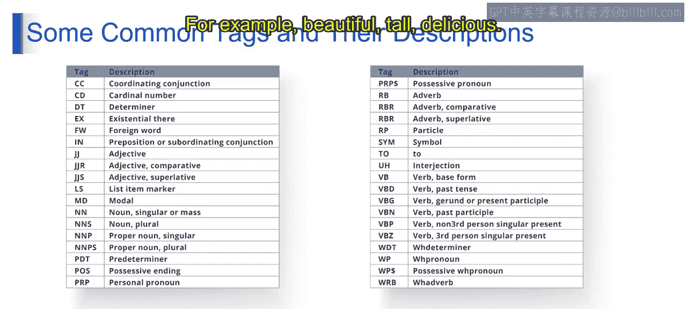
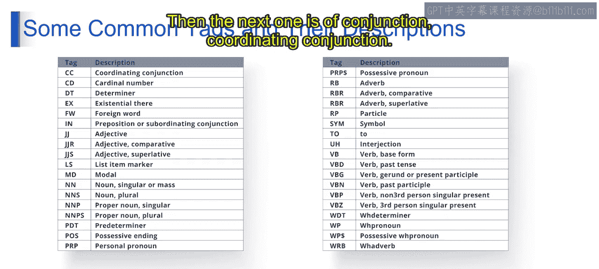
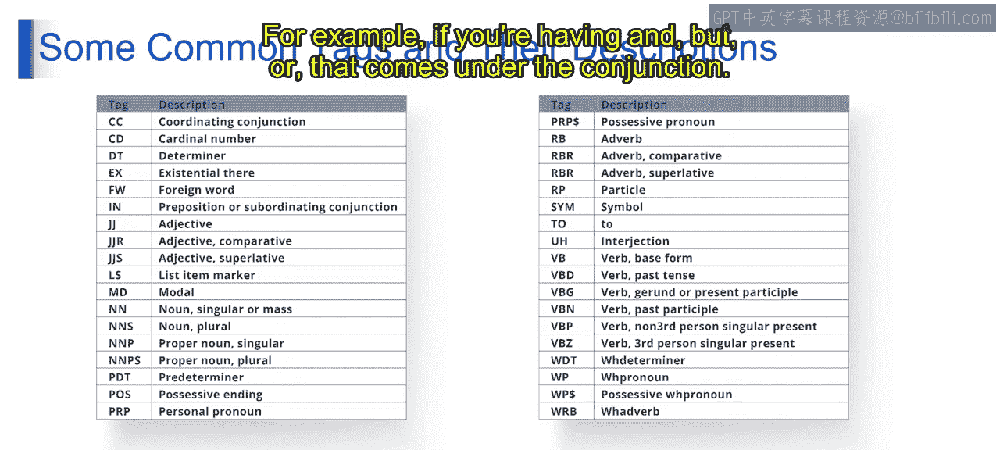
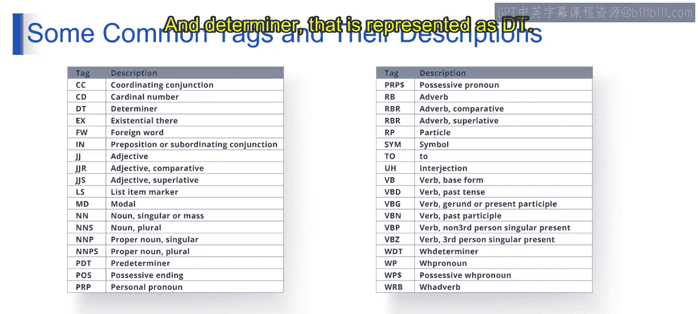
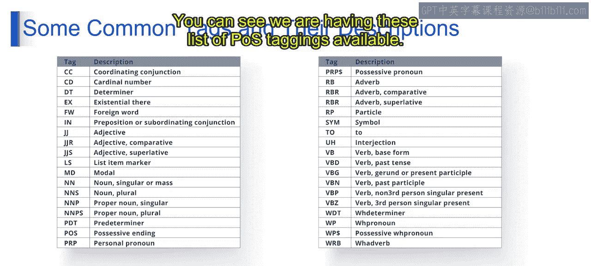
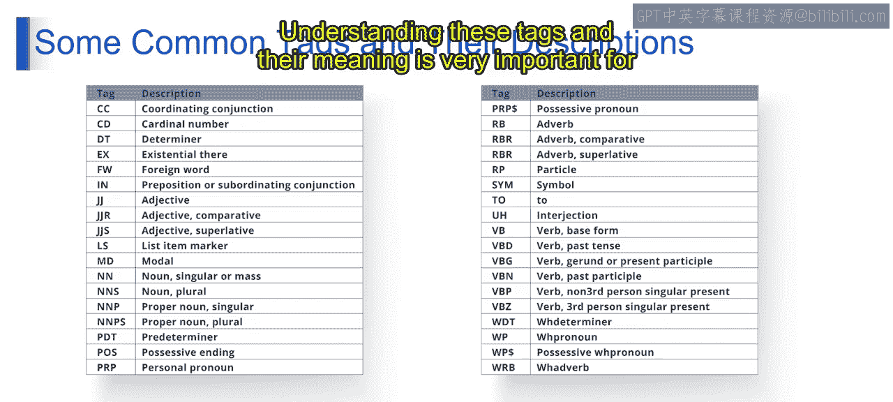
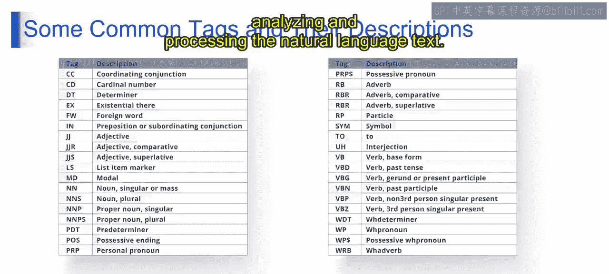
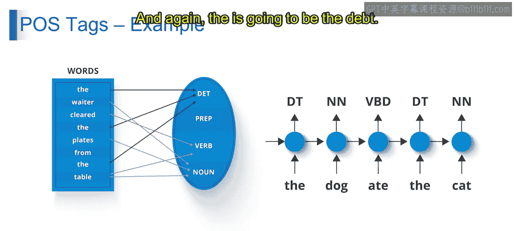
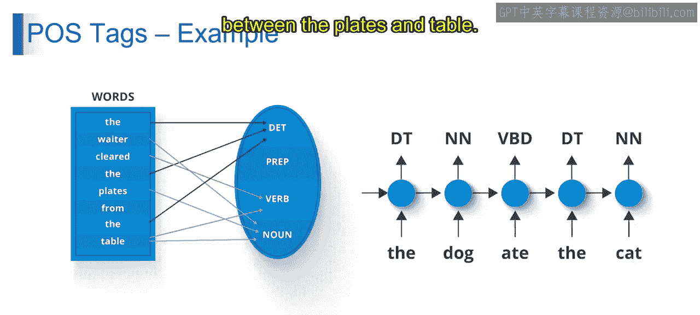
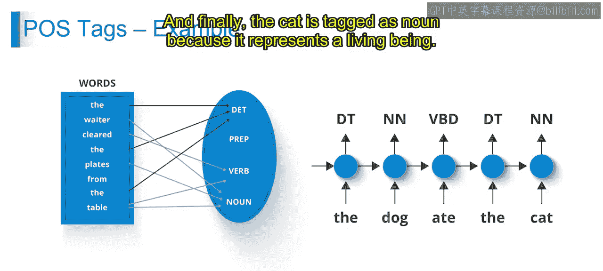

# 第一部分 119：词性常见标签与描述 📚

在本节中，我们将学习自然语言处理中词性标注的基础知识，了解最常见的词性标签及其含义和用法。

上一节我们介绍了词性标注的基本概念，本节中我们来看看具体的词性标签及其描述。

## 常见词性标签与描述

以下是自然语言处理中最常用的一些词性标签及其详细说明。

*   **名词**：标签为 **`NN`**。表示人、地点、事物或概念的词。
    *   例如：`car`（汽车）、`house`（房子）、`book`（书）。

*   **动词**：标签为 **`VB`**。表示动作、事件或存在状态的词。
    *   例如：`run`（跑）、`eat`（吃）、`sleep`（睡）。

*   **形容词**：标签为 **`JJ`**。用于描述或修饰名词或代词，表示其性质或属性的词。
    *   例如：`beautiful`（美丽的）、`tall`（高的）、`delicious`（美味的）。

*   **副词**：标签为 **`RB`**。用于修饰动词、形容词或其他副词，表示方式、地点、时间、程度等的词。
    *   例如：`quickly`（快速地）、`very`（非常）、`here`（这里）。

*   **代词**：标签为 **`PRP`**。用于替代名词或名词短语，指代人、事物的词。
    *   例如：`he`（他）、`she`（她）、`it`（它）。

*   **介词**：标签为 **`IN`**。用于表示名词或代词与句中其他词之间关系的词。
    *   例如：`in`（在…里）、`on`（在…上）、`at`（在…处）。
    *   例句：`I am in a classroom.`（我在教室里。）`The cat is on the mat.`（猫在垫子上。）

*   **连词**：标签为 **`CC`**。用于连接单词、短语或句子的词。
    *   例如：`and`（和）、`but`（但是）、`or`（或者）。

*   **感叹词**：标签为 **`UH`**。用于表达情感、感觉或反应的词或短语。
    *   例如：`wow`（哇）、`ouch`（哎哟）。

*   **限定词**：标签为 **`DT`**。用于引入或特指名词的词，如冠词或指示词。
    *   例如：`the`（定冠词）、`a`/`an`（不定冠词）、`this`（这个）、`that`（那个）。

以上只是自然语言处理中使用的部分常见词性标签示例。理解这些标签及其含义对于分析和处理自然语言文本至关重要。

## 词性标注实例分析

现在，让我们通过具体例句来实践如何应用这些标签。

**例句 1：The waiter cleared the plates from the table.**

*   `The` 标注为 **`DT`**（限定词），因为它特指其后的名词。
*   `waiter` 标注为 **`NN`**（名词），因为它表示一个人。
*   `cleared` 标注为 **`VB`**（动词），因为它表示一个动作。
*   `the` 再次标注为 **`DT`**（限定词）。
*   `plates` 标注为 **`NN`**（名词），因为它表示物体。
*   `from` 标注为 **`IN`**（介词），因为它表示 `plates` 和 `table` 之间的关系。
*   `the` 标注为 **`DT`**（限定词）。
*   `table` 标注为 **`NN`**（名词），因为它表示一个物体。

**例句 2：The dog ate the cat.**

基于对上一个例子的理解：
*   `The` 标注为 **`DT`**（限定词）。
*   `dog` 标注为 **`NN`**（名词），因为它表示一个生物。
*   `ate` 标注为 **`VB`**（动词），因为它表示一个动作。
*   `the` 标注为 **`DT`**（限定词）。
*   `cat` 标注为 **`NN`**（名词），因为它表示一个生物。

这些例子展示了如何根据单词在句子中的语法功能和角色，为其标注相应的词性标签。

本节课中我们一起学习了自然语言处理中最核心的词性标签，包括名词、动词、形容词等，并通过实例分析了如何对句子进行词性标注。理解这些标签是进行更复杂文本分析的基础。接下来的课程将继续深入探讨相关主题。