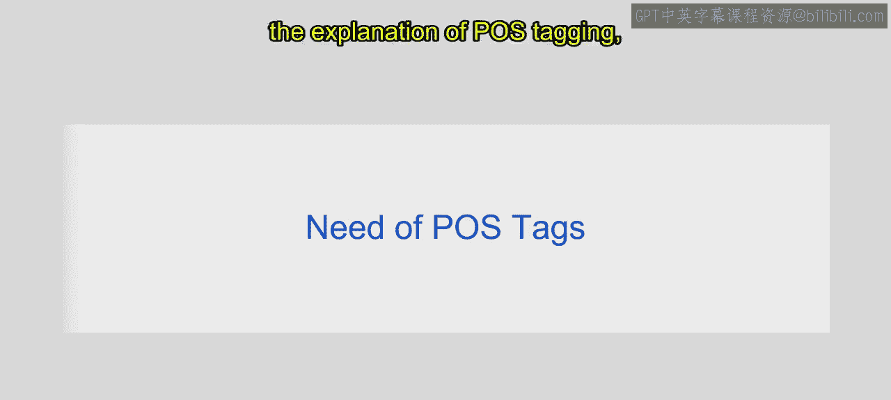
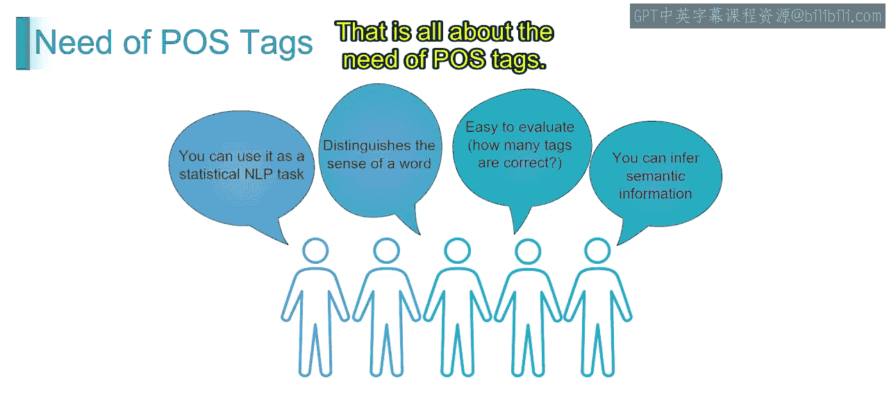
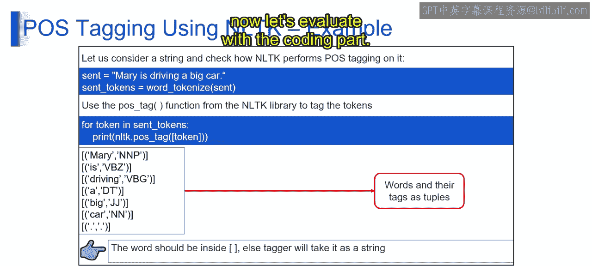

# 第一部分 120：词性标注的需求

在本节中，我们将探讨词性标注在自然语言处理中的重要性。我们将了解它如何作为基础任务，服务于更复杂的NLP应用。

上一节我们介绍了词性标注的基本概念，本节中我们来看看为什么这项技术如此关键。词性标注不仅仅是给单词打标签，它为理解语言的结构和含义提供了基础。

## 概述

词性标注的需求主要体现在四个方面：作为统计NLP任务的基础、区分词语含义、便于模型评估以及推断语义信息。接下来，我们将逐一详细探讨。

## 1. 作为统计NLP任务的基础

词性标注是统计NLP模型中的一项基础任务。通过为句子中的单词分配词性标签，统计模型可以分析语言的句法结构和使用模式。

以下是其支持的下游NLP任务：
*   **句法分析**：理解句子的语法结构。
*   **机器翻译**：在跨语言转换时保持正确的语法。
*   **情感分析**：更准确地判断文本的情感倾向。

## 2. 区分词语含义

词性标注有助于在不同语境中区分词语的含义。

例如，单词 **“bank”** 可以指金融机构（名词），也可以指河岸（名词）。通过根据其在句子中的用法将其标注为相应的词性，可以帮助消除这种歧义。

请看以下例句：
*   **例句1**：“I want to go to a bank to draw some money.”（我想去银行取点钱。）
    *   在此句中，“bank” 被标注为名词，代表金融机构。
*   **例句2**：“I want some peace, I want to sit beside the bank.”（我想要些宁静，我想坐在岸边。）
    *   在此句中，“bank” 同样被标注为名词，但代表河岸。

词性标注通过这种方式帮助消除歧义，从而实现文本的准确解读。

## 3. 便于评估

词性标注为评估NLP模型的准确性提供了一个结构化的框架。由于句子中的每个单词都被标注了特定的词性标签，因此通过比较预测标签与真实标签来评估词性标注算法的性能变得相对容易。

这个评估指标有助于衡量词性标注系统的**精确率**和**召回率**。

## 4. 推断语义信息

词性标签蕴含了关于单词在句子中语法角色和功能的语义信息。通过分析文本语料库中词性标签的分布，NLP系统可以推断出句法模式、语义关系和语言结构。

这种洞察力有助于以下任务：
*   **文本摘要**
*   **问答系统**
*   **信息检索**

## 总结

本节课中我们一起学习了词性标注的核心需求。总的来说，词性标注在NLP中扮演着至关重要的角色，它通过促进统计分析、消除词义歧义、提供评估框架以及从文本数据中推断语义信息，从而提高了NLP系统在各种语言处理任务中的准确性、效率和可解释性。

基于以上的技术理解，接下来让我们通过实际的编码方法来探索如何利用NLTK库进行词性标注。下一节视频将深入探讨具体的实现。