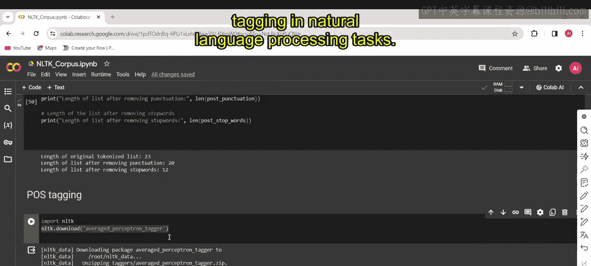
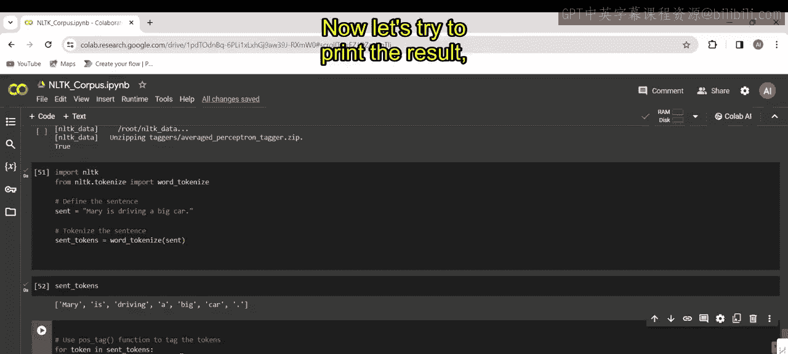
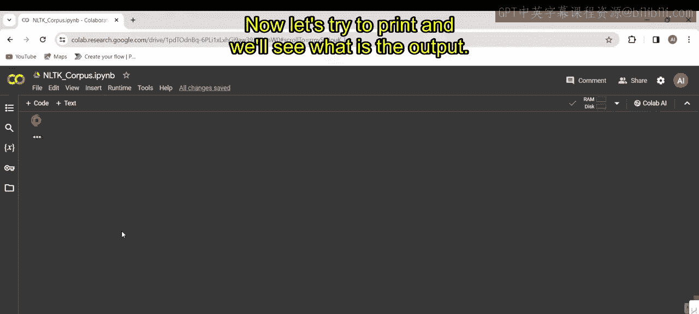
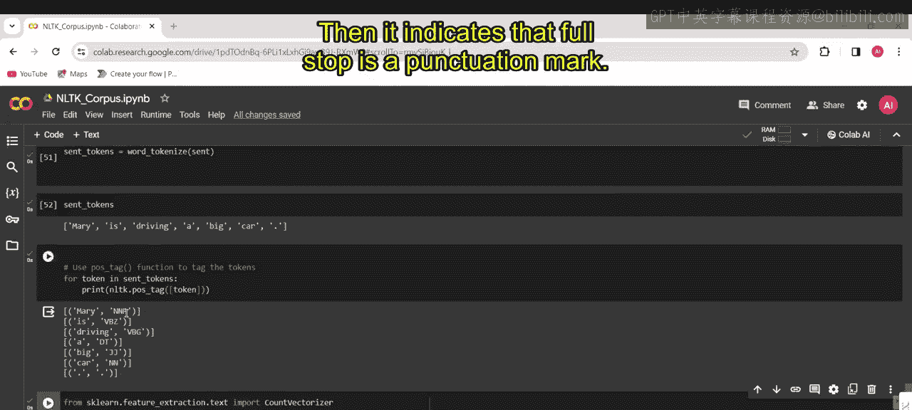
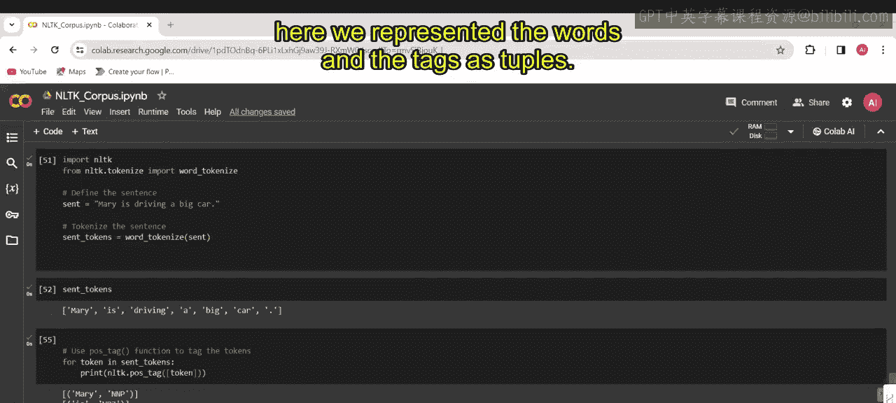
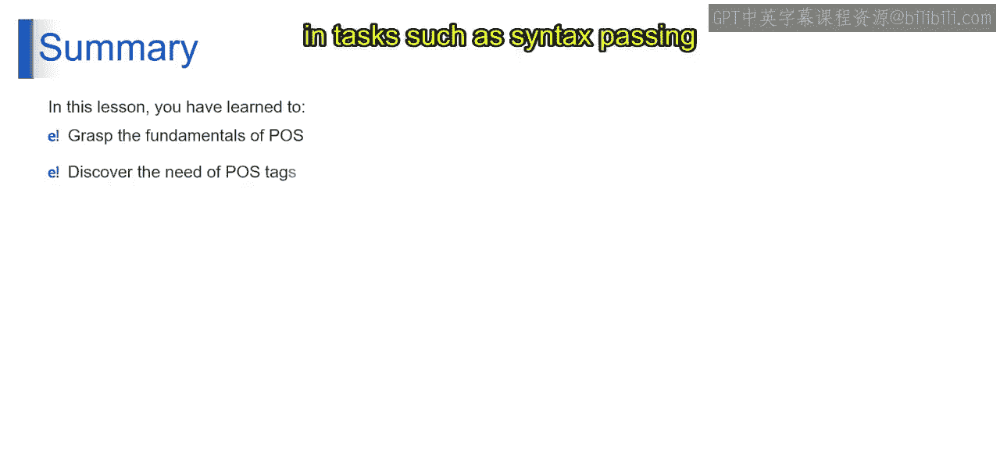

# 第一部分 121：词性标注演示

在本节课中，我们将学习词性标注的基本概念，并通过一个具体的代码示例来演示如何使用NLTK库进行词性标注。词性标注是自然语言处理中的一项基础任务，它帮助我们理解句子中每个单词的语法角色。

## 概述

词性标注旨在为句子中的每个单词分配一个特定的词性标签，例如名词、动词、形容词等。这有助于我们更深入地分析句子的结构和含义。本节我们将使用NLTK库中的预训练模型来完成这一任务。



## 代码实现步骤

以下是实现词性标注的具体步骤，我们将逐一进行讲解。

### 1. 导入必要库

首先，我们需要导入NLTK库及其分词模块。NLTK是一个广泛使用的自然语言处理工具包。

```python
import nltk
from nltk.tokenize import word_tokenize
```

### 2. 下载预训练模型

接下来，我们需要下载一个名为“平均感知机标注器”的预训练模型。这是一个统计模型，专门用于词性标注任务。

```python
nltk.download('averaged_perceptron_tagger')
```

### 3. 定义并分词句子

我们定义一个示例句子：“Mary is driving a big car.”，然后使用`word_tokenize`函数将其分割成独立的单词（即分词）。



```python
sentence = "Mary is driving a big car."
sent_tokens = word_tokenize(sentence)
print(sent_tokens)
```

执行上述代码后，我们将得到分词结果：`['Mary', 'is', 'driving', 'a', 'big', 'car', '.']`。

### 4. 执行词性标注

现在，我们对分词后的单词列表进行词性标注。我们使用`nltk.pos_tag`函数，它接收一个单词列表并返回每个单词及其对应的词性标签。



```python
pos_tags = nltk.pos_tag(sent_tokens)
print(pos_tags)
```

## 结果分析

运行标注代码后，我们将得到以下输出：

```
[('Mary', 'NNP'), ('is', 'VBZ'), ('driving', 'VBG'), ('a', 'DT'), ('big', 'JJ'), ('car', 'NN'), ('.', '.')]
```

每个元组包含一个单词及其词性标签。以下是各标签的含义解释：

*   **NNP**: 专有名词，单数。例如“Mary”。
*   **VBZ**: 动词，第三人称单数现在时。例如“is”。
*   **VBG**: 动词，现在分词。例如“driving”。
*   **DT**: 限定词。例如“a”。
*   **JJ**: 形容词。例如“big”。
*   **NN**: 名词，单数。例如“car”。
*   **.**: 标点符号。例如句号“.”。





通过对比“Mary”(NNP)和“car”(NN)，我们可以看出专有名词和普通名词在标签上的区别。

## 总结



本节课我们一起学习了词性标注的基本原理和实现方法。我们使用NLTK库下载了预训练模型，对一个英文句子进行了分词和词性标注，并解读了常见的词性标签。理解词性标注是进行更复杂语言分析（如句法分析和语义理解）的重要基础。