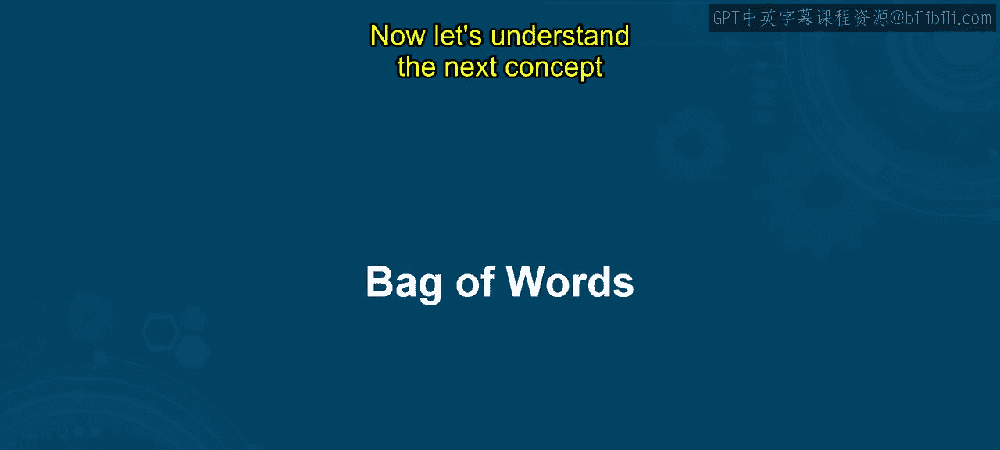
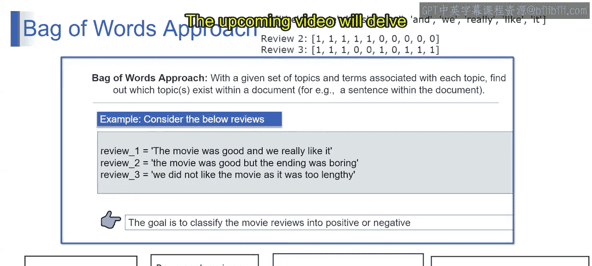

# 第一部分 122：词袋模型

在本节课中，我们将要学习自然语言处理中的一个基础技术——词袋模型。我们将了解词袋方法的核心思想，并学习如何通过它进行文本处理。课程结束时，你将能够理解词袋模型的基本原理，并掌握NLP任务中必要的预处理步骤。

## 概述

词袋模型是自然语言处理中用于文本分析和特征提取的一项基础技术。它将文档视为一个单词的集合，忽略语法和单词顺序，只关注单词的出现频率。

## 什么是词袋模型？

上一节我们介绍了课程目标，本节中我们来看看词袋模型的具体定义。

词袋模型是一种用于自然语言处理中文本分析和特征提取的基础技术。它将一个文档表示为一个单词的集合，忽略语法和单词顺序，只关注单词的出现频率。

例如，我们有两个句子：句子一和句子二。使用词袋方法，我们首先创建一个包含语料库中所有唯一单词的词汇表。

接下来，我们将每个句子表示为一个向量，其中向量的维度对应词汇表中的单词。向量中的值表示每个单词在相应句子中出现的频率。

例如，第一个句子的向量表示将是：对于词汇表中的每个单词，如果该单词在句子中出现，则对应位置为1（或出现次数），否则为0。

现在让我们看看第二个句子的向量表示会是什么样。

## 向量表示示例

以下是两个句子的向量表示过程：

*   **句子一**：检查每个词汇表单词是否在句子中出现，出现则标记为1，否则为0。
*   **句子二**：同样，根据词汇表单词在句子中的出现情况，生成对应的向量。

这些向量捕获了每个句子中单词的出现情况，从而实现了定量的比较和分析。

从技术上讲，词袋模型将每个文档视为一个无序的单词集合，忽略语法和单词顺序。它将文档表示为高维向量，其中每个维度对应词汇表中的一个唯一单词，每个维度的值表示该单词在文档中的出现频率或存在情况。

词袋模型通过关注单词频率来简化文本数据，从而支持各种NLP任务，如文本分类、情感分析和信息检索。

## 词袋模型的应用

基于以上理解，让我们更深入地探讨其应用。

假设我们拥有关于一组主题及其相关术语的信息，需要找出文档中包含哪些主题。例如，对文档中的句子进行分类。

他们提供了一个例子：为了使用词袋方法将电影评论分类为正面或负面，我们首先需要基于评论中出现的唯一单词创建一个词汇表。然后，我们将每条评论表示为一个向量，指示词汇表中每个单词的频率。最后，我们可以使用这些向量来训练一个分类器，以预测新评论的情感。

以下是具体步骤：

1.  **创建词汇表**：识别所有评论中的唯一单词，这些单词构成词汇表。
2.  **将评论表示为向量**：对于每条评论，创建一个向量，指示词汇表中每个单词的频率。
3.  **训练分类器**：使用代表评论的向量作为输入特征，并使用相应的情感标签作为目标，训练一个分类器。
4.  **预测新评论的情感**：对于新的评论，对其进行分词，并使用相同的词汇表将其表示为向量。然后使用训练好的分类器根据其向量表示来预测情感。

## 总结

本节课中我们一起学习了词袋模型。我们了解了它是如何通过忽略语法和顺序、只关注词频来将文本数据转化为数值向量的。我们还探讨了其在文本分类中的基本应用流程，包括创建词汇表、生成向量表示以及训练分类器。词袋模型是NLP领域一个简单而强大的基础工具。