# 第一部分 123：词袋方法演示 🧠

在本节课中，我们将学习词袋模型的实际编码实现。我们将通过一个简单的例子，演示如何将文本数据转换为机器可以理解的数值向量，这是自然语言处理中的一项基础且关键的技术。

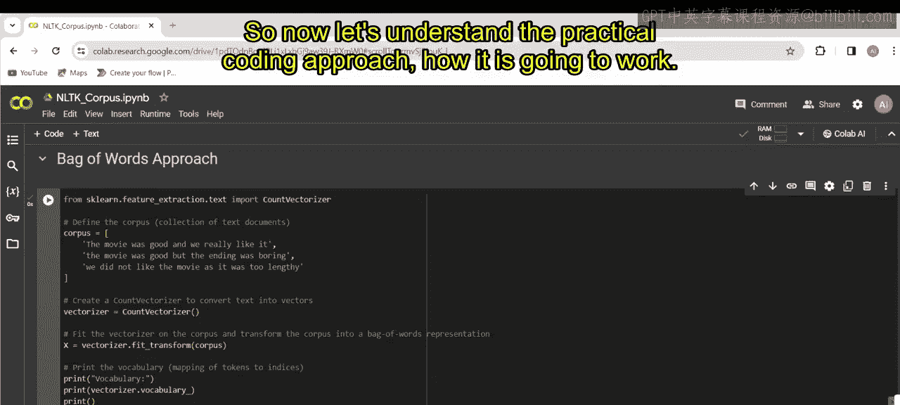

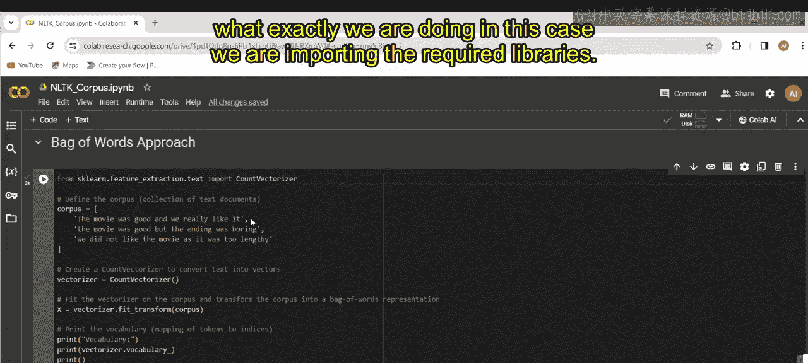

---

上一节我们讨论了词袋模型的基本概念，本节中我们来看看如何用代码实现它。首先，我们需要导入必要的库。

```python
from sklearn.feature_extraction.text import CountVectorizer
```

接下来，我们准备一个语料库，它是一组文档的集合。在这个例子中，我们使用三条电影评论。

```python
corpus = [
    "the movie was good and we really like it",
    "the movie was good but the ending was boring",
    "we did not like the movie as it was too lengthy"
]
```

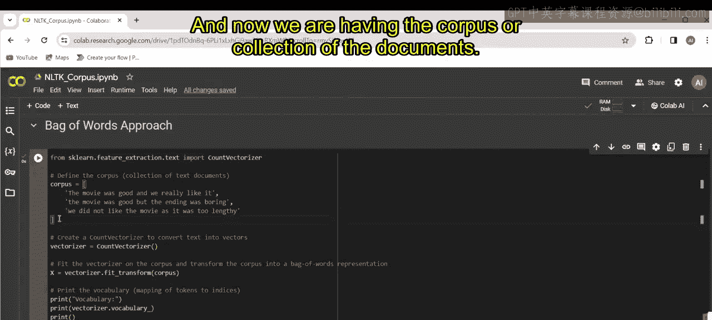

然后，我们创建一个 `CountVectorizer` 对象。这个对象将负责从文本中学习词汇并生成向量。

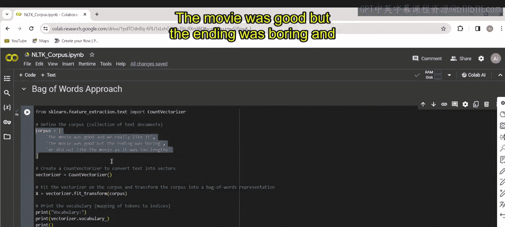

```python
vectorizer = CountVectorizer()
```

现在，我们使用 `fit_transform` 方法来处理语料库。这个方法会执行两个步骤：首先学习语料库中的词汇，然后将语料库转换为矩阵表示。

```python
X = vectorizer.fit_transform(corpus)
```

以下是 `fit_transform` 方法的工作原理：
*   **学习词汇**：它构建一个包含语料库中所有**唯一单词**的字典。
*   **转换文本**：它将语料库中的每个文档转换为一个向量，形成矩阵。
    *   矩阵的**每一行**对应语料库中的一个文档。
    *   矩阵的**每一列**对应词汇表中的一个唯一单词。
    *   矩阵**单元格中的值**代表该单词在对应文档中出现的频率。

让我们首先打印出学习到的词汇表，看看其中包含了哪些单词。

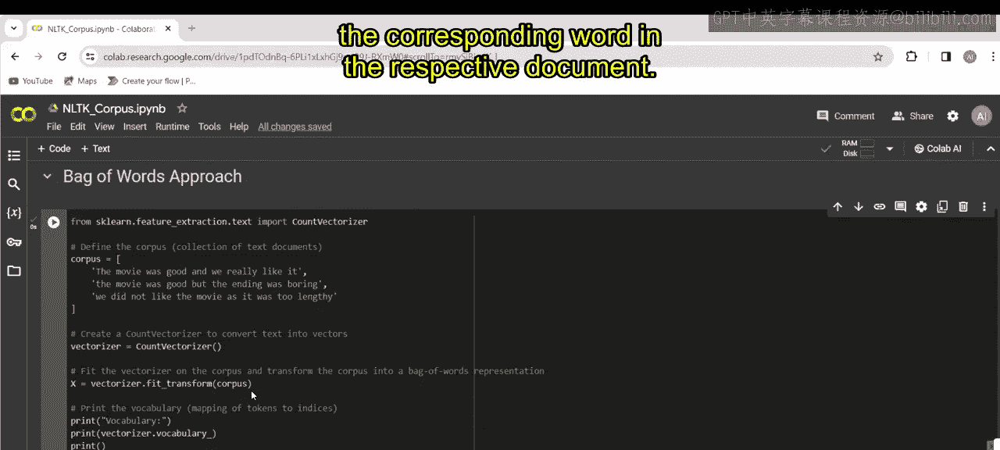

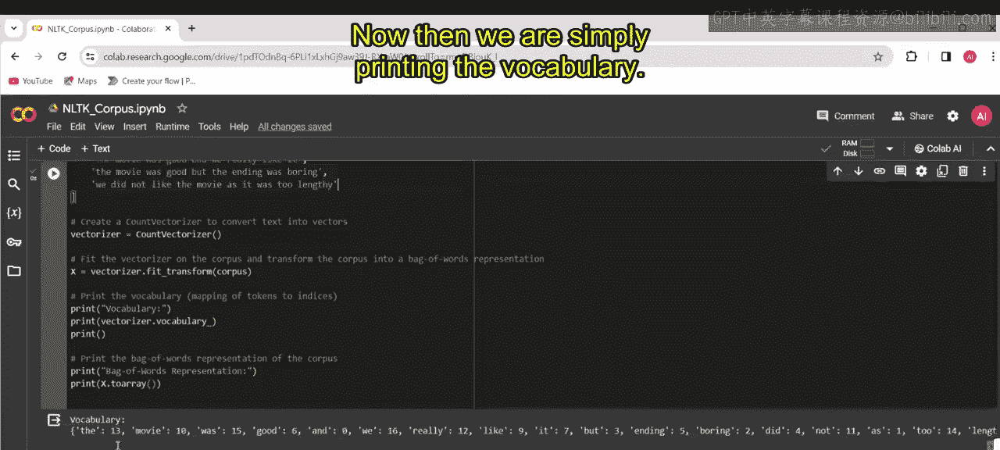

```python
print(vectorizer.vocabulary_)
```

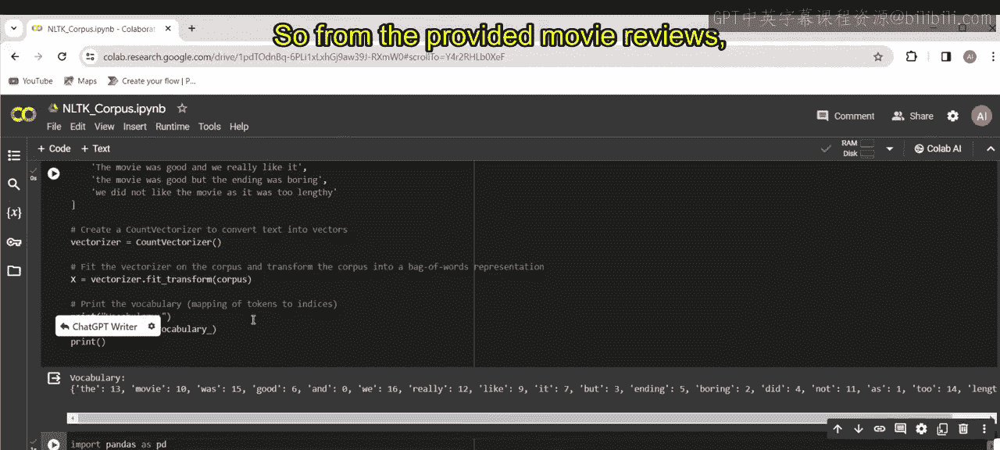

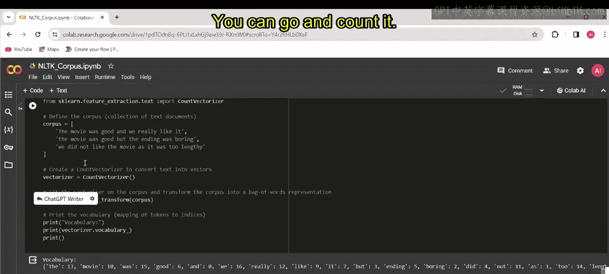

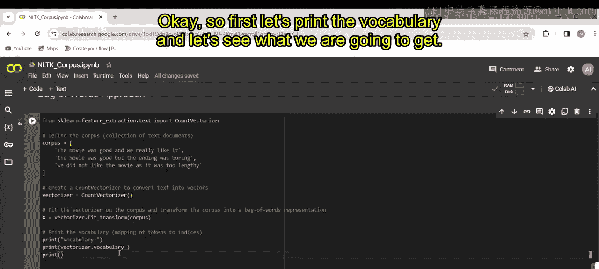

运行上述代码，你将看到类似以下的输出：

```
{'the': 13, 'movie': 10, 'was': 15, 'good': 6, 'and': 1, 'we': 16, 'really': 12, 'like': 9, 'it': 8, 'but': 3, 'ending': 5, 'boring': 2, 'did': 4, 'not': 11, 'as': 0, 'too': 14, 'lengthy': 7}
```

这个输出显示了从文本语料库中学到的词汇表。在这个上下文中，**词汇表**指的是从文本文档中提取出的**唯一单词或标记的集合**。每个单词旁边的数字是它在特征矩阵中对应的索引。例如：
*   `'the': 13` 表示单词 “the” 在词汇表中的索引是 13。
*   `'movie': 10` 表示单词 “movie” 的索引是 10。

现在，让我们查看词袋模型转换后的最终矩阵表示。

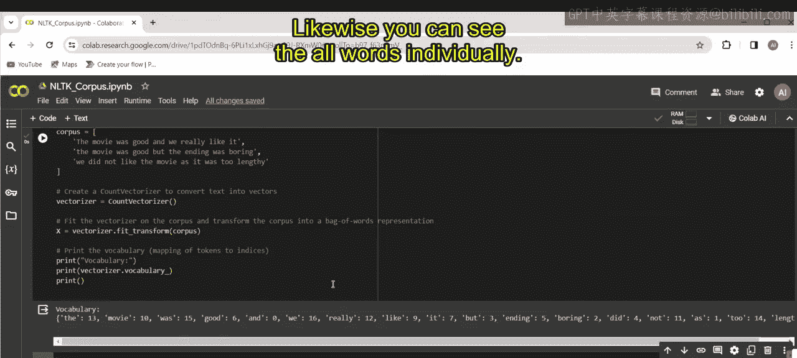

```python
print(X.toarray())
```

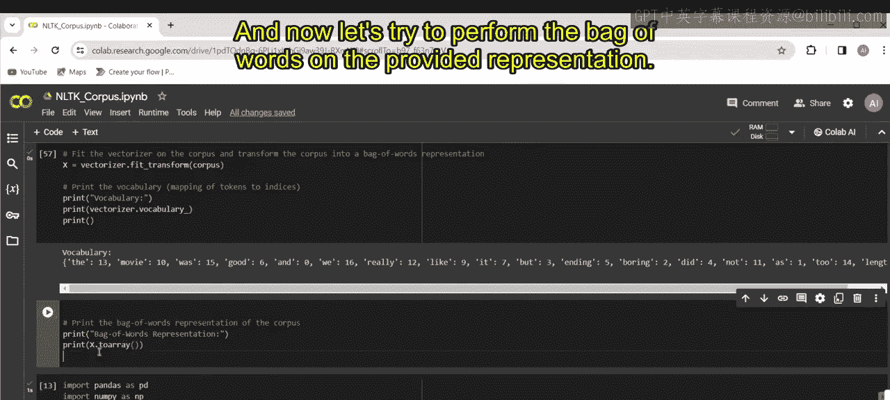

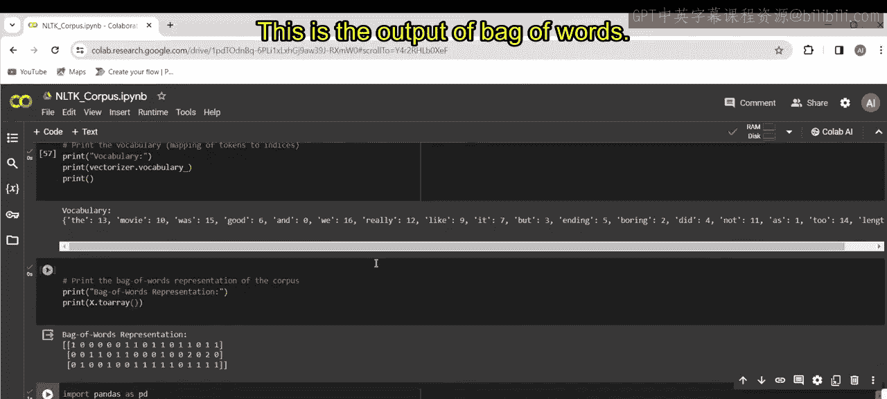

运行代码后，你将得到以下矩阵：

```
[[0 1 0 0 0 0 1 0 1 1 1 0 1 1 0 1 1]
 [0 0 1 1 0 1 1 0 0 0 1 0 0 2 0 2 0]
 [1 0 0 0 1 0 0 1 1 1 1 1 0 1 1 1 1]]
```

这个矩阵就是词袋模型的输出。它的工作原理如下：
*   矩阵的每一行代表一条评论。
*   每一列对应词汇表中的一个单词（顺序与 `vocabulary_` 中的索引一致）。
*   如果某个单词在一条评论中出现，其对应位置的值就是该单词出现的次数（例如第一行中 `‘the’` 的索引13处值为1，第二行中值为2）。
*   如果某个单词没有出现，其对应位置的值就是 **0**。

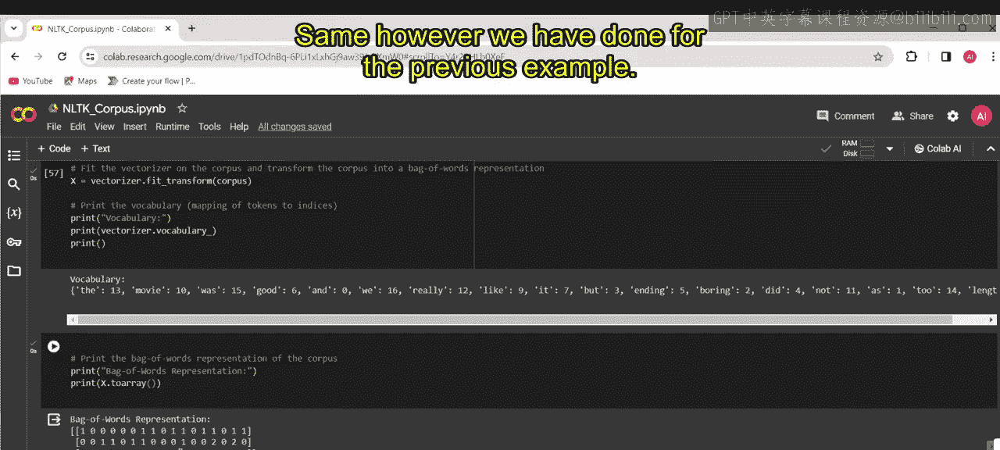

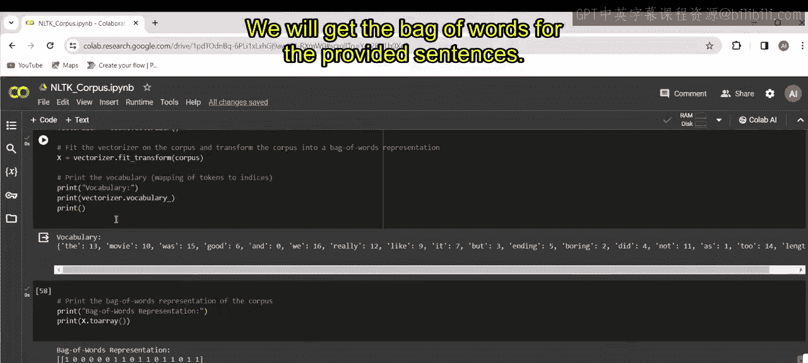

这段代码演示了文本处理的初始步骤：通过标记化评论并创建一组唯一单词，为后续的情感分析或文本分类等任务做好准备。

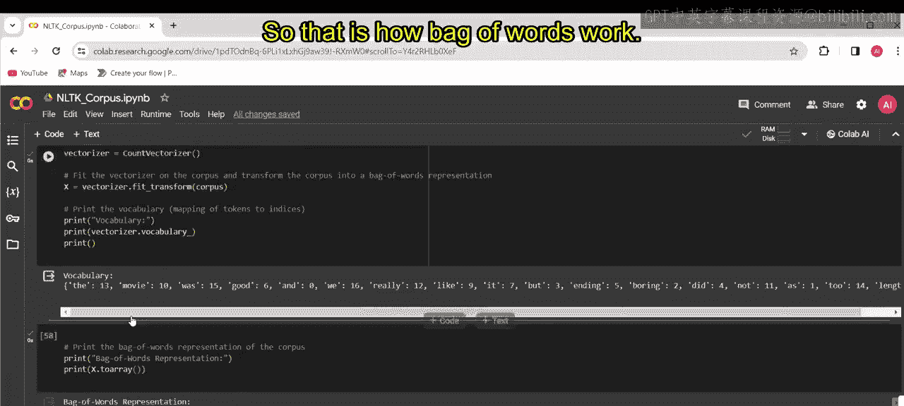

---

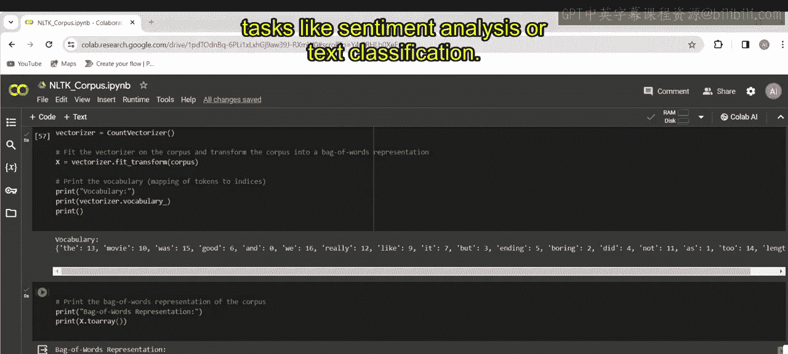

本节课中我们一起学习了词袋模型的代码实现。我们了解了如何使用 `CountVectorizer` 将文本语料库转换为数值矩阵，并解读了词汇表和特征矩阵的含义。这是将文本数据输入机器学习模型进行后续分析的关键第一步。