# 第一部分 124：词袋方法演示 II

在本节课中，我们将继续探索词袋模型，具体演示如何为单个电影评论构建词频字典，并将其整合为便于机器学习分析的数据表格。

上一节我们介绍了如何为整个语料库创建词汇表。本节中我们来看看如何为每一条具体的评论计算词频。

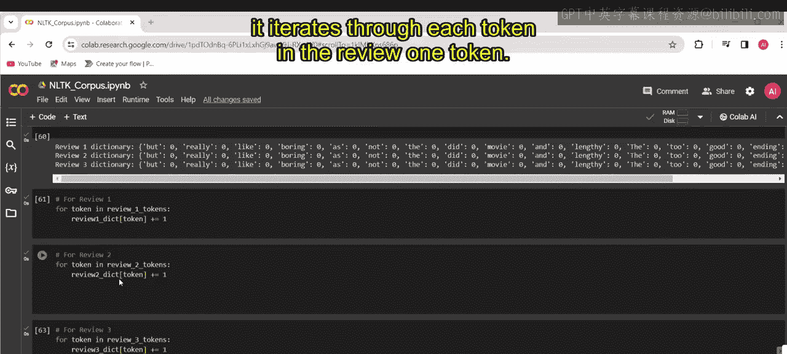

## 为单条评论构建词频字典

首先，我们处理第一条电影评论。程序会遍历该评论中的每一个词元，并在对应的评论字典中增加该词元的计数。

以下是实现此过程的逻辑：
```python
for token in review1_tokens:
    review1_dict[token] += 1
```
具体来说，对于评论1 “The movie was good and we really like it”，循环会遍历其分词后的每个单词。每当遇到一个词元，就在 `review1_dict` 字典中将其对应的值加1。如果同一个词在评论中出现多次，其计数会相应累加。

我们对评论2和评论3执行完全相同的操作。这些循环会分别遍历评论2和评论3的词元列表，并对每个词元进行计数加一的操作。

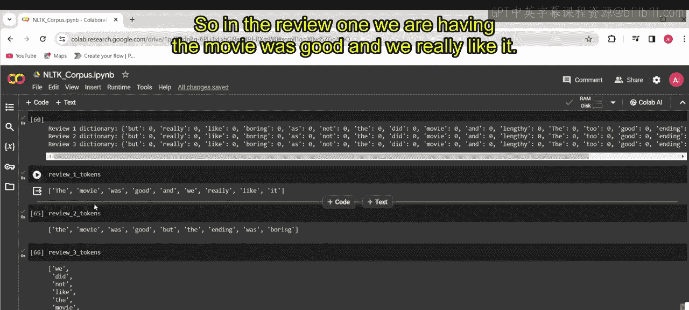

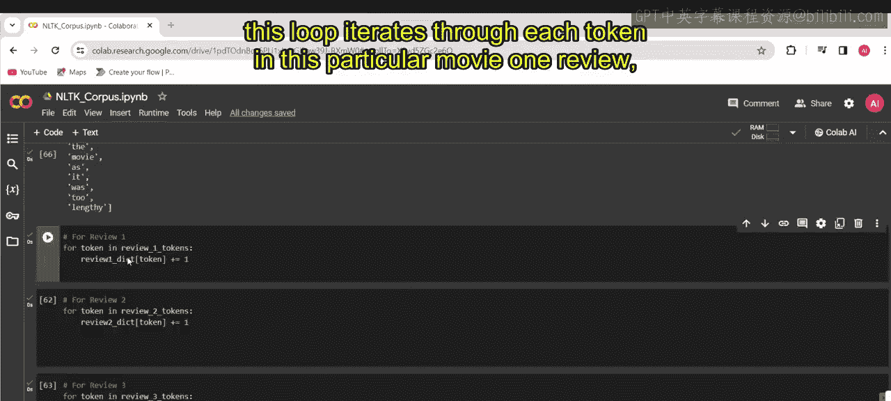

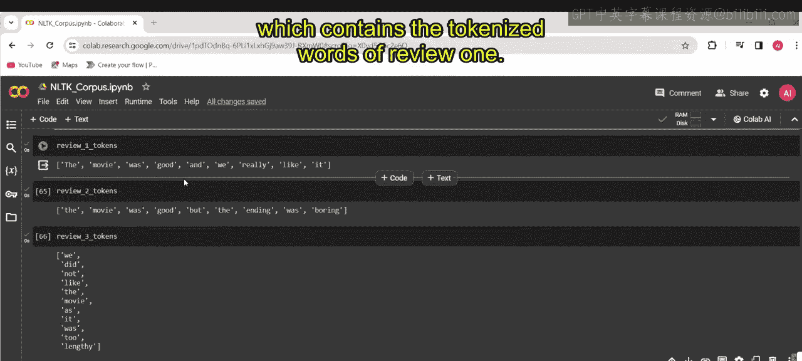

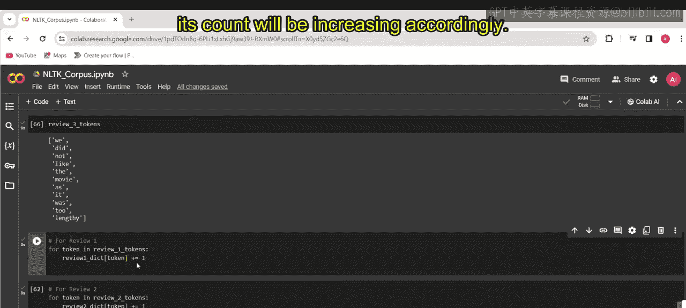

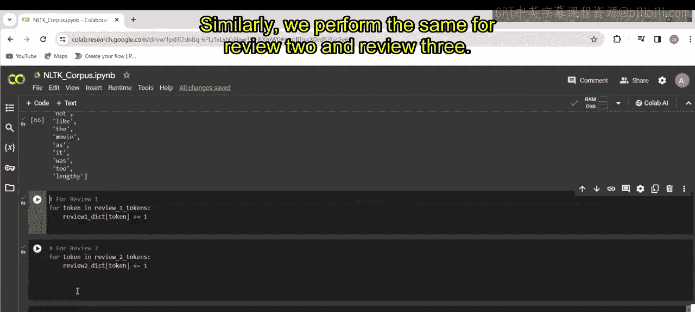


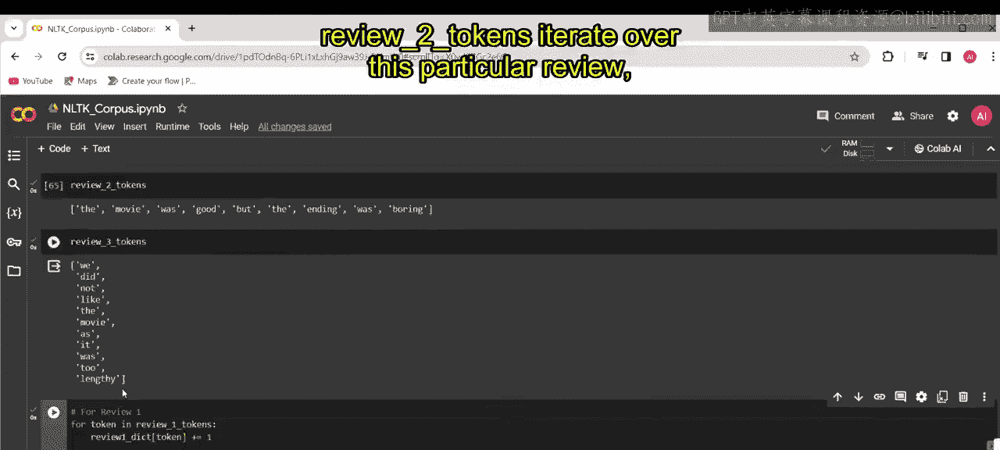


完成这些操作后，每个字典（如 `review1_dict`、`review2_dict`、`review3_dict`）都包含了各自评论中每个词元的出现次数。这些计数代表了每个词元在对应评论中的出现频率。

## 创建数据框以整合结果

现在，我们使用 `pandas` 库创建一个名为 `reviews_dict_df` 的数据框。我们将使用之前创建的三个字典作为数据源。

以下是创建数据框的代码：
```python
reviews_dict_df = pd.DataFrame([review1_dict, review2_dict, review3_dict])
```
在这个函数中，我们提供了一个字典列表（`[review1_dict, review2_dict, review3_dict]`）。每个字典代表了一条评论的词元计数，其中键是词元（单词），值是对应的出现频率。这个字典列表被作为数据传递给 `DataFrame` 构造函数，从而生成一个数据框。在这个数据框中，每个字典对应一行。

执行并打印此数据框后，我们可以看到输出结果。数据框将所有词元显示为列，三条评论显示为行。数据框中的每个单元格代表了相应词元在对应评论中的出现次数。

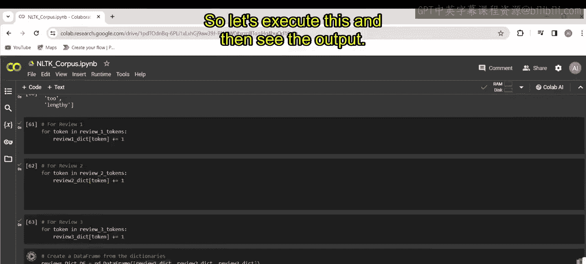
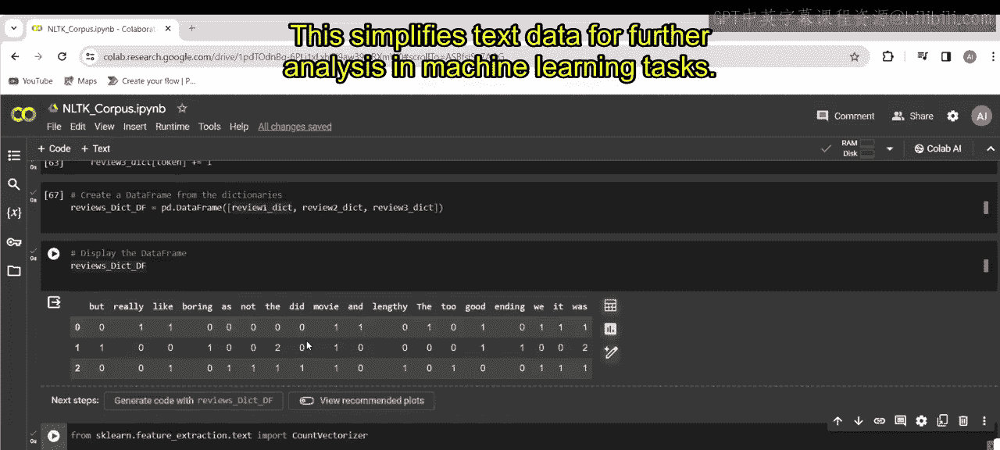

这种将单词及其计数以表格形式呈现的表示方法，就是**词袋模型**。它将文本数据简化为可用于后续机器学习任务的结构化数据。


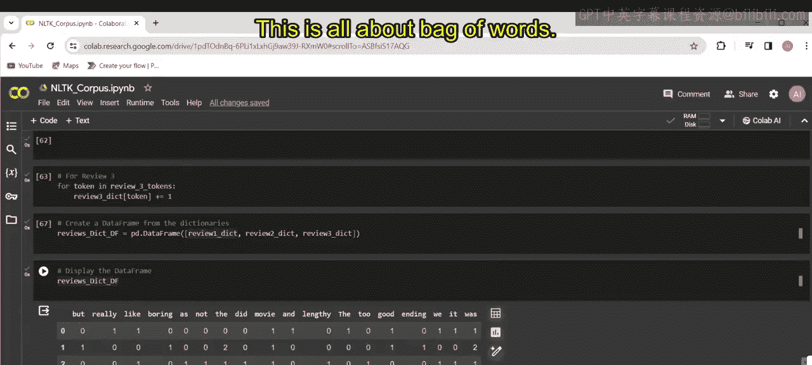


## 课程总结

本节课中我们一起学习了词袋方法的核心实践。我们理解了如何计算重复单词的频率，这种方法通过将文本表示为单词出现次数的集合，从而将文本简化为数据。此外，我们还探索了对自然语言处理任务至关重要的基本预处理步骤，为文本分析和机器学习应用奠定了基础。

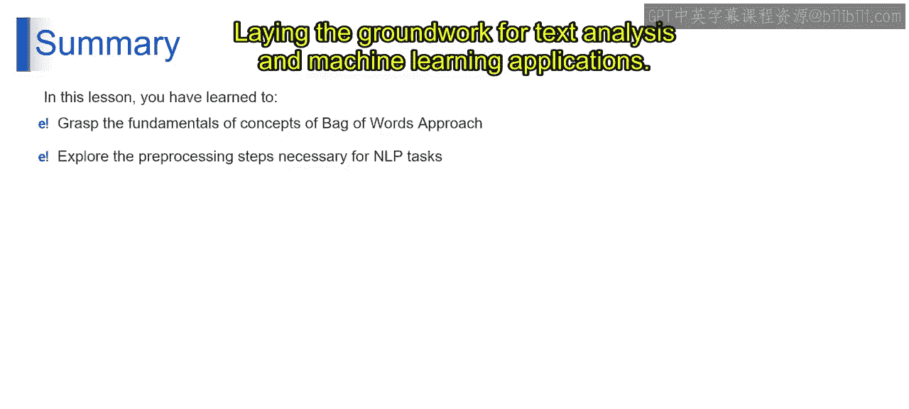

