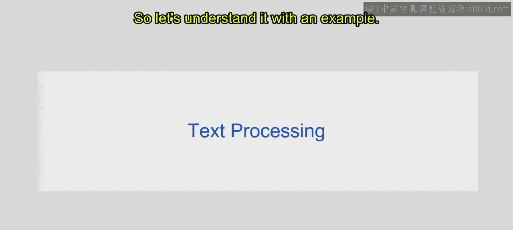
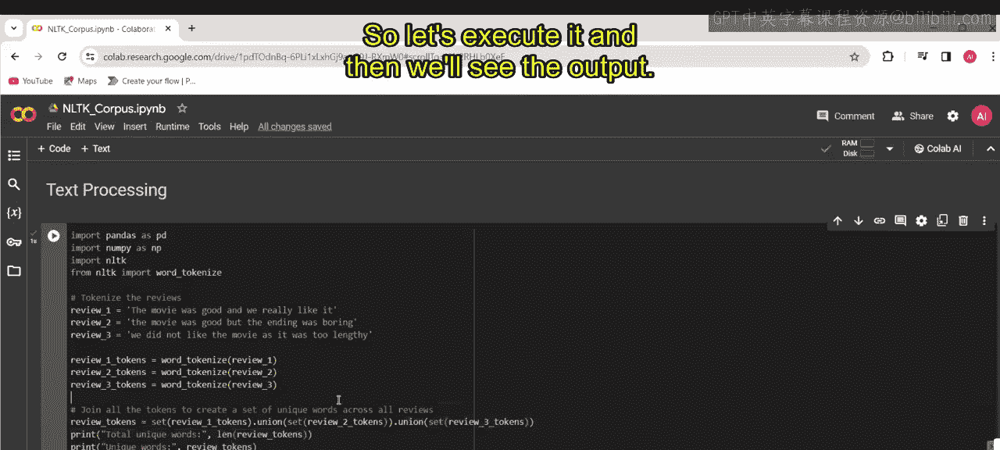
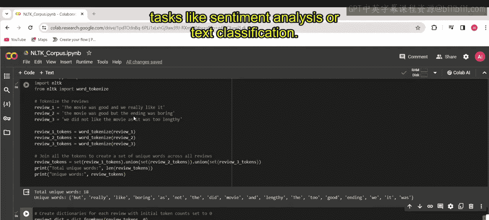
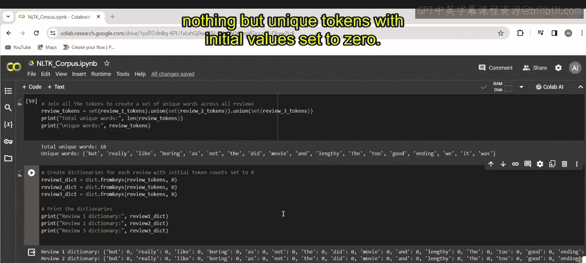
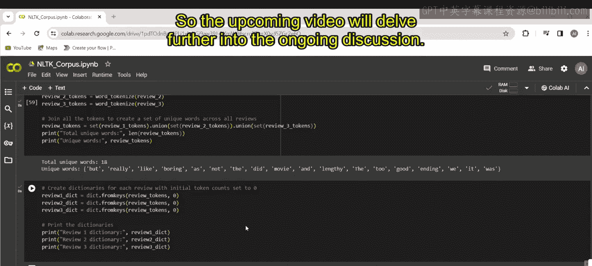

# 第一部分 125：文本处理

在本节课中，我们将要学习自然语言处理中的文本处理。文本处理是NLP的基础步骤，涉及对文本数据的操作、分析和转换，以便为情感分析、文本分类和机器翻译等任务提取有意义的特征。

## 概述

文本处理是NLP中的关键环节。它通过一系列技术将原始文本转换为结构化数据，以便机器学习模型能够理解和处理。接下来，我们将通过一个具体示例来理解文本处理的基本流程。

## 文本处理流程

上一节我们介绍了词袋模型的基本概念，本节中我们来看看如何通过代码实现基础的文本处理步骤。



首先，我们需要导入必要的Python库。

```python
import pandas as pd
import numpy as np
import nltk
from nltk import word_tokenize
```

以下是代码中导入的库及其作用：
*   `pandas`：用于数据操作和分析，通常别名为 `pd`。
*   `numpy`：用于数值计算，通常别名为 `np`。
*   `nltk`：用于执行自然语言处理任务。
*   `word_tokenize`：从 `nltk` 库导入的函数，用于将文本分割成单词列表。

## 文本分词与去重

接下来，我们定义一些示例文本数据并进行分词处理。

```python
review1 = "The movie was good"
review2 = "The movie was really good"
review3 = "I liked it"

review1_tokens = word_tokenize(review1)
review2_tokens = word_tokenize(review2)
review3_tokens = word_tokenize(review3)
```

`word_tokenize` 函数将每条评论分割成独立的单词列表。例如，`review1` 会被转换为 `['The', 'movie', 'was', 'good']`。

为了获取所有评论中的唯一词汇，我们需要合并并去重。

```python
review_tokens_set = set(review1_tokens).union(set(review2_tokens), set(review3_tokens))
print("Total unique words:", len(review_tokens_set))
print("Unique words set:", review_tokens_set)
```



以下是上述代码的关键步骤：
*   `set()`：将每个评论的分词列表转换为集合，自动移除该评论内部的重复单词。
*   `union()`：将三个评论的词汇集合合并成一个，得到所有评论中出现过的唯一词汇集合。
*   `len()`：计算并输出唯一词汇的总数。
*   `print()`：打印唯一词汇集合本身。

这段代码演示了文本处理的初始步骤：通过分词创建词汇表，并提取唯一单词。这个词汇表可以进一步用于情感分析或文本分类等任务。

## 初始化词频字典

在获得唯一词汇集合后，我们通常需要为每条评论创建一个词频向量。首先，为每条评论初始化一个字典。

```python
review1_dict = dict.fromkeys(review_tokens_set, 0)
review2_dict = dict.fromkeys(review_tokens_set, 0)
review3_dict = dict.fromkeys(review_tokens_set, 0)

print("Review 1 dictionary:", review1_dict)
print("Review 2 dictionary:", review2_dict)
print("Review 3 dictionary:", review3_dict)
```





以下是创建字典的过程：
*   `dict.fromkeys()`：使用 `review_tokens_set`（唯一词汇集合）作为键，为每个键设置初始值 `0`。
*   这个操作为每条评论分别创建一个字典，所有字典拥有相同的键（即所有唯一单词）。
*   打印每个字典以验证其内容，每个字典的初始值都应全部为 `0`。

这段代码为每条评论初始化了一个字典结构，键代表从所有评论中提取的唯一词汇，每个词的初始计数设为 `0`。这为后续统计每个词在每条评论中出现的频率建立了基础框架。

## 总结



本节课中我们一起学习了NLP中文本处理的基础知识。我们了解了文本处理的目的，并通过实践掌握了几个核心步骤：导入必要的库、对文本进行分词、创建唯一词汇集合，以及为后续的词频统计初始化字典结构。这些步骤是将原始文本转换为机器学习模型可用数据的关键预处理环节。在接下来的课程中，我们将基于此结构进一步探讨如何构建词袋模型。