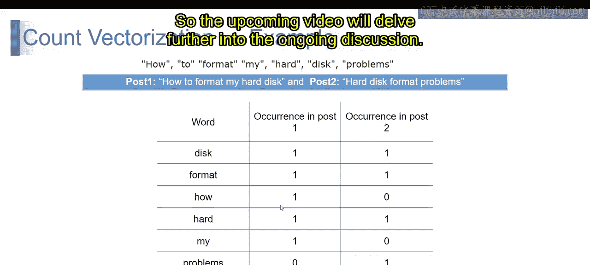

# 第一部分 126：计数向量化

在本节课中，我们将要学习自然语言处理中的一项基础技术——计数向量化。我们将了解它的定义、工作原理，并通过一个简单的例子来演示如何将文本数据转换为机器学习算法可以处理的数值向量。

## 计数向量化简介

上一节我们介绍了文本预处理的重要性，本节中我们来看看如何将文本转换为数值。计数向量化是一种将文本文档转换为数值向量的方法，其中每个向量代表文档中单词的出现频率。

例如，我们有两个句子：
*   句子一：The cat sat on the mat.
*   句子二：The dog played in the garden.

要应用计数向量化，我们首先需要创建一个包含所有句子中唯一单词的词汇表。

以下是创建词汇表的步骤：
1.  收集所有句子中的单词。
2.  去除重复项，得到唯一单词列表。

对于上述两个句子，词汇表将是：`[‘the’， ‘cat’， ‘sat’， ‘on’， ‘mat’， ‘dog’， ‘played’， ‘in’， ‘garden’]`。

然后，我们将每个句子表示为一个向量。向量的每个元素对应词汇表中某个单词在该句子中出现的次数。

以下是句子的向量表示：
*   句子一向量：`[2， 1， 1， 1， 1， 0， 0， 0， 0]`
*   句子二向量：`[1， 0， 0， 0， 0， 1， 1， 1， 1]`

这种方法将文本数据转换为机器学习算法所需的数值格式，从而可以进行后续处理。

## 计数向量化详解

现在，让我们更详细地理解计数向量化。计数向量化是自然语言处理中用于将文本数据转换为数值向量的一种技术，它简化了文本分析的过程。

以下是计数向量化的核心概念：

*   **基于词频**：在计数向量化中，每个文档（即文本样本）被表示为一个向量。向量的每个元素对应特定单词在该文档中出现的频率。例如，如果一个文档中单词“apple”出现了三次，那么代表该文档的向量中，对应“apple”的元素值就是3。
*   **向量化过程**：将文本数据转换为数值向量的过程称为向量化。计数向量化特指统计文档中每个单词的出现次数，并将其表示为数值。
*   **向量维度**：由于数据中的每个唯一单词都对应向量中的一个独立元素，因此生成的向量可能非常庞大，尤其是在数据集包含大量词汇或多样化的单词时。向量的大小最多可以达到整个文档集中所有唯一单词的总数。

简单来说，计数向量化通过基于单词出现次数将文本数据转换为数值向量，简化了文本数据的表示，使其适用于需要数值数据进行处理的机器学习算法。

## 计数向量化示例

为了更直观地理解，让我们通过一个具体例子来分解计数向量化的过程。

假设我们有两个论坛帖子：
*   帖子1：`how to format my hard disk`
*   帖子2：`hard disk format problems`

首先，我们从两个帖子中识别出所有唯一的单词。

以下是提取出的唯一单词列表：
`[‘how’， ‘to’， ‘format’， ‘my’， ‘hard’， ‘disk’， ‘problems’]`

现在，我们来看每个帖子中这些单词的出现次数。下表展示了计数向量化的结果：

| 单词 | 帖子1 | 帖子2 |
| :--- | :--- | :--- |
| how | 1 | 0 |
| to | 1 | 0 |
| format | 1 | 1 |
| my | 1 | 0 |
| hard | 1 | 1 |
| disk | 1 | 1 |
| problems | 0 | 1 |

在这个表格中，每一行对应数据集中的一个唯一单词，每一列对应一个帖子。表格中的数字表示每个单词在每个帖子中出现的次数。

例如，单词“disk”在帖子1和帖子2中各出现一次，因此在对应的单元格中值为1。单词“how”出现在帖子1中但未出现在帖子2中，因此在帖子1列下为1，在帖子2列下为0。

这个表格本质上就是两个帖子的计数向量化表示。这种数值表示使我们能够执行各种文本分析任务，例如使用机器学习算法进行情感分析或文档分类。

## 总结

本节课中我们一起学习了计数向量化技术。我们了解到，计数向量化通过统计文档中每个单词的出现频率，将文本数据转换为数值向量。这种方法为文本数据提供了一种机器可读的表示形式，是许多自然语言处理和机器学习任务（如文本分类和情感分析）的基础预处理步骤。在接下来的课程中，我们将继续探讨其他文本向量化技术。