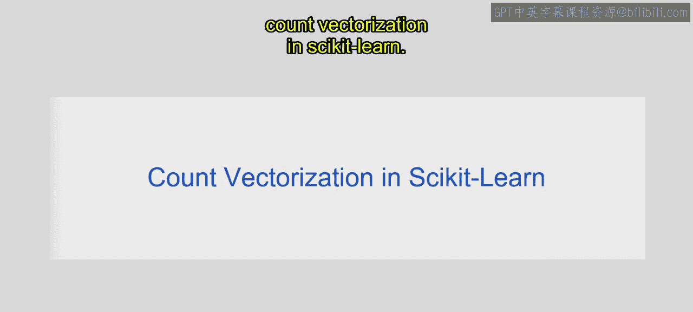
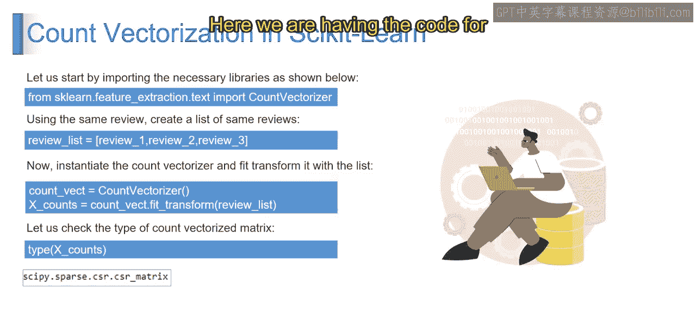
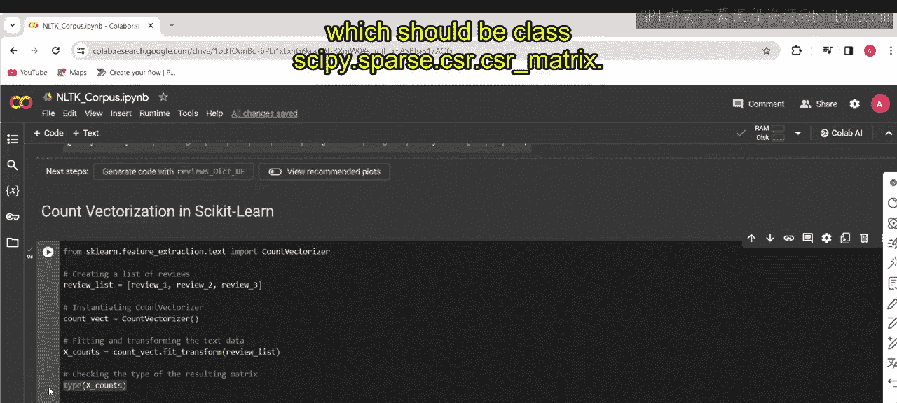
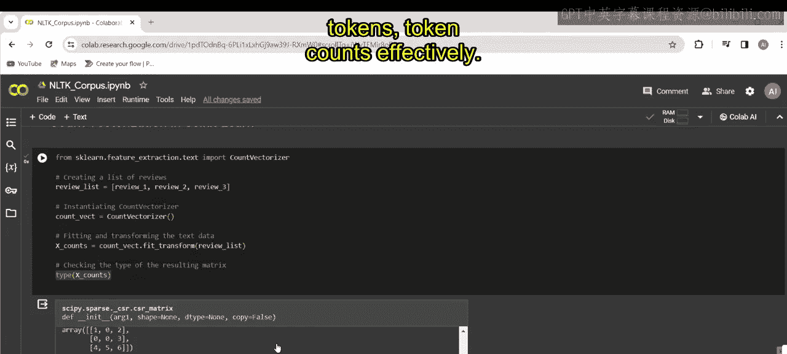
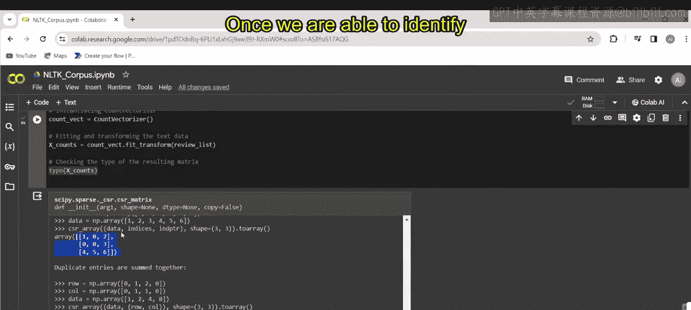
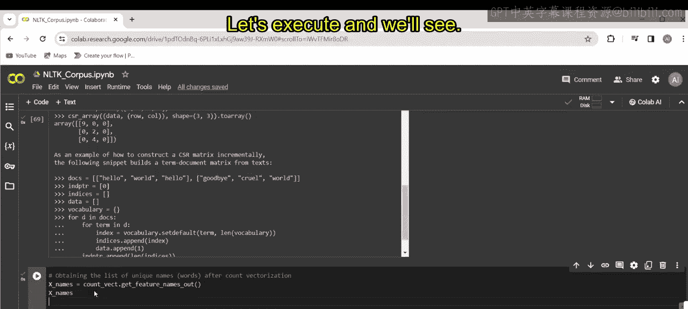
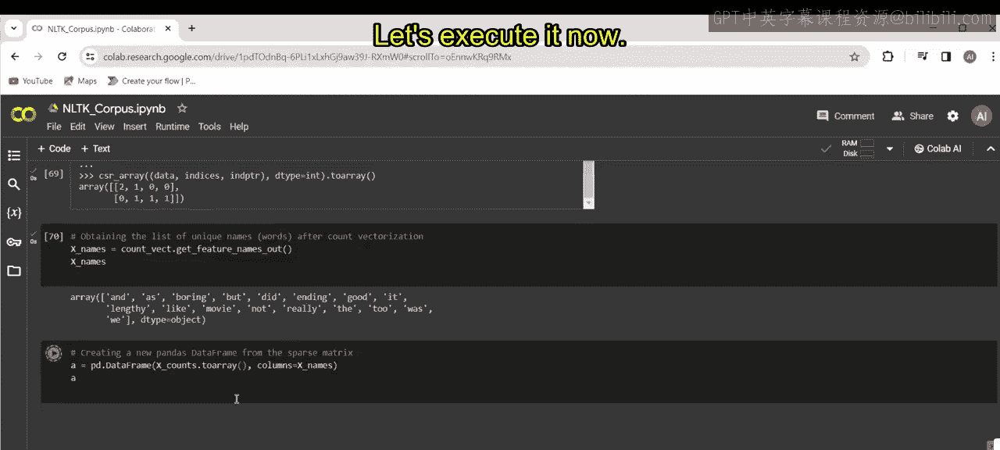
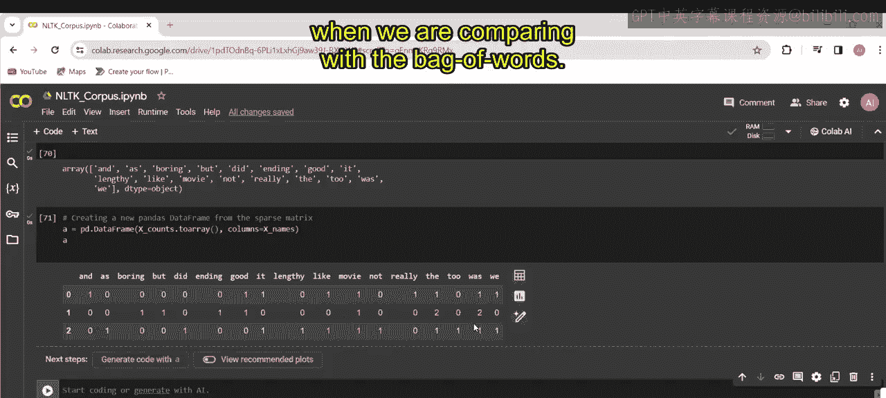
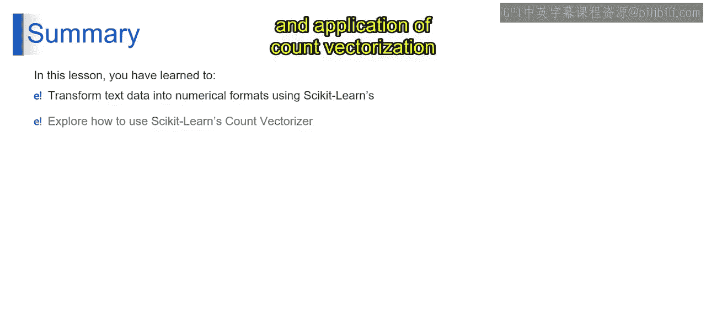

# 第一部分 127：Scikit-learn中的计数向量化



在本节课中，我们将学习如何使用Scikit-learn库中的计数向量化技术，将文本数据转换为机器学习模型可以处理的数值格式。我们将通过一个具体的代码示例来理解其工作原理和应用。



---

### 概述

上一节我们讨论了文本数据预处理的基础概念。本节中，我们将深入探讨**计数向量化**，这是自然语言处理中一种将文本转换为数值向量的常用方法。

### 理解计数向量化

计数向量化是一种将文本文档集合转换为令牌计数矩阵的技术。它统计每个单词在文档中出现的次数，从而创建文档的数值表示。

以下是使用Scikit-learn实现计数向量化的步骤。





### 代码实现步骤

以下是实现计数向量化的具体代码流程。





1.  **导入所需库**
    首先，我们需要从`sklearn.feature_extraction.text`模块导入`CountVectorizer`类。

    ```python
    from sklearn.feature_extraction.text import CountVectorizer
    ```

2.  **创建文本数据列表**
    我们创建一个包含多个文本文档（例如评论）的列表。

    ```python
    review_list = [
        "This product is great.",
        "I love this product.",
        "This is not good."
    ]
    ```

3.  **实例化向量化器并拟合转换数据**
    实例化`CountVectorizer`类，并使用`fit_transform`方法同时学习词汇表并将文本数据转换为令牌计数矩阵。结果是一个稀疏矩阵。

    ```python
    count_vect = CountVectorizer()
    X_counts = count_vect.fit_transform(review_list)
    ```

4.  **检查结果类型**
    我们可以检查`X_counts`的类型，确认它是一个稀疏矩阵。

    ```python
    print(type(X_counts))
    # 输出: <class 'scipy.sparse.csr.csr_matrix'>
    ```

5.  **获取特征名称（词汇表）**
    使用`get_feature_names_out`方法获取向量化过程中生成的所有唯一单词（特征）的列表。

    ```python
    feature_names = count_vect.get_feature_names_out()
    print(feature_names)
    ```

6.  **创建易于查看的DataFrame**
    将稀疏矩阵转换为密集数组，并使用获取的特征名称作为列名，创建一个Pandas DataFrame以便更直观地查看结果。

    ```python
    import pandas as pd
    df = pd.DataFrame(X_counts.toarray(), columns=feature_names)
    print(df)
    ```

    生成的DataFrame中，每一行代表一个文档，每一列代表一个唯一的单词，单元格中的值表示该单词在对应文档中出现的次数。





### 词袋模型与计数向量化的区别

在理解了计数向量化的操作后，我们来比较一下它与**词袋模型**的异同。两者都是NLP中用于文本表示的基本技术。

以下是它们之间的主要区别：

*   **词袋模型**：它将文本文档表示为一个无序的单词集合，忽略语法和词序。它通常只关心单词是否在文档中出现，而不关心出现的次数。其矩阵表示中，值通常为1（出现）或0（未出现）。
*   **计数向量化**：它是词袋模型的一种具体实现，但更进一步，它统计每个单词在文档中出现的**频率**。其矩阵表示中的值是单词的实际出现次数。

简而言之，计数向量化包含了词频信息，而基础的词袋模型通常只包含单词的存在与否信息。

### 总结



本节课中，我们一起学习了如何使用Scikit-learn的`CountVectorizer`将文本数据转换为数值格式。通过一个完整的代码示例，我们探索了计数向量化的功能和应用，并理解了它与基础词袋模型的关键区别。这项技术是许多NLP任务（如文本分类和情感分析）的重要预处理步骤。