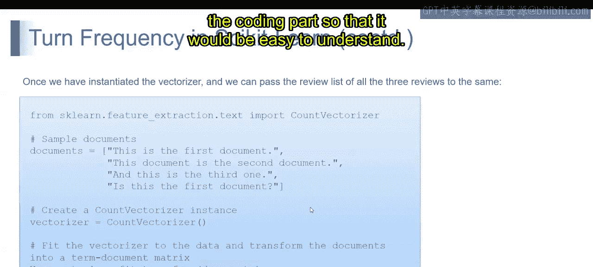
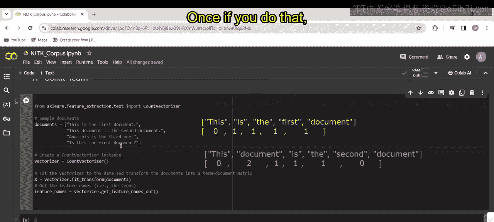

# 第一部分 129：Scikit-learn中的词频统计

在本节课中，我们将学习如何使用Scikit-learn库中的`CountVectorizer`工具，将文本数据转换为计算机可以理解的数字形式。这个过程是自然语言处理的基础步骤，称为“词频统计”。

---



上一节我们讨论了文本处理的基本概念，本节中我们来看看如何用代码实现词频统计。通过实际的编程示例，理解起来会更加容易。

以下是我的代码。首先，我从`sklearn.feature_extraction.text`模块中导入`CountVectorizer`类。

```python
from sklearn.feature_extraction.text import CountVectorizer
```

接着，我定义了一个包含示例文档的列表。

```python
documents = [
    "This is the first document.",
    "This document is the second document.",
    "And this is the third one.",
    "Is this the first document?"
]
```

然后，我实例化了一个`CountVectorizer`对象。

```python
vectorizer = CountVectorizer()
```

现在，我使用`fit_transform`方法。这个方法会做两件事：首先让向量器“学习”我们的数据（即`documents`列表），然后将这些文档转换成一个“词-文档矩阵”。

```python
X = vectorizer.fit_transform(documents)
```

让我们执行这段代码，看看会得到什么输出。然后我将打印结果。

```python
print(X.toarray())
```

现在，我们来理解一下代码背后的步骤。

第一步是将每个文档分割成独立的单词，这个过程称为“分词”。

例如：
*   第一个句子会分成：`["This", "is", "the", "first", "document"]`
*   第二个句子会分成：`["This", "document", "is", "the", "second", "document"]`

接下来是创建词汇表。词汇表是所有文档中出现的唯一单词的集合。

在我们的例子中，词汇表将是：`['and', 'document', 'first', 'is', 'one', 'second', 'the', 'third', 'this']`。

现在开始统计词频。我们需要计算每个文档中，词汇表里的每个单词出现了多少次。

我们用一个矩阵来表示这个结果，其中每一行对应一个文档，每一列对应词汇表中的一个单词。矩阵中的数字代表该单词在对应文档中出现的次数。

对于第一个文档，我们检查词汇表中的每个词：
*   `and`：没有出现，记为0。
*   `document`：出现1次，记为1。
*   `first`：出现1次，记为1。
*   ...以此类推。

对第二、第三和第四个句子重复这个过程。完成后，我们打印出矩阵。

执行代码后，我们得到以下数组，这就是我们的词-文档矩阵表示。

```python
[[0 1 1 1 0 0 1 0 1]
 [0 2 0 1 0 1 1 0 1]
 [1 0 0 1 1 0 1 1 1]
 [0 1 1 1 0 0 1 0 1]]
```

---



本节课中我们一起学习了如何使用Scikit-learn的`CountVectorizer`将文本转换为词频矩阵。我们了解了从分词、构建词汇表到最终生成数字矩阵的完整流程。这是将文本数据用于机器学习模型前的一项关键预处理步骤。