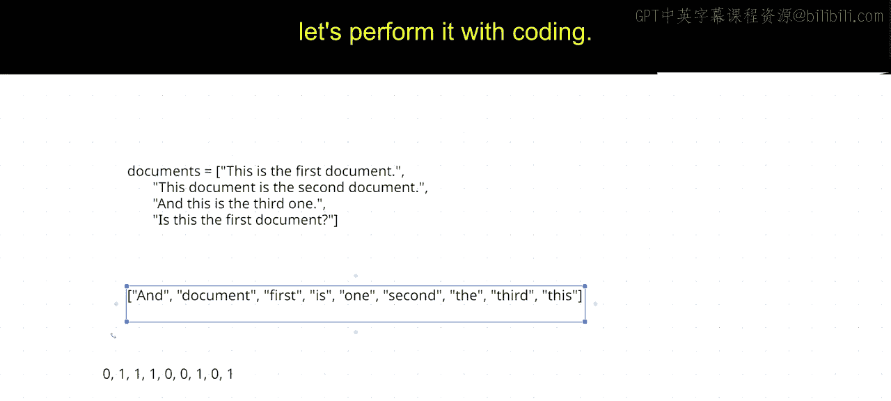
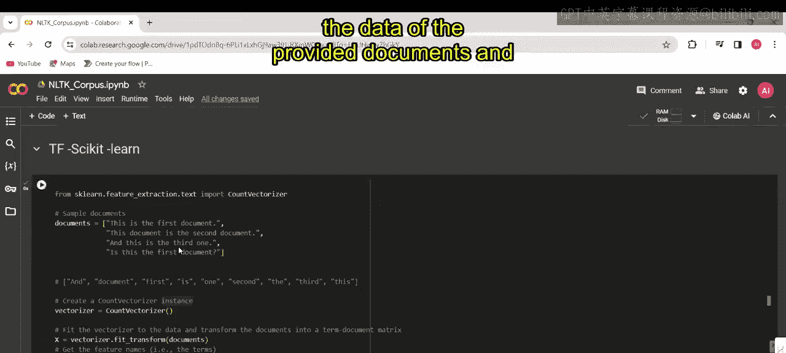
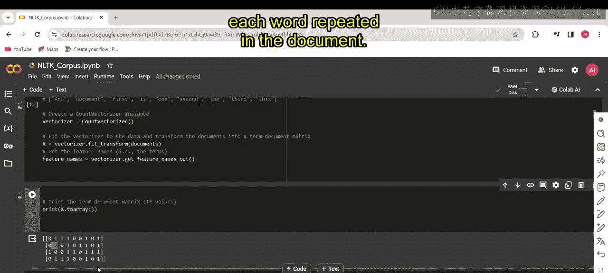
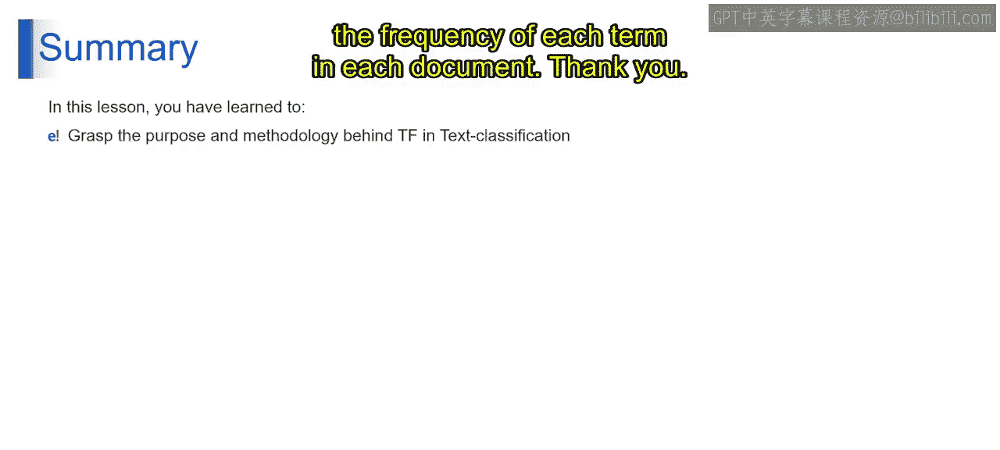

# 第一部分 131：词频演示II

在本节课中，我们将学习如何将一组文档转换为词频矩阵。我们将通过一个具体的例子，演示如何从文档中提取词汇表，并计算每个文档中每个词汇的出现次数，最终使用代码实现这一过程。

---

## 从词汇表到向量表示

上一节我们介绍了词频的基本概念，本节中我们来看看如何将文本转换为数值向量。假设我们有以下四个文档：

1.  this is the first document
2.  this document is the second document
3.  and this is the third one
4.  is this the first document

首先，我们需要从所有文档中提取出唯一的词汇，构成一个词汇表。

以下是构建词汇表的步骤：
*   遍历所有文档。
*   收集所有出现过的单词。
*   去除重复的单词，得到唯一词汇列表。

根据以上步骤，我们得到的词汇表是：`['and', 'document', 'first', 'is', 'one', 'second', 'the', 'third', 'this']`。

---

## 构建词频矩阵

有了词汇表后，我们就可以为每个文档创建一个向量。向量的长度等于词汇表的大小，向量的每个位置对应词汇表中的一个词，其值表示该词在文档中出现的次数。

现在，让我们为第一个文档 `“this is the first document”` 创建向量表示。

以下是计算向量表示的过程：
*   词汇表第一个词是 `‘and’`，在文档1中未出现，所以值为 **0**。
*   第二个词是 `‘document’`，在文档1中出现1次，所以值为 **1**。
*   第三个词是 `‘first’`，在文档1中出现1次，所以值为 **1**。
*   第四个词是 `‘is’`，在文档1中出现1次，所以值为 **1**。
*   第五个词是 `‘one’`，在文档1中未出现，所以值为 **0**。
*   第六个词是 `‘second’`，在文档1中未出现，所以值为 **0**。
*   第七个词是 `‘the’`，在文档1中出现1次，所以值为 **1**。
*   第八个词是 `‘third’`，在文档1中未出现，所以值为 **0**。
*   第九个词是 `‘this’`，在文档1中出现1次，所以值为 **1**。

因此，文档1的向量表示为：`[0, 1, 1, 1, 0, 0, 1, 0, 1]`。



同理，我们可以得到所有文档的向量表示，将它们组合起来就形成了一个矩阵，称为**词-文档矩阵**。在这个矩阵中，每一行代表一个文档，每一列代表词汇表中的一个词，矩阵中的每个值代表该词在对应文档中出现的频率。

---

## 使用代码实现

理解了手动计算过程后，我们来看看如何使用Python的`scikit-learn`库自动完成这项工作。我们将使用`CountVectorizer`类。

以下是实现词频转换的代码步骤：
1.  导入必要的类：`from sklearn.feature_extraction.text import CountVectorizer`。
2.  定义文档列表：`documents = [“this is the first document”, “this document is the second document”, “and this is the third one”, “is this the first document”]`。
3.  实例化`CountVectorizer`对象：`vectorizer = CountVectorizer()`。
4.  拟合并转换数据：`X = vectorizer.fit_transform(documents)`。这一步会学习词汇表并生成词频矩阵。
5.  将矩阵转换为数组并打印，同时打印出对应的特征名称（即词汇表）。

```python
from sklearn.feature_extraction.text import CountVectorizer



# 第一部分 定义文档
documents = [
    "this is the first document",
    "this document is the second document",
    "and this is the third one",
    "is this the first document"
]

# 第一部分 创建 CountVectorizer 实例
vectorizer = CountVectorizer()

# 第一部分 学习词汇表并转换文档为词频矩阵
X = vectorizer.fit_transform(documents)

# 第一部分 将稀疏矩阵转换为密集数组并打印
print("词-文档矩阵：")
print(X.toarray())

# 第一部分 打印词汇表（特征名称）
print("\n词汇表（特征名）：")
print(vectorizer.get_feature_names_out())
```

运行这段代码，我们将得到如下输出：
*   词-文档矩阵：一个二维数组，每一行对应一个文档的词频向量。
*   词汇表：`[‘and’ ‘document’ ‘first’ ‘is’ ‘one’ ‘second’ ‘the’ ‘third’ ‘this’]`。

输出矩阵与之前我们手动计算的结果一致。例如，第一行 `[0 1 1 1 0 0 1 0 1]` 就对应文档1的向量。在第二行中，你可以看到 `‘document’` 对应的值为2，因为它在第二个文档中出现了两次。



这段代码的核心是利用`CountVectorizer`将文本数据转换为数值形式的词-文档矩阵，为后续的机器学习任务做好准备。

---

## 课程总结



本节课中，我们一起深入探讨了文本分类中的词频概念。我们理解了它的重要性，并通过`scikit-learn`库中的`CountVectorizer`工具进行了实践应用。该工具通过生成词-文档矩阵来将文本数据转换为数值格式，其中矩阵的每个值代表了特定词汇在特定文档中出现的频率。掌握这一步骤是处理文本数据的基础。