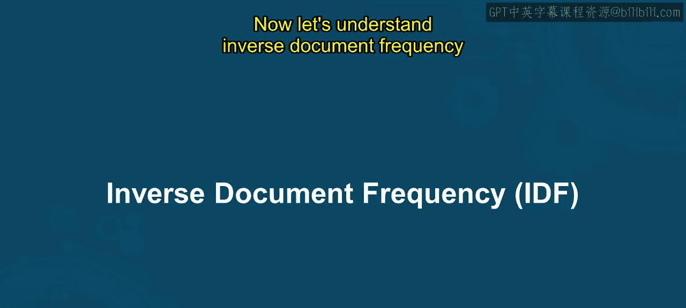
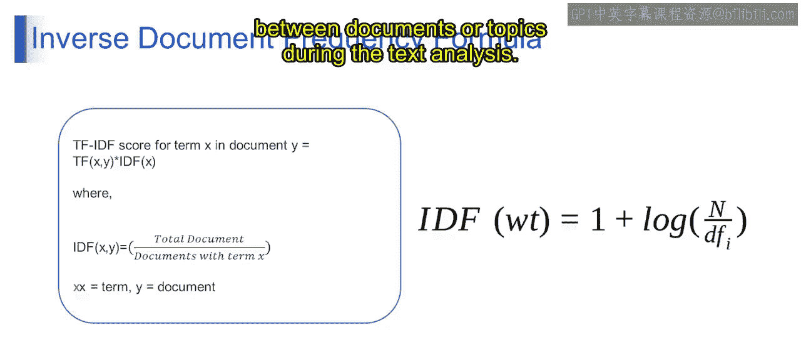

# 第一部分 132：逆文档频率（IDF）📊

在本节课中，我们将要学习自然语言处理中的一个核心概念——逆文档频率（IDF）。上一节我们介绍了词频（TF），本节中我们来看看如何衡量一个词语在整个文档集合中的重要性。

## 概述

逆文档频率（IDF）用于评估一个词语对于整个文档集合的重要性。其核心思想是：如果一个词语在少数文档中出现，它可能携带了更多特定信息，因此应该被赋予更高的权重。

## 理解IDF的核心思想

想象你在一个藏有各种主题书籍的图书馆里搜索特定信息，例如“机器学习”。以下是两种不同的场景：

**常见词语场景**：你发现“机器学习”这个词几乎出现在每一本书中，同时出现的还有“的”、“和”、“是”等常见词语。这些常见词语无处不在，但它们并不能告诉你关于“机器学习”这个特定主题的太多信息。

**独特词语场景**：在另一个场景中，你发现“机器学习”只出现在少数几本书中。但当它出现时，常伴随着“神经网络”、“算法”或“训练数据”等技术术语。这些术语提供了关于主题的宝贵见解，对于理解“机器学习”的含义更有用。

逆文档频率（IDF）正是捕捉了这种思想。它为那些在整个文档集合中只出现在少数文档里的词语分配更高的重要性。这意味着那些对某些特定文档或主题独特的词语会获得更高的IDF分数，使它们在区分不同文档或主题时更具影响力。

## TF与IDF的区别

基于以上理解，我们可以总结词频（TF）与逆文档频率（IDF）的主要区别：

*   **词频（TF）**：衡量一个词语在**单个文档**中出现的频率。其计算方式是将词语在文档中出现的次数除以该文档的总词数。
*   **逆文档频率（IDF）**：衡量一个词语在**整个文档集合**中的重要性。它通过计算一个对数比率来评估词语的普遍性或稀有性。

## IDF的数学公式

IDF的计算公式如下：

**公式：IDF(t) = 1 + log( N / df(t) )**

其中：
*   **N** 是语料库中文档的总数。
*   **df(t)** 是词语 **t** 的文档频率，即包含词语 **t** 的文档数量。

这个比率（N / df(t)）代表了词语在整个语料库中的常见或稀有程度：
*   如果一个词语出现在许多文档中（df(t) 高），这个比率会较小，表示较低的IDF值。
*   如果一个词语只出现在少数文档中（df(t) 低），这个比率会较大，表示较高的IDF值。

对比率取对数（log）是为了缩放IDF值，抑制极大比率的影响，确保IDF值不会过大。公式中“加1”（+1）是一种平滑技术，用于避免当某个词语出现在所有文档中（df(t) = N）时出现除零错误，这确保了即使是常见词语也会获得一个非零的IDF分数。

简而言之，IDF为语料库中稀有的词语分配更高的权重，为常见的词语分配较低的权重。那些对特定文档或主题独特的词语会获得更高的IDF分数，使它们在文本分析（如区分文档或主题）时更具影响力。

## 总结

本节课中我们一起学习了逆文档频率（IDF）。我们理解了IDF用于衡量词语在文档集合中重要性的核心思想，掌握了其数学计算公式 **IDF(t) = 1 + log( N / df(t) )**，并明确了它与词频（TF）的区别：TF关注词语在单个文档内的频率，而IDF关注词语在整个集合中的分布稀有性。下一节，我们将探讨如何将TF和IDF结合起来，形成强大的TF-IDF表示方法。