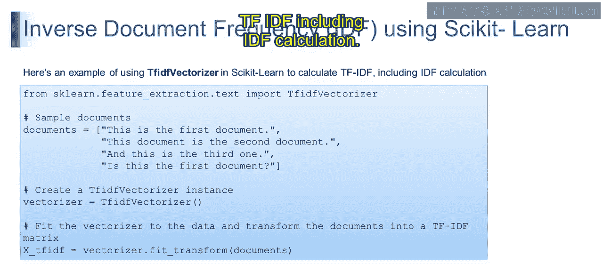
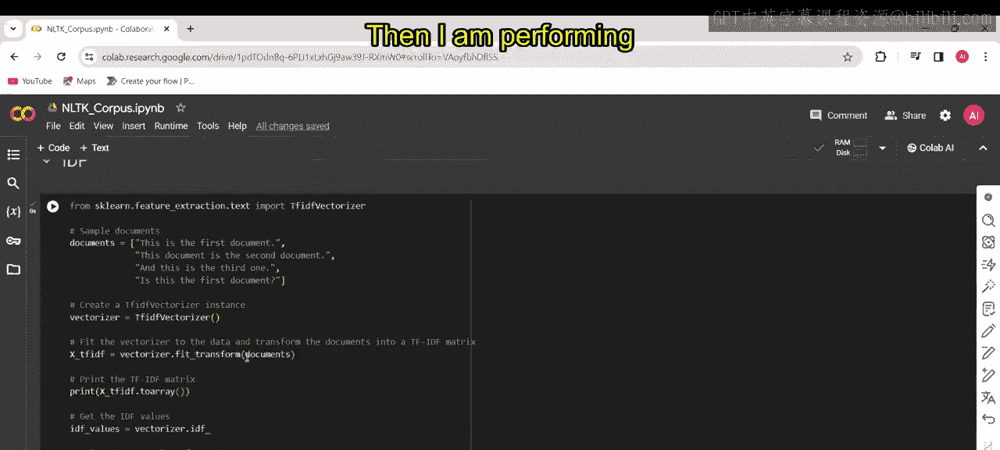
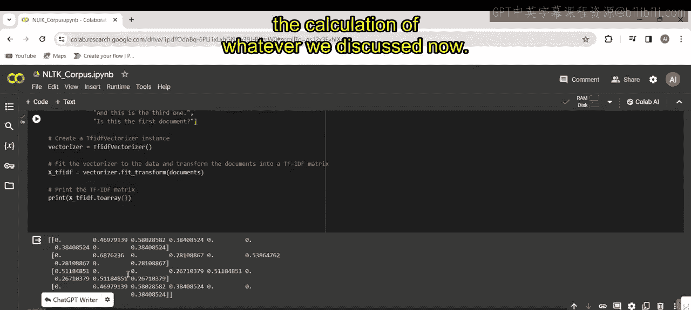
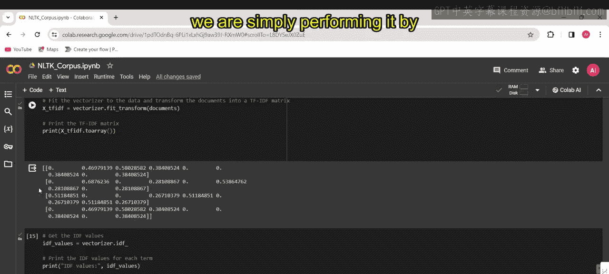
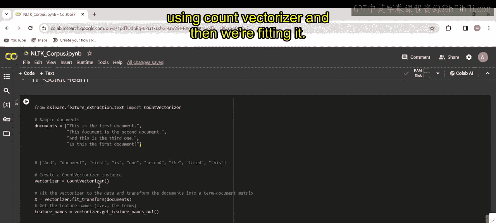
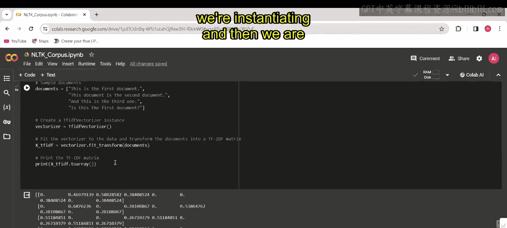
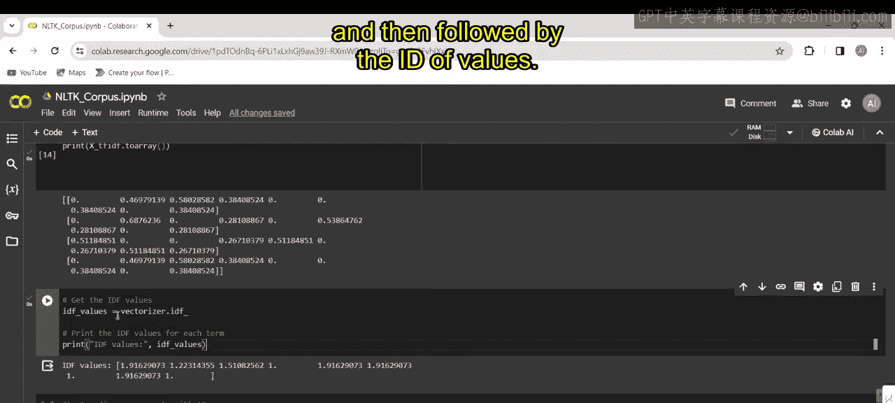
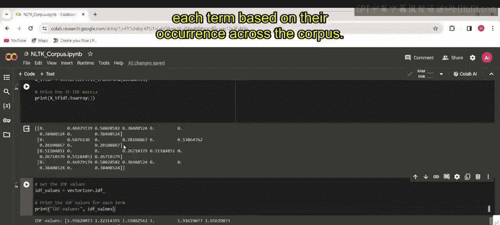
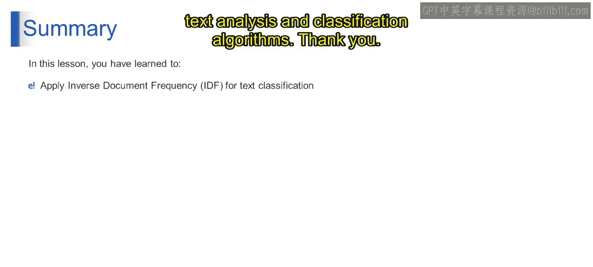

# 第一部分 133：逆文档频率（IDF）示例 📊

在本节课中，我们将学习如何通过一个具体示例来计算逆文档频率（IDF）。我们将从上一节讨论的IDF概念出发，通过手动计算和代码实现两种方式，深入理解IDF如何量化词语在文档集合中的重要性。

## 概述

上一节我们介绍了逆文档频率（IDF）的基本概念及其公式。本节中，我们来看看如何通过一个具体的例子来计算句子中每个词语的IDF值。我们将使用两个示例句子，先手动计算，然后使用Python的`scikit-learn`库进行验证。

## 手动计算IDF示例


以下是计算IDF的具体步骤。首先，我们需要确定每个词语的文档频率（DF），即包含该词语的文档数量。然后，我们可以应用之前讨论的公式来计算IDF。

IDF的计算公式为：
**IDF(t) = 1 + log( N / DF(t) )**
其中，`N`是语料库中的文档总数，`DF(t)`是词语`t`的文档频率。

现在，我们来计算以下两个句子中每个词语的IDF值：
*   句子A: `The car is driven on the road.`
*   句子B: `The truck is driven on the highway.`

在这个例子中，文档总数 `N = 2`。

以下是每个词语的文档频率（DF）计算过程：

*   **the**: 在两个句子中都出现，因此 `DF = 2`。
*   **car**: 仅在句子A中出现，因此 `DF = 1`。
*   **truck**: 仅在句子B中出现，因此 `DF = 1`。
*   **is**: 在两个句子中都出现，因此 `DF = 2`。
*   **driven**: 在两个句子中都出现，因此 `DF = 2`。
*   **on**: 在两个句子中都出现，因此 `DF = 2`。
*   **road**: 仅在句子A中出现，因此 `DF = 1`。
*   **highway**: 仅在句子B中出现，因此 `DF = 1`。

现在，我们可以将这些值代入IDF公式进行计算。

## 使用代码计算TF-IDF

理解了手动计算过程后，我们来看看如何通过编程更高效地完成这项任务。以下是使用`scikit-learn`库中的`TfidfVectorizer`来计算TF-IDF（包含IDF）的示例。



```python
from sklearn.feature_extraction.text import TfidfVectorizer

# 第一部分 定义文档
documents = [
    "The car is driven on the road.",
    "The truck is driven on the highway."
]





# 第一部分 实例化TF-IDF向量化器
vectorizer = TfidfVectorizer()

# 第一部分 对文档进行拟合和转换，计算TF-IDF矩阵
tfidf_matrix = vectorizer.fit_transform(documents)

# 第一部分 打印TF-IDF矩阵（稠密格式以便查看）
print("TF-IDF Matrix:")
print(tfidf_matrix.toarray())
print("\nFeature Names (Vocabulary):")
print(vectorizer.get_feature_names_out())
```

运行上述代码，将得到每个文档中每个词语的TF-IDF值。这个输出结果综合了词频（TF）和我们刚刚计算的逆文档频率（IDF）。

为了单独查看IDF值，我们可以访问向量化器的`idf_`属性。









```python
# 第一部分 获取并打印每个词语的IDF值
print("\nIDF values for each term:")
idf_values = vectorizer.idf_
feature_names = vectorizer.get_feature_names_out()
for word, idf in zip(feature_names, idf_values):
    print(f"{word}: {idf:.4f}")
```

这些IDF值代表了每个词语在整个语料库中的重要性。IDF值越高，表明该词语在越少的文档中出现，因此对于区分文档可能越重要。

## 总结

本节课中，我们一起学习了如何通过具体示例计算逆文档频率（IDF）。我们首先手动计算了两个示例句子中词语的IDF，理解了其计算过程。随后，我们使用`scikit-learn`的`TfidfVectorizer`通过代码实现了相同的计算，并验证了结果。





通过应用IDF，我们能够识别并优先考虑那些对特定文档具有独特性的词语，从而提升文本分析和分类算法的效果。IDF通过量化词语在文档集合中的普遍重要性，有效增强了文本分类的特征表示能力。