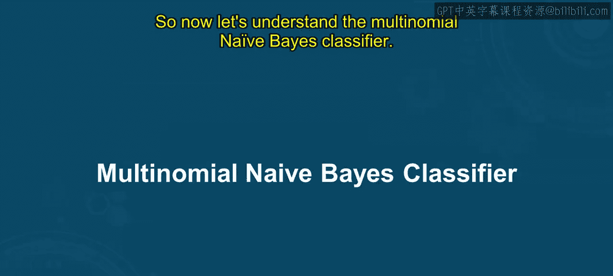
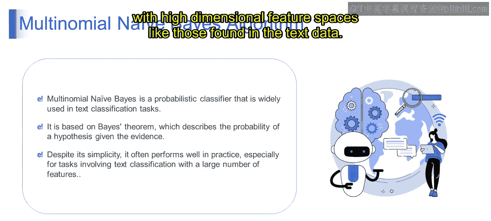

# 第一部分 134：多项式朴素贝叶斯分类器 🧠

在本节课中，我们将要学习多项式朴素贝叶斯分类器。这是一种在文本分类任务中广泛使用的简单而强大的算法。我们将了解它的基本原理、工作方式以及为何它在实践中表现良好。

## 概述

朴素贝叶斯算法是一种基于贝叶斯定理的简单而强大的分类技术，其核心假设是特征之间相互独立。它被广泛应用于文本分类、垃圾邮件过滤和推荐系统。

上一节我们介绍了朴素贝叶斯算法的基本概念，本节中我们来看看其一个重要的变体——多项式朴素贝叶斯分类器。

## 朴素贝叶斯算法简介

在理解多项式朴素贝叶斯算法之前，首先需要理解朴素贝叶斯算法本身。朴素贝叶斯算法是一种基于贝叶斯定理的简单分类技术，它假设所有特征相互独立。尽管这个“朴素”的假设在实践中往往不成立，但该算法在许多任务中仍然表现优异。

想象一下，你正在根据某些单词的出现情况将电子邮件分类为垃圾邮件或非垃圾邮件。朴素贝叶斯通过计算每个类别（垃圾邮件或非垃圾邮件）在给定某些特征（即单词）出现的情况下的概率来进行工作。

从技术上讲，朴素贝叶斯算法涉及使用贝叶斯定理来计算给定某些特征时某个类别的概率。它假设所有特征相互独立，这简化了概率计算。

基于对朴素贝叶斯的理解，现在让我们深入探讨多项式朴素贝叶斯。

## 多项式朴素贝叶斯分类器

多项式朴素贝叶斯是朴素贝叶斯分类器的一种特定类型，特别适用于特征表示某些事件发生频率的任务，例如文本分类中的单词计数。

以下是多项式朴素贝叶斯的核心组成部分：

*   **多项式**：这意味着它适用于特征表示频率的分类任务，例如文本分类中的词频。
*   **朴素**：因为它假设特征（例如单词）彼此独立，这在实际中通常不成立，但效果仍然出奇地好。
*   **概率分类器**：多项式朴素贝叶斯为给定数据实例的不同类别分配概率。它计算给定特征时特定类别的似然度，然后选择概率最高的类别作为预测类别。

### 贝叶斯定理

贝叶斯定理是概率论中的一个基本定理，它描述了如何根据新证据更新概率。在分类的上下文中，它帮助计算给定特征时某个类别的概率，这正是朴素贝叶斯算法所做的。

其公式可以表示为：
`P(类别|特征) = [P(特征|类别) * P(类别)] / P(特征)`

### 为何适用于文本分类

多项式朴素贝叶斯简单且易于实现。尽管简单，它在实践中通常表现良好，因为它可以高效且有效地处理像文本数据这样的高维数据（即许多特征）。

文本分类涉及将文本文档分类到预定义的类别中。多项式朴素贝叶斯特别适合文本分类任务，因为它可以处理文本数据中通常出现的大量特征（例如单词或N-gram）。因此，由于其简单性、高效性以及在处理文本数据中发现的高维特征空间时常常出人意料的好性能，多项式朴素贝叶斯成为文本分类任务的热门选择之一。

## 一个简单示例

为了更好地理解，让我们看一个文本分类的简单示例。

假设我们有一个包含标记为垃圾邮件或非垃圾邮件的数据集。每封电子邮件都表示为一个“词袋”，其中特征是特定单词的存在或不存在。

例如，假设我们有两封邮件：
1.  邮件一内容：“恭喜你赢得了一次假期！”
2.  邮件二内容：“会议提醒：别忘了明天的电话会议。”

在这个例子中，我们希望根据内容将这些电子邮件分类为垃圾邮件或非垃圾邮件。多项式朴素贝叶斯模型会计算每封邮件属于“垃圾邮件”或“非垃圾邮件”类别的概率，并选择概率更高的类别。

从技术定义上讲，多项式朴素贝叶斯模型对给定类别的文档D的概率进行建模。它假设每个类别内的特征（即词频）服从多项式分布。每个文档表示为一个词频向量，其中向量的第i个元素表示词汇表中第i个单词的计数。

## 总结

本节课中我们一起学习了多项式朴素贝叶斯分类器。我们了解到它是一种基于贝叶斯定理的概率分类器，特别适用于像文本分类这样涉及特征频率的任务。尽管其“特征独立”的假设很朴素，但由于能高效处理高维数据，它在实践中常常表现优异。它是进入机器学习文本分类领域一个强大而简单的起点。

请继续关注下一个视频，我们将详细阐述这个话题。