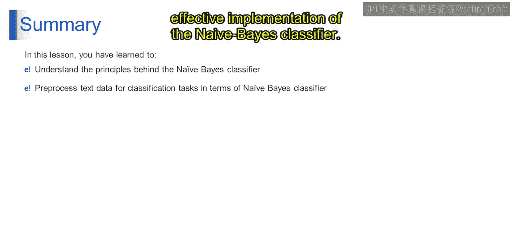

第1：多项式朴素贝叶斯算法

在本节课中，我们将要学习多项式朴素贝叶斯算法，这是一种在文本分类中广泛使用的概率算法。我们将从数学表示、模型训练到预测过程，系统地理解其工作原理。

---

上一节我们介绍了朴素贝叶斯分类器的基本概念，本节中我们来看看其数学表示。

在数学上，多项式朴素贝叶斯分类器使用贝叶斯定理计算给定输入特征 **x** 时每个类别 **y** 的概率。输入特征 **x** 等于 **x1, x2, ..., xn**。

其核心公式为：
**P(y | x) = [ P(y) * P(x1 | y) * P(x2 | y) * ... * P(xn | y) ] / P(x)**

其中：
*   **P(y | x)** 是给定输入特征 **x** 后，类别 **y** 的后验概率。
*   **P(y)** 是类别 **y** 的先验概率。
*   **P(xi | y)** 是给定类别 **y** 时，特征 **xi** 的条件概率。
*   **P(x)** 是证据（即特征 **x** 出现的概率），在比较不同类别时可作为归一化常数忽略。

在特征独立的假设下，每个特征 **xi** 给定类别 **y** 的条件概率 **P(xi | y)** 可以从训练数据中估计。在文本分类中，这些概率通常计算为：在属于类别 **y** 的文档中，每个特征（即单词）出现的频率，除以这些文档中的总单词数。最终，算法会选择后验概率 **P(y | x)** 最高的类别作为输入特征 **x** 的预测类别。

---

理解了数学原理后，接下来我们探讨模型是如何进行训练的。

在多项式朴素贝叶斯算法的训练阶段，分类器从提供的训练数据中学习，以估计两个关键概率：先验概率 **P(y)** 和条件概率 **P(x | y)**。

以下是训练过程的关键步骤：

1.  **计算先验概率 P(y)**：这代表了在不考虑任何特征的情况下，每个类别在数据集中出现的可能性。分类器通过简单地统计训练数据中每个类别的出现频率并进行归一化来计算此概率。

2.  **计算条件概率 P(x | y)**：这代表了在特定类别 **y** 下，观察到一组特定特征值 **x** 的概率。在文本分类中，这些概率通常表示在特定类别的文档中观察到每个单词（即特征）的可能性。分类器通过统计每个类别文档中每个特征的出现次数，并除以这些文档中的特征总数（即总词数）来进行计算。

---

掌握了训练过程后，我们来看模型如何对新数据进行预测。

当面对新文档或一组新特征时，分类器会应用贝叶斯定理为每个类别 **y** 计算后验概率 **P(y | x)**。然后，它选择具有最高后验概率的类别作为预测的类别标签。

对于输入文档，这个过程使分类器能够基于从训练数据中学到的概率进行预测。

---

本节课中我们一起学习了多项式朴素贝叶斯分类器，这是一种在文本分类中广泛使用的概率算法。我们详细探讨了其数学表示、训练阶段如何估计先验概率和条件概率，以及预测阶段如何应用贝叶斯定理进行分类决策。理解这些核心概念是有效实现朴素贝叶斯分类的基础。