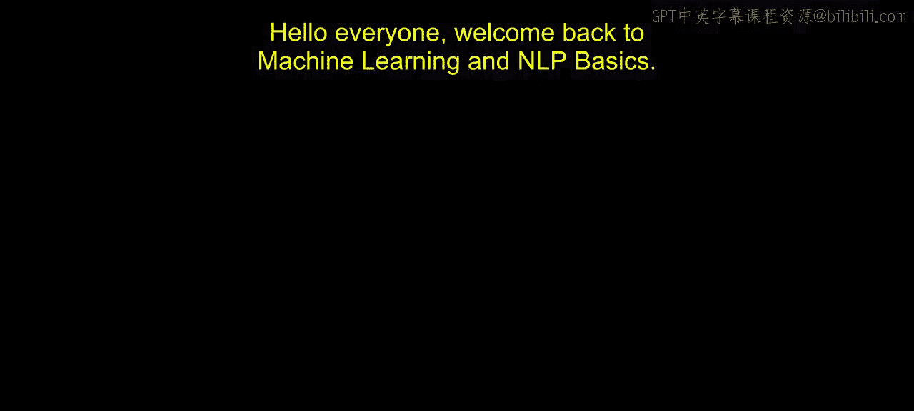
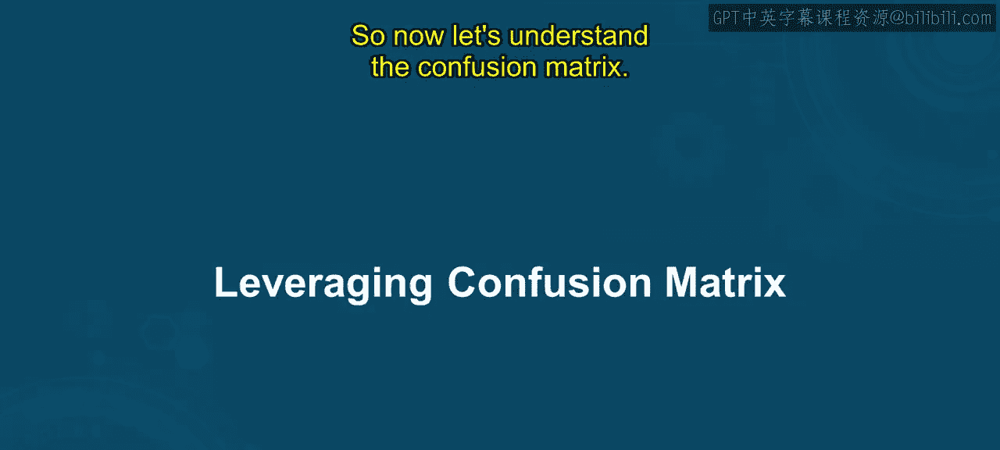
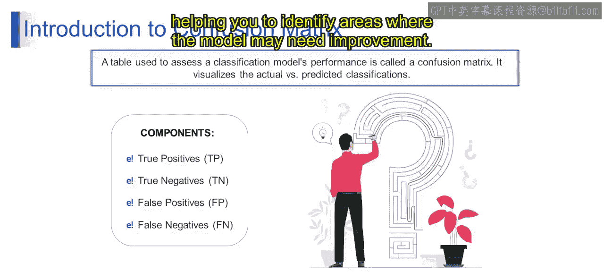

# 第一部分 136：利用混淆矩阵 📊

在本节课中，我们将要学习混淆矩阵。这是一种用于评估机器学习分类模型性能的重要工具。我们将了解它的构成部分，并学习如何通过分析混淆矩阵来识别模型的错误分类。

## 混淆矩阵简介

上一节我们介绍了分类模型的基本概念，本节中我们来看看如何具体评估其性能。混淆矩阵是一种在机器学习中用于可视化分类模型性能的评估工具。它在处理二分类或多分类问题时尤其有用。

想象你有一个模型，用于将电子邮件分类为垃圾邮件或非垃圾邮件。混淆矩阵通过汇总模型的预测结果与实际标签的对比，帮助你理解模型的性能表现。

## 混淆矩阵的构成

那么，它是如何做到这一点的呢？如前所述，混淆矩阵是一个表格，用于通过比较模型的预测结果与实际类别标签来评估分类模型的性能。它有助于可视化模型在不同类别上的表现。

混淆矩阵的组成部分包括：真正例、真反例、假正例和假反例。

以下是每个组成部分的定义：
*   **真正例**：模型正确预测为正类的实例数量。
*   **真反例**：模型正确预测为负类的实例数量。
*   **假正例**：模型错误预测为正类的实例数量。
*   **假反例**：模型错误预测为负类的实例数量。

这些组成部分为了解模型的准确率、精确率、召回率和其他性能指标提供了依据，帮助你识别模型可能需要改进的领域。

## 总结

本节课中我们一起学习了混淆矩阵。我们了解到混淆矩阵是一个强大的工具，它能清晰地展示分类模型的预测结果与实际结果的对比。通过分析其中的真正例、真反例、假正例和假反例，我们可以深入评估模型的性能并发现其不足之处。请继续关注下一个视频，我们将更详细地阐述这个话题。