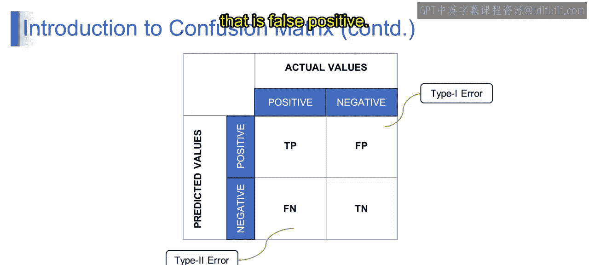

# 第一部分 137：混淆矩阵的表示

在本节课中，我们将要学习混淆矩阵的表示方法。混淆矩阵是评估分类模型性能的核心工具，它能清晰地展示模型预测结果与真实情况之间的对应关系。通过它，我们可以计算出多种评估指标，并理解模型所犯错误的类型。

上一节我们介绍了分类任务的基本概念，本节中我们来看看如何具体地表示和解读模型的预测结果。

## 混淆矩阵的结构

混淆矩阵是一个二维表格，用于总结分类模型的预测结果。它包含一个水平轴和一个垂直轴。

*   **水平轴**代表**实际值**。它展示了数据集中实例的真实标签或类别，通常包含两个类别：正类（P）和负类（N）。
*   **垂直轴**代表**预测值**。它展示了分类模型为实例分配的预测标签或类别，同样区分了模型做出的正类预测和负类预测。

下图清晰地展示了混淆矩阵的布局：

## 矩阵的四个核心单元

基于实际值与预测值的组合，混淆矩阵被划分为四个核心单元。以下是这四个单元的定义：

*   **真正例**：指模型正确预测为正类的实例，其实际类别也是正类。公式表示为：`TP = 模型预测为正类且实际为正类的实例数`。
*   **真反例**：指模型正确预测为负类的实例，其实际类别也是负类。公式表示为：`TN = 模型预测为负类且实际为负类的实例数`。
*   **假正例**：指模型错误预测为正类的实例，其实际类别是负类。公式表示为：`FP = 模型预测为正类但实际为负类的实例数`。
*   **假反例**：指模型错误预测为负类的实例，其实际类别是正类。公式表示为：`FN = 模型预测为负类但实际为正类的实例数`。

这种布局通过比较模型的预测与真实情况，帮助我们评估分类模型的性能。它是一个强大的工具，可以揭示模型在哪些地方犯错，从而指导我们改进模型。

## 错误类型：第一类错误与第二类错误

在混淆矩阵的语境下，第一类错误和第二类错误指的是分类器在预测实例类别时可能犯的两种不同类型的错误。

首先，我们来理解第一类错误。

*   **第一类错误**：也称为**假正例**。当分类器错误地预测了一个正类结果（即预测存在某种状况或类别），而实际结果是负类时，就发生了第一类错误。例如，在医疗诊断场景中，如果分类器将一个健康人诊断为患病，这就是第一类错误。其计算公式为：`第一类错误率 = FP / (FP + TN)`。

接下来，我们看看第二类错误。

*   **第二类错误**：也称为**假反例**。当分类器错误地预测了一个负类结果，而实际结果是正类时，就发生了第二类错误。例如，在医疗诊断中，如果分类器未能识别出一位患病者（即预测为阴性），这就是第二类错误。其计算公式为：`第二类错误率 = FN / (FN + TP)`。

第一类错误（假正例）和第二类错误（假反例）通过识别分类器在预测中所犯错误的类型，帮助我们量化分类器的性能。

## 实例解析：垃圾邮件分类

为了更深入地理解，让我们通过一个二元分类问题来具体分析，例如将电子邮件分类为垃圾邮件（正类）或非垃圾邮件（负类）。

假设我们有一个包含100封邮件的分类结果。

*   **实际值**：30封邮件实际上是垃圾邮件（正类），70封邮件实际上是非垃圾邮件（负类）。
*   **预测值**：模型预测40封邮件为垃圾邮件（正类），预测60封邮件为非垃圾邮件（负类）。

根据这些信息，我们可以填充混淆矩阵。下图展示了这个例子的具体数值分布：

让我们逐一解读：

*   **真正例**：在模型预测为垃圾邮件的40封邮件中，有30封确实是垃圾邮件。
*   **假正例**：在模型预测为垃圾邮件的40封邮件中，有10封实际上是非垃圾邮件。
*   **真反例**：在模型预测为非垃圾邮件的60封邮件中，有60封确实是非垃圾邮件（因为实际非垃圾邮件有70封，其中10封被误判为垃圾邮件，剩下60被正确判断）。
*   **假反例**：在模型预测为非垃圾邮件的60封邮件中，有0封实际上是垃圾邮件（因为所有30封实际垃圾邮件都被预测为垃圾邮件了）。

通过这个具体例子，我们可以直观地看到TP、FP、TN、FN是如何从实际预测数据中得出的。

本节课中我们一起学习了混淆矩阵的表示方法。我们了解了其基本结构，定义了真正例、真反例、假正例和假反例这四个核心概念，并探讨了与之相关的第一类错误和第二类错误。最后，通过一个垃圾邮件分类的实例，我们巩固了对这些概念的理解。混淆矩阵是评估分类模型的基础，掌握它对于后续学习准确率、精确率、召回率等指标至关重要。