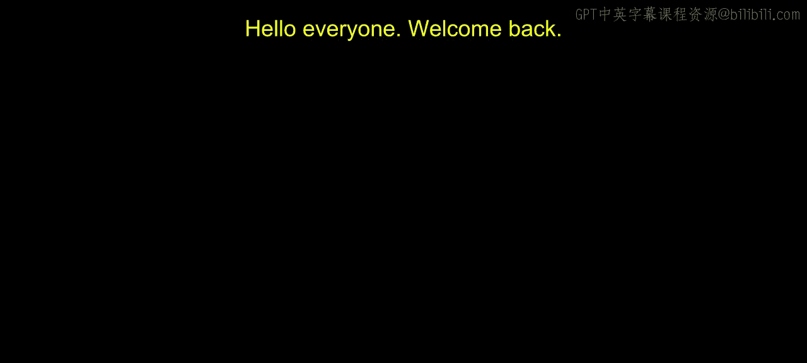
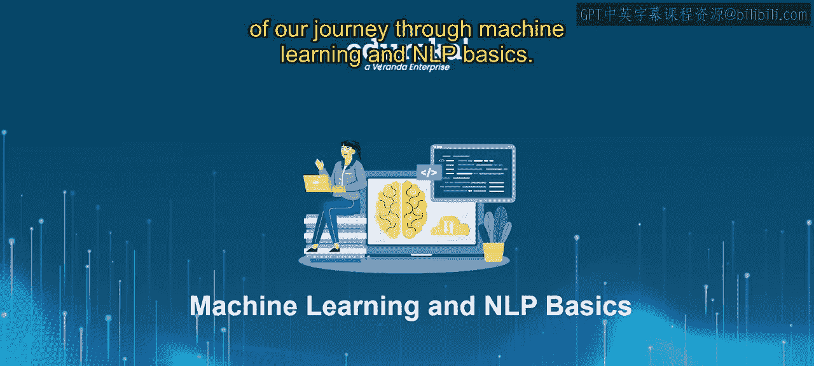
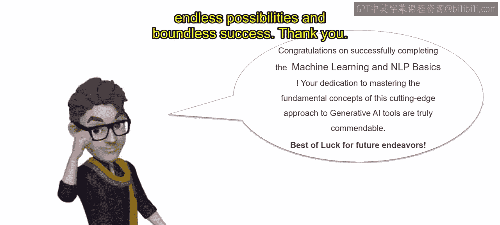

# 第一部分 138：课程总结

在本节课中，我们将回顾《机器学习和NLP基础》课程的核心内容，并展望学习者在人工智能领域的未来机会与路径。

## 课程核心内容回顾

我们首先深入探讨了机器学习的基础知识。你学习了驱动这一变革性技术的核心原理与算法，为你的AI之旅奠定了基础。

接下来，我们探索了机器学习的各种类型。从监督学习、无监督学习到强化学习，你全面了解了每种类型的优势、劣势及其在现实世界中的应用。

随着模块的结束，你通过完成富有挑战性的作业来检验新获得的知识，从而巩固了对机器学习基础的理解。

随后，我们深入研究了分类与回归这两种强大的技术，它们能解决广泛的预测问题。你学习了如何训练模型，将数据分类到不同的类别，并以显著的准确性预测连续结果。

随着每一个概念的探索与掌握，你现在已经具备了基础知识和实践技能，可以充满信心地开启你的AI世界之旅。

## 未来路径与机遇

既然你已经完成了《机器学习和NLP基础》课程，让我们来探索等待你的激动人心的机会。

作为一名AI或机器学习工程师，你将站在创新的前沿，设计和实施尖端的解决方案，不断拓展人工智能的边界。

作为一名数据科学家，准备好深入大数据、机器学习、自然语言处理的世界，为全球的企业和组织提取有价值的见解，推动有影响力的决策。

对于初学者而言，你的旅程才刚刚开始。但凭借在机器学习和NLP方面的坚实基础，你已做好充分准备，可以在快速发展的AI领域追求广泛的、令人兴奋的职业机会。

机会远不止于此。从AI顾问到研究科学家，从创业者到教育者，对于那些对AI充满热情并渴望有所作为的人来说，可能性是无限的。

因此，在你规划前进道路时，请记住，完成这门课程仅仅是一个开始。拥抱等待你的无限可能，抓住每一个机会，在人工智能的世界里留下你的印记。未来由你塑造，张开双臂拥抱它，让你的AI世界之旅就此启程。

## 总结与祝贺

最后，祝贺你成功完成了《机器学习和NLP基础》课程。你致力于掌握这种前沿的生成式AI工具的基础概念，这确实值得称赞。你致力于掌握机器学习和NLP的基础概念，这确实值得称赞。

在整个旅程中，你展现出了对知识的渴望和对创新的热情，这将在你未来的探索中助你一臂之力。

当你带着新获得的技能和见解步入AI世界时，要知道可能性是无限的。无论你是寻求职业发展、开创全新事业，还是仅仅为了探索好奇心，你在这门课程中获得的知识都将是指引你的明灯。

在此，我们全体人员祝愿你在未来的探索中一切顺利。愿你持续学习、成长和创新，塑造人工智能的未来，并为你周围的世界带来积极的影响。

再次祝贺你，愿你在激动人心的AI世界中，充满无限可能与无边的成功。

谢谢。